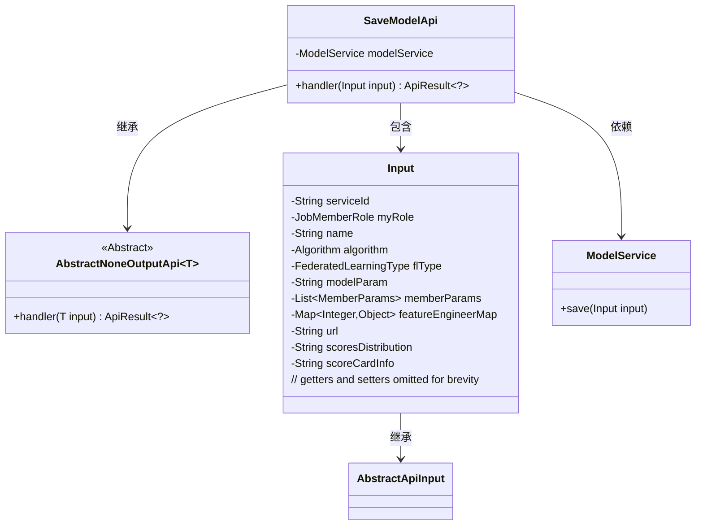
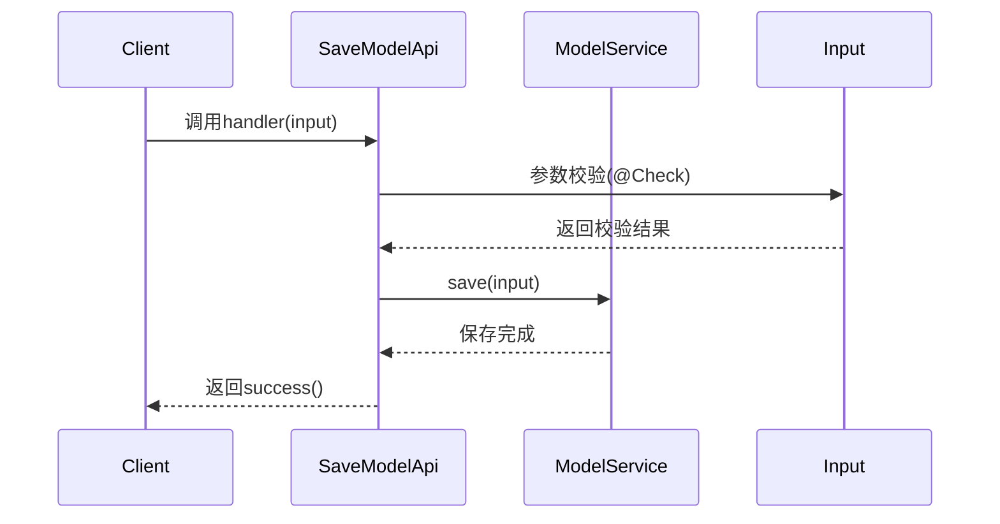

# 基础信息

|      |      |
|------|------|
| 名称 | SaveModelApi |
| 编码语言 | .java |
| 代码路径 | WeFe/serving/serving-service/src/main/java/com/welab/wefe/serving/service/api/model/SaveModelApi.java |
| 包名 | com.welab.wefe.serving.service.api.model |
| 依赖项 | ['java.util.List', 'java.util.Map', 'org.springframework.beans.factory.annotation.Autowired', 'com.welab.wefe.common.fieldvalidate.annotation.Check', 'com.welab.wefe.common.web.api.base.AbstractNoneOutputApi', 'com.welab.wefe.common.web.api.base.Api', 'com.welab.wefe.common.web.api.base.Caller', 'com.welab.wefe.common.web.dto.AbstractApiInput', 'com.welab.wefe.common.web.dto.ApiResult', 'com.welab.wefe.common.wefe.enums.Algorithm', 'com.welab.wefe.common.wefe.enums.FederatedLearningType', 'com.welab.wefe.common.wefe.enums.JobMemberRole', 'com.welab.wefe.serving.service.dto.MemberParams', 'com.welab.wefe.serving.service.service.ModelService'] |
| 概述说明 | 保存模型信息的API接口，包含模型ID、角色、算法、联邦学习类型等必填参数，调用ModelService保存数据。 |

# 说明

该代码定义了一个名为SaveModelApi的API类，用于保存模型信息。API路径为model_save，允许带签名访问，属于Caller.Board域。类继承自AbstractNoneOutputApi，使用ModelService处理输入数据。输入类Input包含多个必填和选填字段，如模型ID、角色、算法类型、联邦学习类型、模型参数、成员参数等，并提供相应的getter和setter方法。处理逻辑为调用modelService保存输入数据并返回成功结果。

# 类列表 Class Summary

| 名称   | 类型  | 说明 |
|-------|------|-------------|
| SaveModelApi | class | SaveModelApi类用于保存模型信息，包含必填字段如模型ID、算法、联邦学习类型等，通过ModelService保存输入数据，返回成功结果。 |

## 类 SaveModelApi

|      |      |
|------|------|
| 访问范围 | @Api(;        path = "model_save",;        name = "保存模型信息",;        allowAccessWithSign = true,;        domain = Caller.Board;);public |
| 类型 | class |
| 名称 | SaveModelApi |
| 说明 | SaveModelApi类用于保存模型信息，包含必填字段如模型ID、算法、联邦学习类型等，通过ModelService保存输入数据，返回成功结果。 |

### UML类图

这段代码描述了一个保存模型信息的API类`SaveModelApi`，它继承自`AbstractNoneOutputApi`泛型类并指定`Input`作为参数类型。`SaveModelApi`通过`ModelService`来保存模型数据，其输入参数`Input`是一个包含多个校验字段的嵌套类，继承自`AbstractApiInput`。类图中展示了继承关系、依赖关系和包含关系，清晰地呈现了各个组件之间的交互方式。

### 内部方法调用关系图

```mermaid
graph TD
    A["类SaveModelApi"]
    B["注解: @Api"]
    C["继承: AbstractNoneOutputApi<Input>"]
    D["依赖注入: @Autowired ModelService"]
    E["重写方法: handler(Input input)"]
    F["内部类: Input"]
    G["继承: AbstractApiInput"]
    H["校验注解: @Check"]
    I["字段: serviceId/myRole/name等"]
    J["getter/setter方法"]

    A --> B
    A --> C
    A --> D
    A --> E
    A --> F
    F --> G
    F --> H
    F --> I
    F --> J
    E --> D
    E --> F
```

这段代码实现了一个模型保存API，主要包含SaveModelApi类和其内部Input类。流程图展示了类结构关系，包含注解、继承、依赖注入等元素；时序图描述了API调用流程：客户端请求→参数校验→服务层保存→返回结果。Input类封装了模型相关参数，通过@Check注解实现参数校验，所有字段都提供了标准的getter/setter方法。该设计实现了业务逻辑与参数校验的分离，符合单一职责原则。

### 字段列表 Field List

| 名称  | 类型  | 说明 |
|-------|-------|------|
| modelService | ModelService | 使用@Autowired自动注入ModelService实例。 |

### 方法列表

| 名称  | 类型  | 说明 |
|-------|-------|------|
| handler | ApiResult<?> | 代码重写handler方法，调用modelService保存输入数据并返回成功结果。 |

