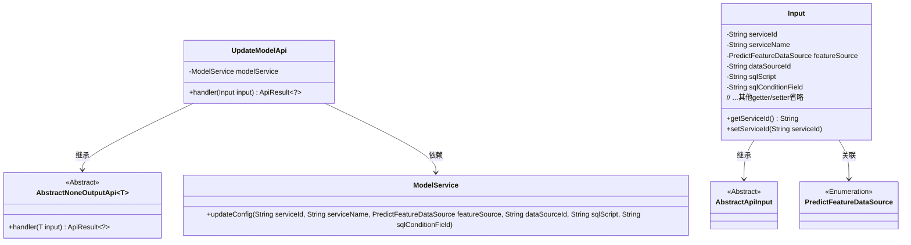

# 基础信息

|      |      |
|------|------|
| 名称 | UpdateModelApi |
| 编码语言 | .java |
| 代码路径 | WeFe/serving/serving-service/src/main/java/com/welab/wefe/serving/service/api/model/UpdateModelApi.java |
| 包名 | com.welab.wefe.serving.service.api.model |
| 依赖项 | ['com.welab.wefe.common.exception.StatusCodeWithException', 'com.welab.wefe.common.fieldvalidate.annotation.Check', 'com.welab.wefe.common.web.api.base.AbstractNoneOutputApi', 'com.welab.wefe.common.web.api.base.Api', 'com.welab.wefe.common.web.dto.AbstractApiInput', 'com.welab.wefe.common.web.dto.ApiResult', 'com.welab.wefe.common.wefe.enums.PredictFeatureDataSource', 'com.welab.wefe.serving.service.service.ModelService', 'org.springframework.beans.factory.annotation.Autowired'] |
| 概述说明 | UpdateModelApi类用于更新模型SQL配置，通过ModelService.updateConfig方法处理输入参数（模型ID、名称、数据源等），返回成功结果。输入类包含必填和选填字段。 |

# 说明

这是一个用于更新模型SQL配置的API类，路径为model/update。该类继承自AbstractNoneOutputApi，输入参数为内部类Input。主要功能是通过ModelService更新模型配置，包括模型ID、名称、配置来源、数据源ID、SQL语句和查询条件字段。输入参数包含多个必填和选填字段，并通过getter/setter方法进行访问和修改。处理完成后返回成功结果。

# 类列表 Class Summary

| 名称   | 类型  | 说明 |
|-------|------|-------------|
| UpdateModelApi | class | UpdateModelApi类用于更新模型SQL配置，接收模型ID、名称、数据源等输入，调用modelService更新配置并返回成功结果。 |

## 类 UpdateModelApi

|      |      |
|------|------|
| 访问范围 | @Api(path = "model/update", name = "Update model SQL configuration");public |
| 类型 | class |
| 名称 | UpdateModelApi |
| 说明 | UpdateModelApi类用于更新模型SQL配置，接收模型ID、名称、数据源等输入，调用modelService更新配置并返回成功结果。 |

### UML类图

该类图展示了UpdateModelApi及其相关类的结构。UpdateModelApi继承自泛型类AbstractNoneOutputApi<Input>，包含一个ModelService依赖用于更新配置。Input作为内部类继承AbstractApiInput，包含多个带校验注解的字段和对应的getter/setter方法。PredictFeatureDataSource是一个枚举类型，表示特征数据来源。整体结构体现了API处理请求时对模型配置的更新操作。

### 内部方法调用关系图

```mermaid
graph TD
    A["类UpdateModelApi"]
    B["注解: @Api"]
    C["继承: AbstractNoneOutputApi<Input>"]
    D["依赖注入: @Autowired ModelService"]
    E["重写方法: handler(Input input)"]
    F["调用: modelService.updateConfig"]
    G["返回: success()"]
    H["静态内部类Input"]
    I["继承: AbstractApiInput"]
    J["字段: serviceId/serviceName/featureSource/dataSourceId/sqlScript/sqlConditionField"]
    K["校验注解: @Check"]
    L["getter/setter方法"]

    A --> B
    A --> C
    A --> D
    A --> E
    E --> F
    E --> G
    A --> H
    H --> I
    H --> J
    J --> K
    H --> L
```

这段代码描述了一个用于更新模型SQL配置的API类UpdateModelApi，它继承自抽象基类并实现了handler方法。流程图展示了类结构关系，包括API注解、服务注入、输入参数处理等关键元素。核心流程是通过ModelService更新配置参数后返回成功结果，输入参数通过静态内部类Input定义并包含严格的数据校验规则。整个设计体现了清晰的层级结构和参数校验机制。

### 字段列表 Field List

| 名称  | 类型  | 说明 |
|-------|-------|------|
| modelService | ModelService | 自动注入ModelService实例。 |

### 方法列表

| 名称  | 类型  | 说明 |
|-------|-------|------|
| handler | ApiResult<?> | 该方法重写父类handler，接收Input参数，调用modelService更新配置（包括服务ID、名称、数据源等字段），成功返回ApiResult。异常时抛出StatusCodeWithException。 |

