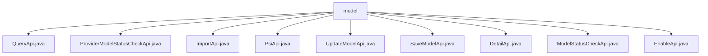

# 基础信息

|      |      |
|------|------|
| 名称 | model |
| 编码语言 | .java |
| 代码路径 | WeFe/serving/serving-service/src/main/java/com/welab/wefe/serving/service/api/model |
| 包名 | docs.serving.serving-service.src.main.java.com.welab.wefe.serving.service.api.model |
| 概述说明 | QueryApi查询模型信息，ProviderModelStatusCheckApi检查模型状态，ImportApi导入模型文件，PsiApi计算模型稳定性指标，UpdateModelApi更新SQL配置，SaveModelApi保存模型信息，DetailApi获取模型详情，ModelStatusCheckApi检查模型状态，EnableApi处理模型上下线。 |

# 说明

## 概述  
该模块核心职责是提供模型全生命周期管理API，包括查询、状态检查、导入、PSI计算、配置更新等操作。接口规范遵循统一设计：继承AbstractApi基类，使用Input/Output参数类，通过ModelService等组件处理业务逻辑。关键数据结构包含模型ID、服务ID、算法类型、联邦学习类型、创建者等字段，例如QueryApi.Output扩展了分页和详细模型属性。外部依赖包括ModelService、ModelMemberService和TableModelRepository等。具体实现如ImportApi根据服务类型（机器学习/深度学习）调用不同导入方法。

## 主要业务场景  
模块支持模型协作全流程：客户通过QueryApi分页查询模型，ProviderModelStatusCheckApi检查协作方状态，ImportApi导入模型文件（例如深度学习模型），SaveApi保存参数。运维场景通过EnableApi上下线模型，UpdateModelApi修改SQL配置。监控场景如PsiApi计算稳定性指标，类似质量水位线。典型集成模式为链式调用：查询→检查→导入→配置，例如先检查ModelStatusCheckApi状态再启用EnableApi。API类型涵盖CRUD、状态检查和数据分析三类。

### 包内部结构视图

该流程图展示了WeFe服务项目中model目录下的API文件结构。根节点为model文件夹，其下直接包含9个不同的API实现类文件，包括查询、状态检查、导入、更新等功能的API实现。所有API文件均位于同一层级，没有进一步的子目录结构。

# 文件列表

| 名称   | 类型  | 说明 |
|-------|------|-------------|
| [QueryApi.java](QueryApi.md) | file | QueryApi类用于分页查询模型数据，包含输入参数模型ID、算法类型、联邦学习类型、创建者和名称，输出模型详细信息如ID、服务ID、名称、算法等。 |
| [ProviderModelStatusCheckApi.java](ProviderModelStatusCheckApi.md) | file | 这是一个协作方提供的API，用于检查模型状态。路径为model/provider/status/check，需要签名访问，调用方为Customer。输入参数为必填的模型id，输出为模型状态。 |
| [ImportApi.java](ImportApi.md) | file | 导入模型文件的API类，根据服务类型调用不同方法保存模型，返回模型ID。输入需文件名、服务类型和模型名称。 |
| [PsiApi.java](PsiApi.md) | file | 模型稳定性指标API类，处理输入输出数据，计算PSI值，包含预期与实际数据提取及分组统计功能。 |
| [UpdateModelApi.java](UpdateModelApi.md) | file | UpdateModelApi类用于更新模型SQL配置，通过ModelService.updateConfig方法处理输入参数（模型ID、名称、数据源等），返回成功结果。输入类包含必填和选填字段。 |
| [SaveModelApi.java](SaveModelApi.md) | file | 保存模型信息的API接口，包含模型ID、角色、算法、联邦学习类型等必填参数，调用ModelService保存数据。 |
| [DetailApi.java](DetailApi.md) | file | DetailApi类通过ID查询模型详情，包含模型参数、角色、状态等信息，支持XGBoost树结构处理。 |
| [ModelStatusCheckApi.java](ModelStatusCheckApi.md) | file | 该API用于检查模型状态，接收模型ID和成员ID参数，调用ModelMemberService返回模型可用性结果。 |
| [EnableApi.java](EnableApi.md) | file | EnableApi用于更新模型启用状态，接收id和enable参数，调用modelService.enable方法处理，返回成功结果。 |

