# 基础信息

|      |      |
|------|------|
| 名称 | LogQueryApi |
| 编码语言 | .java |
| 代码路径 | WeFe/serving/serving-service/src/main/java/com/welab/wefe/serving/service/api/operation/LogQueryApi.java |
| 包名 | com.welab.wefe.serving.service.api.operation |
| 依赖项 | ['org.springframework.beans.factory.annotation.Autowired', 'com.welab.wefe.common.exception.StatusCodeWithException', 'com.welab.wefe.common.fieldvalidate.annotation.Check', 'com.welab.wefe.common.web.api.base.AbstractApi', 'com.welab.wefe.common.web.api.base.Api', 'com.welab.wefe.common.web.dto.ApiResult', 'com.welab.wefe.serving.service.dto.OperationLogOutputModel', 'com.welab.wefe.serving.service.dto.PagingInput', 'com.welab.wefe.serving.service.dto.PagingOutput', 'com.welab.wefe.serving.service.service.OperationLogService'] |
| 概述说明 | LogQueryApi用于分页查询操作日志，输入包含接口、操作人员ID、时间范围，输出为分页的操作日志列表。 |

# 说明

这是一个名为LogQueryApi的Java类，用于查询操作日志。它继承自AbstractApi，定义了输入类型Input和分页输出类型PagingOutput<OperationLogOutputModel>。类中注入了OperationLogService服务，并通过handle方法调用服务的query方法处理查询请求。Input内部类继承自PagingInput，包含logInterface、operatorId、startTime和endTime四个字段，其中前两个有校验注解，后两个有getter和setter方法。整个API路径为operation_log/query，名称为query log。

# 类列表 Class Summary

| 名称   | 类型  | 说明 |
|-------|------|-------------|
| LogQueryApi | class | LogQueryApi用于分页查询操作日志，接收接口名、操作人员ID和时间范围参数，返回分页结果。 |


## 类 LogQueryApi

|      |      |
|------|------|
| 访问范围 | @Api(path = "operation_log/query", name = "query log");public |
| 类型 | class |
| 名称 | LogQueryApi |
| 说明 | LogQueryApi用于分页查询操作日志，接收接口名、操作人员ID和时间范围参数，返回分页结果。 |


### UML类图

```mermaid
classDiagram
    class LogQueryApi {
        -OperationLogService service
        +handle(Input input) ApiResult~PagingOutput~OperationLogOutputModel~~
    }
    <<Interface>> AbstractApi~Input, PagingOutput~OperationLogOutputModel~~
    LogQueryApi --|> AbstractApi~Input, PagingOutput~OperationLogOutputModel~~ : 继承
    LogQueryApi --> OperationLogService : 依赖

    class Input {
        +String logInterface
        +String operatorId
        -Long startTime
        -Long endTime
        +Long getStartTime()
        +void setStartTime(Long startTime)
        +Long getEndTime()
        +void setEndTime(Long endTime)
    }
    Input --|> PagingInput : 继承

    class OperationLogService {
        +query(Input input) PagingOutput~OperationLogOutputModel~
    }
```

这段代码展示了一个日志查询API的实现结构。LogQueryApi继承自泛型抽象类AbstractApi，处理分页查询操作日志的请求。它依赖OperationLogService进行实际查询操作，使用内部类Input作为请求参数，Input继承自PagingInput并包含日志接口、操作员ID和时间范围等查询条件。整个设计体现了清晰的层次结构和职责分离。


### 内部方法调用关系图

```mermaid
graph TD
    A["类LogQueryApi"]
    B["注解: @Api"]
    C["继承: AbstractApi<Input, PagingOutput<OperationLogOutputModel>>"]
    D["依赖注入: @Autowired OperationLogService"]
    E["重写方法: handle(Input input)"]
    F["内部类Input"]
    G["继承: PagingInput"]
    H["校验字段: @Check String logInterface"]
    I["校验字段: @Check String operatorId"]
    J["私有字段: Long startTime/endTime"]
    K["方法: get/setStartTime()"]
    L["方法: get/setEndTime()"]
    M["调用: service.query(input)"]
    N["返回: success()"]

    A --> B
    A --> C
    A --> D
    A --> E
    E --> M
    M --> N
    A --> F
    F --> G
    F --> H
    F --> I
    F --> J
    J --> K
    J --> L
```



该流程图展示了日志查询API的核心结构，包含主类与嵌套输入类的继承关系。LogQueryApi通过@Api注解定义接口路径，继承抽象模板类并注入OperationLogService服务。重写的handle方法调用service.query处理分页查询，Input内部类扩展了分页参数并包含带校验的查询条件字段。流程清晰呈现了从API入口到服务调用的完整数据流转路径，以及输入参数的校验和封装机制。

### 字段列表 Field List

| 名称  | 类型  | 说明 |
|-------|-------|------|
| service | OperationLogService | 代码片段使用@Autowired自动注入OperationLogService服务实例。 |

### 方法列表

| 名称  | 类型  | 说明 |
|-------|-------|------|
| handle | ApiResult<PagingOutput<OperationLogOutputModel>> | 重写handle方法，调用service.query处理输入并返回分页操作日志结果。 |


