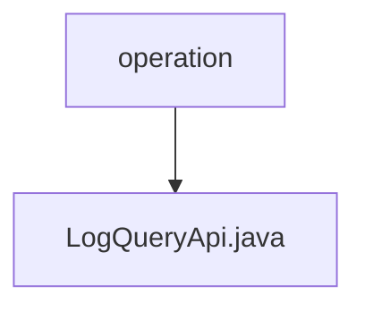

# 基础信息

|      |      |
|------|------|
| 名称 | operation |
| 编码语言 | .java |
| 代码路径 | WeFe/serving/serving-service/src/main/java/com/welab/wefe/serving/service/api/operation |
| 包名 | docs.serving.serving-service.src.main.java.com.welab.wefe.serving.service.api.operation |
| 概述说明 | LogQueryApi用于分页查询操作日志，输入包含接口、操作人员ID、时间范围，输出为分页的操作日志列表。 |

# 说明

这是一个名为LogQueryApi的Java类，用于查询操作日志。它继承自AbstractApi，定义了输入类型Input和分页输出类型PagingOutput<OperationLogOutputModel>。类中注入了OperationLogService服务，并通过handle方法调用服务的query方法处理查询请求。Input内部类继承自PagingInput，包含logInterface、operatorId、startTime和endTime四个字段，其中前两个有校验注解，后两个有getter和setter方法。整个API路径为operation_log/query，名称为query log。

### 包内部结构视图

该流程图展示了WeFe项目中serving-service模块的API操作路径结构。operation作为父级目录节点，包含一个具体的API实现文件LogQueryApi.java。这种结构符合典型的Java项目分层规范，其中operation目录用于存放与操作相关的API接口，而LogQueryApi.java则是实现具体日志查询功能的控制器类文件。

# 文件列表

| 名称   | 类型  | 说明 |
|-------|------|-------------|
| [LogQueryApi.java](LogQueryApi.md) | file | LogQueryApi用于分页查询操作日志，输入包含接口、操作人员ID、时间范围，输出为分页的操作日志列表。 |

