# 基础信息

|      |      |
|------|------|
| 名称 | DownloadApi |
| 编码语言 | .java |
| 代码路径 | WeFe/serving/serving-service/src/main/java/com/welab/wefe/serving/service/api/orderstatistics/DownloadApi.java |
| 包名 | com.welab.wefe.serving.service.api.orderstatistics |
| 依赖项 | ['com.welab.wefe.common.StatusCode', 'com.welab.wefe.common.exception.StatusCodeWithException', 'com.welab.wefe.common.fieldvalidate.annotation.Check', 'com.welab.wefe.common.util.StringUtil', 'com.welab.wefe.common.web.api.base.AbstractApi', 'com.welab.wefe.common.web.api.base.Api', 'com.welab.wefe.common.web.dto.AbstractApiInput', 'com.welab.wefe.common.web.dto.ApiResult', 'com.welab.wefe.serving.service.enums.DateTypeEnum', 'com.welab.wefe.serving.service.service.OrderStatisticsService', 'org.springframework.beans.factory.annotation.Autowired', 'org.springframework.core.io.FileSystemResource', 'org.springframework.http.HttpHeaders', 'org.springframework.http.MediaType', 'org.springframework.http.ResponseEntity', 'java.io.File', 'java.util.Date', 'java.util.List', 'java.util.regex.Matcher'] |
| 概述说明 | DownloadApi类处理订单统计文件下载，输入参数包括时间、合作方信息和服务详情，输出CSV文件响应，包含缓存和内容配置。 |

# 说明

DownloadApi类是一个用于下载订单统计数据的API，继承自AbstractApi，处理输入参数Input并返回文件响应。Input类包含多个校验字段，如开始时间、结束时间、请求方和响应方信息、服务ID及名称，以及必填的统计粒度。API通过OrderStatisticsService下载文件，若文件不存在则抛出异常。响应设置包含缓存控制、内容处置、最后修改时间和ETag头信息，返回CSV格式文件。

# 类列表 Class Summary

| 名称   | 类型  | 说明 |
|-------|------|-------------|
| DownloadApi | class | DownloadApi类处理订单统计文件下载，接收时间、合作方和服务等参数，返回CSV文件响应。检查文件存在性并设置HTTP头。 |


## 类 DownloadApi

|      |      |
|------|------|
| 访问范围 | @Api(path = "orderstatistics/download", name = "download order statistics");public |
| 类型 | class |
| 名称 | DownloadApi |
| 说明 | DownloadApi类处理订单统计文件下载，接收时间、合作方和服务等参数，返回CSV文件响应。检查文件存在性并设置HTTP头。 |


### UML类图

```mermaid
classDiagram
    class DownloadApi {
        -OrderStatisticsService orderStatisticsService
        +handle(Input input) ApiResult~ResponseEntity~?~~
        +file(File file) ApiResult~ResponseEntity~?~~
    }
    DownloadApi --> OrderStatisticsService : 依赖

    class AbstractApi~T, R~ {
        <<Abstract>>
        +handle(T input) ApiResult~R~
        +file(File file) ApiResult~R~
    }
    DownloadApi --|> AbstractApi~Input, ResponseEntity~?~~ : 继承

    class Input {
        -Date startTime
        -Date endTime
        -String requestPartnerId
        -String requestPartnerName
        -String responsePartnerId
        -String responsePartnerName
        -String serviceId
        -String serviceName
        -String statisticalGranularity
        +getStartTime() Date
        +setStartTime(Date startTime)
        // ...其他getter/setter省略...
    }
    Input --|> AbstractApiInput : 继承

    class AbstractApiInput {
        <<Abstract>>
    }

    class OrderStatisticsService {
        <<Interface>>
        +downloadFile(DownloadApi$Input input) File
    }
```

这段代码描述了一个订单统计下载API的实现。DownloadApi继承自泛型抽象类AbstractApi，处理Input类型的输入并返回ResponseEntity响应。核心功能是通过OrderStatisticsService下载文件，并封装成带HTTP头的文件响应。Input类继承自AbstractApiInput，包含时间范围、合作方信息、服务信息等校验字段。类图展示了DownloadApi与OrderStatisticsService的依赖关系，以及Input作为嵌套类的继承结构，体现了Spring风格的API实现方式。


### 内部方法调用关系图

```mermaid
graph TD
    A["类DownloadApi"]
    B["继承: AbstractApi<Input, ResponseEntity<?>>"]
    C["依赖: OrderStatisticsService"]
    D["方法: handle(Input input)"]
    E["调用: orderStatisticsService.downloadFile(input)"]
    F["方法: file(File file)"]
    G["检查: file.exists()"]
    H["异常处理: StatusCode.PARAMETER_VALUE_INVALID"]
    I["设置HTTP头: HttpHeaders"]
    J["构建响应: ResponseEntity"]
    K["返回: ApiResult<ResponseEntity<?>>"]
    L["内部类Input"]
    M["属性: Date startTime/endTime等"]
    N["校验注解: @Check"]
    O["Getter/Setter方法"]

    A --> B
    A --> C
    A --> D
    D --> E
    D --> F
    F --> G
    G -->|false| H
    G -->|true| I
    I --> J
    J --> K
    A --> L
    L --> M
    M --> N
    L --> O
```



该流程图展示了DownloadApi类的完整结构和工作流程。类继承AbstractApi并实现文件下载功能，核心处理流程包含handle方法调用服务层获取文件，通过file方法验证文件存在性并构建HTTP响应。内部类Input定义了多个带校验注解的日期和字符串字段，通过标准Getter/Setter方法访问。异常处理分支会在文件不存在时抛出状态码异常，成功时则设置缓存控制等HTTP头信息返回文件资源。

### 字段列表 Field List

| 名称  | 类型  | 说明 |
|-------|-------|------|
| orderStatisticsService | OrderStatisticsService | 自动注入订单统计服务实例。 |

### 方法列表

| 名称  | 类型  | 说明 |
|-------|-------|------|
| handle | ApiResult<ResponseEntity<?>> | 重写方法处理输入并返回文件下载结果，调用服务层生成文件后封装为ApiResult响应。 |
| file | ApiResult<ResponseEntity<?>> | 检查文件是否存在，设置HTTP响应头并返回文件内容，包含缓存控制和下载信息。 |


