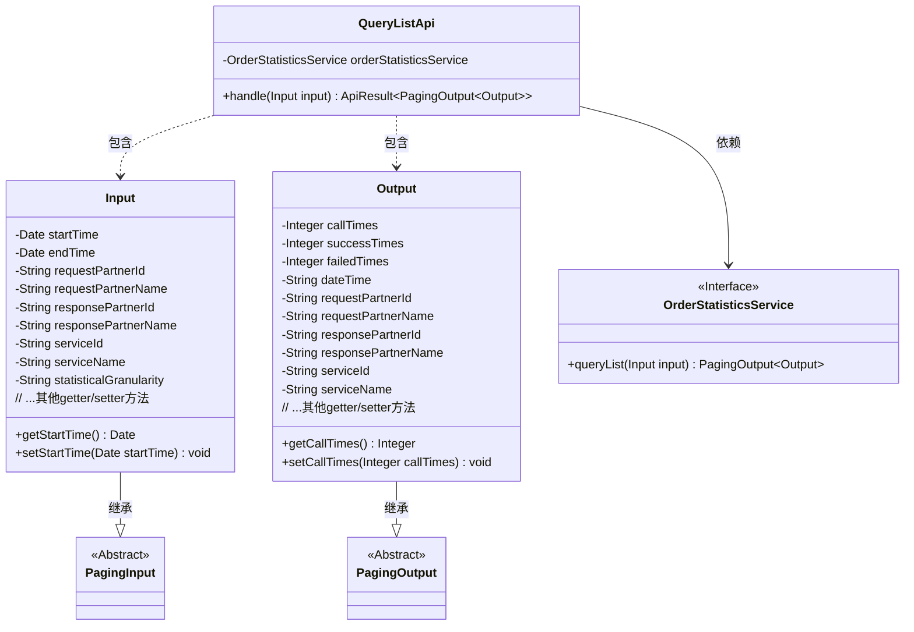

# 基础信息

|      |      |
|------|------|
| 名称 | QueryListApi |
| 编码语言 | .java |
| 代码路径 | WeFe/serving/serving-service/src/main/java/com/welab/wefe/serving/service/api/orderstatistics/QueryListApi.java |
| 包名 | com.welab.wefe.serving.service.api.orderstatistics |
| 依赖项 | ['com.welab.wefe.common.fieldvalidate.annotation.Check', 'com.welab.wefe.common.web.api.base.AbstractApi', 'com.welab.wefe.common.web.api.base.Api', 'com.welab.wefe.common.web.dto.ApiResult', 'com.welab.wefe.serving.service.dto.PagingInput', 'com.welab.wefe.serving.service.dto.PagingOutput', 'com.welab.wefe.serving.service.enums.DateTypeEnum', 'com.welab.wefe.serving.service.service.OrderStatisticsService', 'org.springframework.beans.factory.annotation.Autowired', 'javax.persistence.Column', 'java.util.Date'] |
| 概述说明 | 查询订单统计列表的API，包含时间、合作方、服务等查询条件，返回分页的请求次数、成功失败次数等统计结果。 |

# 说明

QueryListApi是一个用于查询订单统计列表的API类，继承自AbstractApi，处理分页输入输出。输入类Input包含分页参数及多个查询条件，如时间范围、请求方和响应方信息、服务ID及名称、统计粒度等，默认统计粒度为分钟。输出类Output包含分页结果及统计信息，如请求次数、成功失败次数、统计时间、请求方和响应方信息、服务ID及名称等。API通过OrderStatisticsService处理查询逻辑，返回分页统计结果。

# 类列表 Class Summary

| 名称   | 类型  | 说明 |
|-------|------|-------------|
| QueryListApi | class | 订单统计查询API，支持分页查询请求方、响应方、服务及时间范围的订单统计数据，返回调用次数、成功失败次数等信息。 |

## 类 QueryListApi

|      |      |
|------|------|
| 访问范围 | @Api(path = "orderstatistics/query-list", name = "search order statistics list");public |
| 类型 | class |
| 名称 | QueryListApi |
| 说明 | 订单统计查询API，支持分页查询请求方、响应方、服务及时间范围的订单统计数据，返回调用次数、成功失败次数等信息。 |

### UML类图

这段代码展示了一个订单统计查询API的实现结构。QueryListApi类继承自AbstractApi，处理分页查询请求，依赖OrderStatisticsService接口获取数据。Input类继承PagingInput包含查询条件参数，Output类继承PagingOutput封装返回的统计结果数据。整体设计采用分层架构，通过泛型实现类型安全，注解用于参数校验和结果映射，体现了清晰的职责划分和扩展性考虑。

### 内部方法调用关系图

```mermaid
graph TD
    A["类QueryListApi"]
    B["继承: AbstractApi<Input, PagingOutput<Output>>"]
    C["注解: @Api(path='orderstatistics/query-list', name='search order statistics list')"]
    D["依赖注入: @Autowired OrderStatisticsService"]
    E["重写方法: handle(Input input)"]
    F["内部类: Input"]
    G["内部类: Output"]
    H["Input属性: Date startTime/endTime, String requestPartnerId/Name, responsePartnerId/Name, serviceId/Name, statisticalGranularity"]
    I["Output属性: Integer callTimes/successTimes/failedTimes, String dateTime/requestPartnerId/Name/responsePartnerId/Name/serviceId/Name"]
    J["方法调用: orderStatisticsService.queryList(input)"]

    A --> B
    A --> C
    A --> D
    A --> E
    A --> F
    A --> G
    F --> H
    G --> I
    E --> J
```

这段代码描述了一个订单统计查询API的实现，主要包含QueryListApi类及其两个内部类Input和Output。Input类用于封装查询参数，包含时间范围、合作方信息、服务信息和统计粒度等字段；Output类用于封装分页查询结果，包含调用次数、成功/失败次数等统计信息。流程图展示了类之间的继承关系、属性组成和核心方法调用链路，特别是handle方法通过orderStatisticsService完成实际查询操作。整体结构体现了标准的API分层设计模式。

### 字段列表 Field List

| 名称  | 类型  | 说明 |
|-------|-------|------|
| orderStatisticsService | OrderStatisticsService | 代码片段使用@Autowired注解自动注入OrderStatisticsService实例。 |

### 方法列表

| 名称  | 类型  | 说明 |
|-------|-------|------|
| handle | ApiResult<PagingOutput<Output>> | 处理输入并返回订单统计查询结果的分页输出。 |

