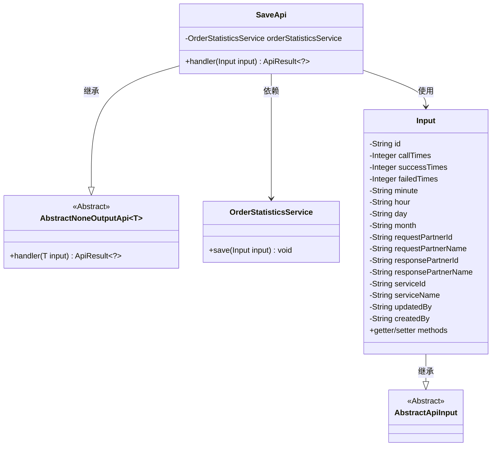

# 基础信息

|      |      |
|------|------|
| 名称 | SaveApi |
| 编码语言 | .java |
| 代码路径 | WeFe/serving/serving-service/src/main/java/com/welab/wefe/serving/service/api/orderstatistics/SaveApi.java |
| 包名 | com.welab.wefe.serving.service.api.orderstatistics |
| 依赖项 | ['com.welab.wefe.common.exception.StatusCodeWithException', 'com.welab.wefe.common.fieldvalidate.annotation.Check', 'com.welab.wefe.common.web.api.base.AbstractNoneOutputApi', 'com.welab.wefe.common.web.api.base.Api', 'com.welab.wefe.common.web.dto.AbstractApiInput', 'com.welab.wefe.common.web.dto.ApiResult', 'com.welab.wefe.serving.service.service.OrderStatisticsService', 'org.springframework.beans.factory.annotation.Autowired'] |
| 概述说明 | 新增订单统计接口，接收请求次数、成功失败次数、时间、请求响应方及服务信息等输入，调用服务保存数据。 |

# 说明

这是一个名为SaveApi的Java类，用于新增订单统计。它继承自AbstractNoneOutputApi，输入参数为Input类。主要功能是通过OrderStatisticsService保存订单统计数据。Input类包含多个字段，如id、总请求次数、总成功次数、总失败次数、时间相关字段（分钟、小时、天、月）、请求方和响应方的ID和名称、服务ID和名称、更新人和创建人等。每个字段都有对应的getter和setter方法。handler方法处理输入参数并调用服务保存数据。

# 类列表 Class Summary

| 名称   | 类型  | 说明 |
|-------|------|-------------|
| SaveApi | class | 新增订单统计接口，接收订单统计数据并保存，包含请求次数、成功失败次数、时间信息、合作方及服务信息等字段。 |

## 类 SaveApi

|      |      |
|------|------|
| 访问范围 | @Api(path = "orderstatistics/save", name = "新增订单统计");public |
| 类型 | class |
| 名称 | SaveApi |
| 说明 | 新增订单统计接口，接收订单统计数据并保存，包含请求次数、成功失败次数、时间信息、合作方及服务信息等字段。 |

### UML类图

该类图展示了订单统计保存API的结构设计。SaveApi继承自泛型抽象类AbstractNoneOutputApi，并实现了对Input参数的处理逻辑。Input类继承自AbstractApiInput，包含订单统计相关的20余个字段及其getter/setter方法。SaveApi通过依赖OrderStatisticsService完成数据持久化操作，整体采用分层架构设计，Input类作为数据传输对象封装了完整的订单统计信息。

### 内部方法调用关系图

```mermaid
graph TD
    A["类SaveApi"]
    B["注解: @Api(path='orderstatistics/save', name='新增订单统计')"]
    C["继承: AbstractNoneOutputApi<Input>"]
    D["依赖注入: @Autowired OrderStatisticsService"]
    E["重写方法: handler(Input input)"]
    F["调用: orderStatisticsService.save(input)"]
    G["返回: success()"]
    H["静态内部类Input"]
    I["继承: AbstractApiInput"]
    J["校验字段: 17个@Check标注属性"]
    K["Getter/Setter方法: 每个属性对应"]

    A --> B
    A --> C
    A --> D
    A --> E
    E --> F
    F --> G
    A --> H
    H --> I
    H --> J
    H --> K
```

该流程图展示了SaveApi类的完整结构，包含API注解、父类继承、服务注入和核心处理方法。内部类Input作为参数载体，继承标准输入基类并包含17个校验字段及其访问方法。主要流程是handler方法接收输入参数后调用服务层保存数据，最后返回成功结果。整个设计体现了清晰的层次结构和职责分离，符合API接口的典型实现模式。

### 字段列表 Field List

| 名称  | 类型  | 说明 |
|-------|-------|------|
| orderStatisticsService | OrderStatisticsService | 使用@Autowired自动注入OrderStatisticsService实例。 |

### 方法列表

| 名称  | 类型  | 说明 |
|-------|-------|------|
| handler | ApiResult<?> | 重写handler方法，调用orderStatisticsService保存输入数据并返回成功结果。 |

