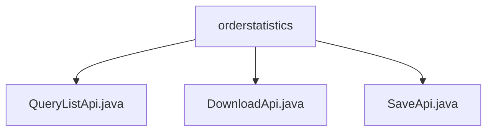

# 基础信息

|      |      |
|------|------|
| 名称 | orderstatistics |
| 编码语言 | .java |
| 代码路径 | WeFe/serving/serving-service/src/main/java/com/welab/wefe/serving/service/api/orderstatistics |
| 包名 | docs.serving.serving-service.src.main.java.com.welab.wefe.serving.service.api.orderstatistics |
| 概述说明 | QueryListApi用于查询订单统计列表，处理分页及多条件查询，返回统计信息。DownloadApi下载订单统计数据为CSV文件，校验输入参数并处理异常。SaveApi新增订单统计，保存输入数据到服务。 |

# 说明

## 概述  
该模块核心职责是提供订单统计数据的查询、下载和保存功能，支持分页处理和CSV导出。接口规范统一继承AbstractApi基类，输入参数均包含时间范围、请求方/响应方信息和服务标识，输出采用分页结构或文件流。关键数据结构包括统计粒度（分钟/小时/天/月）、请求次数指标和时间维度字段。外部依赖仅为OrderStatisticsService，用于业务逻辑处理。例如QueryListApi返回分页统计结果，DownloadApi生成CSV文件，SaveApi持久化统计数据。

## 主要业务场景  
模块支持三种典型交互：查询统计列表（类似分页表格渲染）、批量导出数据（类似报表下载）和实时数据入库。完整业务流程涵盖统计生成→查询展示→导出归档，API类型包含RESTful查询和文件下载。例如用户可查询分钟级请求成功率，导出月维度报表，或通过SaveApi写入实时统计。所有操作均围绕时间维度和服务标识展开，采用服务层统一处理模式。

### 包内部结构视图

该流程图展示了orderstatistics目录下的三个Java文件：QueryListApi.java、DownloadApi.java和SaveApi.java。这些文件都直接隶属于orderstatistics目录，没有更深层次的嵌套结构。每个文件代表不同的API功能实现，分别用于查询列表、下载和保存操作。整个结构简洁明了，体现了单一目录下的多文件平级关系。

# 文件列表

| 名称   | 类型  | 说明 |
|-------|------|-------------|
| [QueryListApi.java](QueryListApi.md) | file | 查询订单统计列表的API，包含时间、合作方、服务等查询条件，返回分页的请求次数、成功失败次数等统计结果。 |
| [DownloadApi.java](DownloadApi.md) | file | DownloadApi类处理订单统计文件下载，输入参数包括时间、合作方信息和服务详情，输出CSV文件响应，包含缓存和内容配置。 |
| [SaveApi.java](SaveApi.md) | file | 新增订单统计接口，接收请求次数、成功失败次数、时间、请求响应方及服务信息等输入，调用服务保存数据。 |

