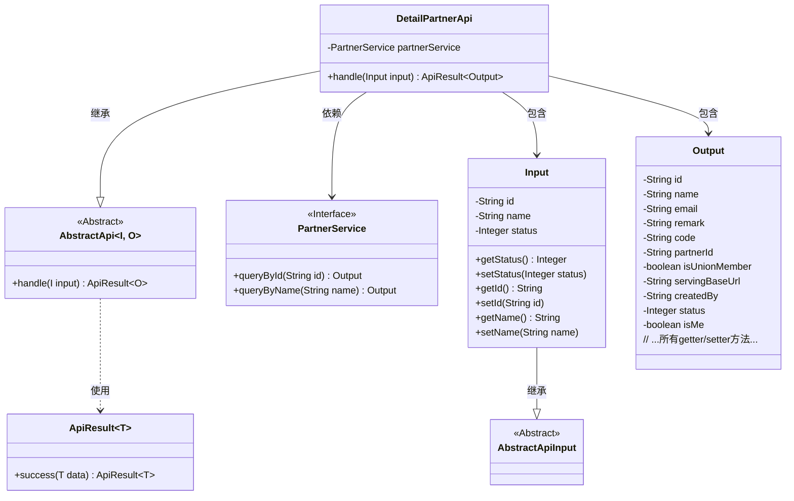

# 基础信息

|      |      |
|------|------|
| 名称 | DetailPartnerApi |
| 编码语言 | .java |
| 代码路径 | WeFe/serving/serving-service/src/main/java/com/welab/wefe/serving/service/api/partner/DetailPartnerApi.java |
| 包名 | com.welab.wefe.serving.service.api.partner |
| 依赖项 | ['org.springframework.beans.factory.annotation.Autowired', 'com.welab.wefe.common.fieldvalidate.annotation.Check', 'com.welab.wefe.common.web.api.base.AbstractApi', 'com.welab.wefe.common.web.api.base.Api', 'com.welab.wefe.common.web.dto.AbstractApiInput', 'com.welab.wefe.common.web.dto.ApiResult', 'com.welab.wefe.serving.service.service.PartnerService'] |
| 概述说明 | DetailPartnerApi通过ID或名称查询合作伙伴详情，输入包含ID、名称和状态，输出包含合作伙伴详细信息如ID、名称、邮箱等。 |

# 说明

DetailPartnerApi是一个用于获取合作伙伴详情的API类，继承自AbstractApi。它通过PartnerService处理输入请求，支持根据ID或名称查询合作伙伴信息。输入类Input包含id、name和status字段，均带有校验注解。输出类Output包含合作伙伴的详细信息，如id、name、email、remark、code、partnerId、isUnionMember、servingBaseUrl、createdBy、status和isMe等字段，并提供了相应的getter和setter方法。API路径为"partner/detail"，名称为"get partner"。

# 类列表 Class Summary

| 名称   | 类型  | 说明 |
|-------|------|-------------|
| DetailPartnerApi | class | DetailPartnerApi通过ID或名称查询合作伙伴信息，输入包含ID、名称和状态，输出包含合作伙伴详细信息如ID、名称、邮箱等。 |

## 类 DetailPartnerApi

|      |      |
|------|------|
| 访问范围 | @Api(path = "partner/detail", name = "get partner");public |
| 类型 | class |
| 名称 | DetailPartnerApi |
| 说明 | DetailPartnerApi通过ID或名称查询合作伙伴信息，输入包含ID、名称和状态，输出包含合作伙伴详细信息如ID、名称、邮箱等。 |

### UML类图

类图描述：
该图展示了一个合作伙伴详情查询API的类结构，核心是继承自AbstractApi的DetailPartnerApi类，包含Input和Output两个静态内部类。DetailPartnerApi通过PartnerService接口查询数据，根据输入参数不同（ID或名称）调用不同查询方法。Input类继承自AbstractApiInput，包含客户端ID、名称和状态等校验字段；Output类包含合作伙伴的详细信息字段。整体采用泛型设计，AbstractApi定义了输入输出泛型模板，ApiResult用于包装返回结果。

### 内部方法调用关系图

```mermaid
graph TD
    A["类DetailPartnerApi"]
    B["注解: @Api(path='partner/detail', name='get partner')"]
    C["继承: AbstractApi<Input, Output>"]
    D["依赖注入: @Autowired PartnerService"]
    E["重写方法: handle(Input input)"]
    F["条件判断: input.getId() != null"]
    G["调用: partnerService.queryById"]
    H["条件判断: input.getName() != null"]
    I["调用: partnerService.queryByName"]
    J["返回: ApiResult<Output>"]
    K["嵌套类: Input"]
    L["属性: String id, String name, Integer status"]
    M["方法: getter/setter"]
    N["嵌套类: Output"]
    O["属性: String id, name, email..."]
    P["方法: getter/setter"]

    A --> B
    A --> C
    A --> D
    A --> E
    E --> F
    F --是--> G
    F --否--> H
    H --是--> I
    G --> J
    I --> J
    A --> K
    K --> L
    K --> M
    A --> N
    N --> O
    N --> P
```

这段代码是DetailPartnerApi类的实现，继承自AbstractApi并处理合作伙伴详情查询。流程图展示了主类结构、依赖注入、核心handle方法的分支逻辑（根据ID或名称查询合作伙伴），以及嵌套的Input/Output类的属性结构。handle方法通过PartnerService执行实际查询，返回封装在ApiResult中的结果。Input类包含查询参数和校验注解，Output类则封装了丰富的合作伙伴详情字段。

### 字段列表 Field List

| 名称  | 类型  | 说明 |
|-------|-------|------|
| partnerService | PartnerService | 使用@Autowired自动注入PartnerService实例。 |

### 方法列表

| 名称  | 类型  | 说明 |
|-------|-------|------|
| handle | ApiResult<Output> | 方法根据输入ID或名称查询合作伙伴，返回对应结果，无匹配返回null。 |

