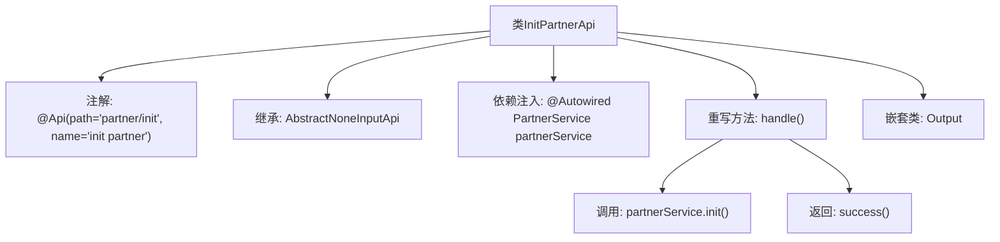

# 基础信息

|      |      |
|------|------|
| 名称 | InitPartnerApi |
| 编码语言 | .java |
| 代码路径 | WeFe/serving/serving-service/src/main/java/com/welab/wefe/serving/service/api/partner/InitPartnerApi.java |
| 包名 | com.welab.wefe.serving.service.api.partner |
| 依赖项 | ['org.springframework.beans.factory.annotation.Autowired', 'com.welab.wefe.common.exception.StatusCodeWithException', 'com.welab.wefe.common.web.api.base.AbstractNoneInputApi', 'com.welab.wefe.common.web.api.base.Api', 'com.welab.wefe.common.web.dto.ApiResult', 'com.welab.wefe.serving.service.service.PartnerService'] |
| 概述说明 | 这是一个名为"init partner"的API类，路径为"partner/init"，继承自AbstractNoneInputApi，使用PartnerService初始化合作伙伴，无输入参数，返回空输出。 |

# 说明

这是一个名为InitPartnerApi的Java类，用于初始化合作伙伴。它继承自AbstractNoneInputApi类，泛型参数为内部类Output。类上标注了Api注解，指定路径为"partner/init"，名称为"init partner"。通过Autowired注入了PartnerService依赖。重写了handle方法，调用partnerService.init()进行初始化操作后返回成功结果。内部定义了一个空的Output静态类作为响应数据结构。整个类实现了一个无需输入参数的初始化合作伙伴API接口。

# 类列表 Class Summary

| 名称   | 类型  | 说明 |
|-------|------|-------------|
| InitPartnerApi | class | 初始化合作伙伴API，调用PartnerService的init方法，无输入参数，返回空输出。 |


## 类 InitPartnerApi

|      |      |
|------|------|
| 访问范围 | @Api(path = "partner/init", name = "init partner");public |
| 类型 | class |
| 名称 | InitPartnerApi |
| 说明 | 初始化合作伙伴API，调用PartnerService的init方法，无输入参数，返回空输出。 |


### UML类图

```mermaid
classDiagram
    class InitPartnerApi {
        -PartnerService partnerService
        +handle() ApiResult~Output~
    }
    class AbstractNoneInputApi~T~ {
        <<Abstract>>
        +handle() ApiResult~T~
    }
    class PartnerService {
        <<Interface>>
        +init()
    }
    class Output {
    }
    class ApiResult~T~ {
    }

    InitPartnerApi --|> AbstractNoneInputApi~Output~ : 继承
    InitPartnerApi --> PartnerService : 依赖
    InitPartnerApi --> Output : 包含
    AbstractNoneInputApi ~.~ ApiResult : 使用泛型
```

类图描述：该图展示了InitPartnerApi类继承自泛型类AbstractNoneInputApi<Output>，并依赖PartnerService接口的实现。InitPartnerApi重写了父类的handle方法，返回ApiResult<Output>类型结果。PartnerService作为接口提供init()方法，Output作为静态嵌套类用于封装返回数据。整体结构体现了Spring框架中典型的API控制器设计模式。


### 内部方法调用关系图



该流程图展示了InitPartnerApi类的结构，它是一个带有@Api注解的REST接口类，继承自AbstractNoneInputApi并指定泛型为内部类Output。核心逻辑在重写的handle方法中，通过自动注入的PartnerService执行初始化操作后返回成功结果。嵌套类Output作为空结构体用于类型占位。

### 字段列表 Field List

| 名称  | 类型  | 说明 |
|-------|-------|------|
| partnerService | PartnerService | 使用@Autowired自动注入PartnerService实例。 |

### 方法列表

| 名称  | 类型  | 说明 |
|-------|-------|------|
| handle | ApiResult<Output> | 代码重写handle方法，初始化partnerService并返回成功结果。 |


