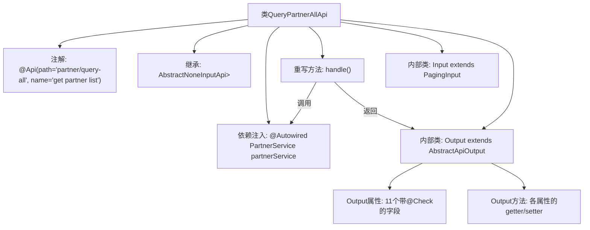

# 基础信息

|      |      |
|------|------|
| 名称 | QueryPartnerAllApi |
| 编码语言 | .java |
| 代码路径 | WeFe/serving/serving-service/src/main/java/com/welab/wefe/serving/service/api/partner/QueryPartnerAllApi.java |
| 包名 | com.welab.wefe.serving.service.api.partner |
| 依赖项 | ['java.util.Date', 'java.util.List', 'org.springframework.beans.factory.annotation.Autowired', 'com.welab.wefe.common.fieldvalidate.annotation.Check', 'com.welab.wefe.common.web.api.base.AbstractNoneInputApi', 'com.welab.wefe.common.web.api.base.Api', 'com.welab.wefe.common.web.dto.AbstractApiOutput', 'com.welab.wefe.common.web.dto.ApiResult', 'com.welab.wefe.serving.service.dto.PagingInput', 'com.welab.wefe.serving.service.service.PartnerService'] |
| 概述说明 | 查询所有合作者信息的API，包含ID、名称、邮箱等字段，返回列表结果。 |

# 说明

该代码定义了一个名为QueryPartnerAllApi的API类，用于获取合作伙伴列表。API路径为partner/query-all，无需输入参数，返回合作伙伴列表。输出类Output包含合作伙伴的详细信息，如ID、名称、邮箱、code、是否联邦成员、服务地址、备注、创建时间、创建人、更新人和状态等字段，每个字段都有对应的getter和setter方法。处理逻辑通过调用partnerService的queryAll方法获取数据并返回成功结果。

# 类列表 Class Summary

| 名称   | 类型  | 说明 |
|-------|------|-------------|
| QueryPartnerAllApi | class | 查询所有合作伙伴信息的API，包含ID、名称、邮箱等详细信息，通过PartnerService获取数据并返回结果列表。 |


## 类 QueryPartnerAllApi

|      |      |
|------|------|
| 访问范围 | @Api(path = "partner/query-all", name = "get partner list");public |
| 类型 | class |
| 名称 | QueryPartnerAllApi |
| 说明 | 查询所有合作伙伴信息的API，包含ID、名称、邮箱等详细信息，通过PartnerService获取数据并返回结果列表。 |


### UML类图

```mermaid
classDiagram
    class QueryPartnerAllApi {
        -PartnerService partnerService
        +handle() ApiResult~List~Output~~
    }
    
    class AbstractNoneInputApi~R~ {
        <<Abstract>>
        +handle() R
    }
    
    class PartnerService {
        <<Interface>>
        +queryAll() List~Output~
    }
    
    class Input {
        <<InnerClass>>
        +PagingInput superclass
    }
    
    class Output {
        <<InnerClass>>
        -String id
        -String name
        -String email
        -String code
        -boolean isUnionMember
        -String servingBaseUrl
        -String remark
        -Date createdTime
        -String createdBy
        -String updatedBy
        -Integer status
        +getter/setter methods
    }
    
    class PagingInput {
        <<BaseClass>>
    }
    
    class AbstractApiOutput {
        <<Abstract>>
    }
    
    QueryPartnerAllApi --|> AbstractNoneInputApi~List~Output~~ : 继承
    QueryPartnerAllApi --> PartnerService : 依赖
    Input --|> PagingInput : 继承
    Output --|> AbstractApiOutput : 继承
```

这段代码描述了一个查询合作伙伴列表的API实现。QueryPartnerAllApi继承自AbstractNoneInputApi抽象类，通过PartnerService接口获取数据，返回包含合作伙伴详细信息的Output对象列表。Input和Output作为内部类，分别继承自PagingInput和AbstractApiOutput。Output类包含合作伙伴的各类属性（如ID、名称、邮箱等）及其getter/setter方法，并使用@Check注解进行参数校验。整个设计体现了清晰的层级关系和职责分离，Input处理分页参数，Output封装响应数据结构。


### 内部方法调用关系图



该流程图展示了QueryPartnerAllApi类的完整结构，包含API注解、父类继承、服务注入和两个内部类的定义。核心处理流程是handle()方法通过partnerService.queryAll()获取数据后，包装成Output对象列表返回。Output类包含11个带校验注解的合作伙伴属性及其访问方法，Input类则继承自分页参数基类。整个设计实现了合作伙伴查询API的标准化封装。

### 字段列表 Field List

| 名称  | 类型  | 说明 |
|-------|-------|------|
| partnerService | PartnerService | 使用@Autowired自动注入PartnerService实例。 |

### 方法列表

| 名称  | 类型  | 说明 |
|-------|-------|------|
| handle | ApiResult<List<QueryPartnerAllApi.Output>> | 这段代码重写了handle方法，返回一个包含所有合作伙伴查询结果的ApiResult成功响应。 |


