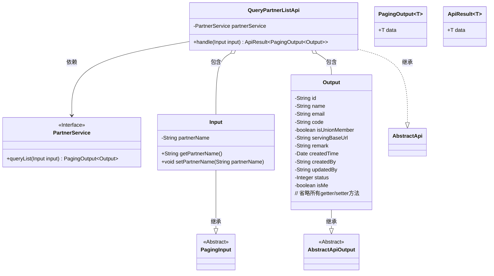

# 基础信息

|      |      |
|------|------|
| 名称 | QueryPartnerListApi |
| 编码语言 | .java |
| 代码路径 | WeFe/serving/serving-service/src/main/java/com/welab/wefe/serving/service/api/partner/QueryPartnerListApi.java |
| 包名 | com.welab.wefe.serving.service.api.partner |
| 依赖项 | ['java.util.Date', 'org.springframework.beans.factory.annotation.Autowired', 'com.welab.wefe.common.fieldvalidate.annotation.Check', 'com.welab.wefe.common.web.api.base.AbstractApi', 'com.welab.wefe.common.web.api.base.Api', 'com.welab.wefe.common.web.dto.AbstractApiOutput', 'com.welab.wefe.common.web.dto.ApiResult', 'com.welab.wefe.serving.service.dto.PagingInput', 'com.welab.wefe.serving.service.dto.PagingOutput', 'com.welab.wefe.serving.service.service.PartnerService'] |
| 概述说明 | 定义查询合作伙伴列表的API接口，包含分页输入参数和输出结果，输出含ID、名称、邮箱等详细信息。 |

# 说明

该代码定义了一个名为QueryPartnerListApi的API类，用于获取合作伙伴列表。API路径为partner/query-list，输入参数Input继承自PagingInput，包含合作者名称partnerName。输出Output继承自AbstractApiOutput，包含合作者id、名称、邮箱、code、是否联邦成员、服务地址、备注、创建时间、创建人、更新人、状态及是否自己等字段。API通过PartnerService的queryList方法处理请求并返回分页结果。所有字段均有校验注解Check标注属性名称。

# 类列表 Class Summary

| 名称   | 类型  | 说明 |
|-------|------|-------------|
| QueryPartnerListApi | class | QueryPartnerListApi是获取合作者列表的接口，输入包含分页和合作者名称，输出包含合作者ID、名称、邮箱等详细信息，支持分页返回。 |

## 类 QueryPartnerListApi

|      |      |
|------|------|
| 访问范围 | @Api(path = "partner/query-list", name = "get partner list");public |
| 类型 | class |
| 名称 | QueryPartnerListApi |
| 说明 | QueryPartnerListApi是获取合作者列表的接口，输入包含分页和合作者名称，输出包含合作者ID、名称、邮箱等详细信息，支持分页返回。 |

### UML类图

这段代码展示了一个查询合作伙伴列表的API实现，核心类QueryPartnerListApi继承自AbstractApi，处理分页查询请求。类图清晰地展示了类之间的关系：Input继承自PagingInput用于接收分页参数，Output继承自AbstractApiOutput包含丰富的合作伙伴信息字段，PartnerService接口提供查询功能。整个设计体现了分层架构思想，输入输出与业务逻辑分离，通过泛型实现了灵活的类型处理。

### 内部方法调用关系图

```mermaid
graph TD
    A["类QueryPartnerListApi"]
    B["注解: @Api(path='partner/query-list', name='get partner list')"]
    C["继承: AbstractApi<Input, PagingOutput<Output>>"]
    D["依赖注入: @Autowired PartnerService"]
    E["重写方法: handle(Input input)"]
    F["内部类: Input extends PagingInput"]
    G["内部类: Output extends AbstractApiOutput"]
    H["Input属性: String partnerName"]
    I["Input方法: getter/setter"]
    J["Output属性: id/name/email/code/isUnionMember等"]
    K["Output方法: 全部字段的getter/setter"]

    A --> B
    A --> C
    A --> D
    A --> E
    A --> F
    A --> G
    F --> D
    F -->|调用| D["partnerService.queryList(input)"]
    F -->|返回| E["success()"]
    F --> H
    F --> I
    G --> J
    G --> K
```

流程图描述：该流程图展示了QueryPartnerListApi类的完整结构，包括类注解、继承关系、依赖注入的PartnerService，以及重写的handle方法处理流程。重点呈现了内部类Input和Output的结构，其中Input包含分页参数和合作者名称，Output包含12个带校验注解的属性和对应的getter/setter方法。handle方法通过调用partnerService.queryList实现业务逻辑，最终返回包装后的分页结果。

### 字段列表 Field List

| 名称  | 类型  | 说明 |
|-------|-------|------|
| partnerService | PartnerService | 使用@Autowired自动注入PartnerService实例。 |

### 方法列表

| 名称  | 类型  | 说明 |
|-------|-------|------|
| handle | ApiResult<PagingOutput<Output>> | Java方法重写，调用partnerService.queryList处理输入并返回分页结果。 |

