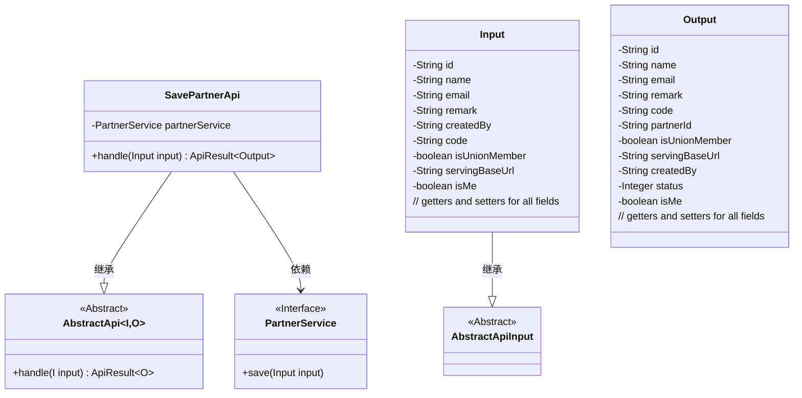

# 基础信息

|      |      |
|------|------|
| 名称 | SavePartnerApi |
| 编码语言 | .java |
| 代码路径 | WeFe/serving/serving-service/src/main/java/com/welab/wefe/serving/service/api/partner/SavePartnerApi.java |
| 包名 | com.welab.wefe.serving.service.api.partner |
| 依赖项 | ['com.welab.wefe.common.fieldvalidate.annotation.Check', 'com.welab.wefe.common.web.api.base.AbstractApi', 'com.welab.wefe.common.web.api.base.Api', 'com.welab.wefe.common.web.dto.AbstractApiInput', 'com.welab.wefe.common.web.dto.ApiResult', 'com.welab.wefe.serving.service.service.PartnerService', 'org.springframework.beans.factory.annotation.Autowired'] |
| 概述说明 | 保存合作者信息的API，包含输入输出类，输入有名称、邮箱等字段，输出返回合作者详细信息。 |

# 说明

这是一个名为SavePartnerApi的API类，用于保存合作者信息。它继承自AbstractApi，包含输入类Input和输出类Output。Input类定义了合作者的各种属性，如id、name、email等，并带有校验注解。Output类包含与Input类相似的属性，并额外增加了status和partnerId字段。API通过注入的PartnerService处理输入数据并返回成功结果。该API路径为partner/save，名称为save partner。

# 类列表 Class Summary

| 名称   | 类型  | 说明 |
|-------|------|-------------|
| SavePartnerApi | class | SavePartnerApi类用于保存合作者信息，包含输入输出类。输入类有id、name、email等字段，输出类包含类似字段及状态等。通过partnerService保存输入数据。 |

## 类 SavePartnerApi

|      |      |
|------|------|
| 访问范围 | @Api(path = "partner/save", name = "save partner");public |
| 类型 | class |
| 名称 | SavePartnerApi |
| 说明 | SavePartnerApi类用于保存合作者信息，包含输入输出类。输入类有id、name、email等字段，输出类包含类似字段及状态等。通过partnerService保存输入数据。 |

### UML类图

该代码实现了一个保存合作者信息的API，包含输入输出数据结构和业务处理逻辑。SavePartnerApi继承自泛型抽象类AbstractApi，使用PartnerService处理核心业务。Input类继承AbstractApiInput包含合作者基本信息，Output类包含操作结果数据。类图展示了继承关系和依赖关系，体现了清晰的层次结构设计。

### 内部方法调用关系图

```mermaid
graph TD
    A["类SavePartnerApi"]
    B["注解: @Api(path='partner/save', name='save partner')"]
    C["继承: AbstractApi<Input, Output>"]
    D["依赖注入: @Autowired PartnerService"]
    E["重写方法: handle(Input input)"]
    F["内部类: Input"]
    G["内部类: Output"]
    H["Input属性: id, name, email, remark, createdBy, code, isUnionMember, servingBaseUrl, isMe"]
    I["Input方法: getter/setter"]
    J["Output属性: id, name, email, remark, code, partnerId, isUnionMember, servingBaseUrl, createdBy, status, isMe"]
    K["Output方法: getter/setter"]

    A --> B
    A --> C
    A --> D
    A --> E
    A --> F
    A --> G
    F --> H
    F --> I
    G --> J
    G --> K
    E --> D
    E --> F
    E --> G
```

这段代码描述了一个保存合作者信息的API类SavePartnerApi，继承自AbstractApi并实现了输入输出参数的封装。流程图展示了类结构关系，包括注解声明、父类继承、服务注入、核心处理方法handle()以及两个内部数据类Input和Output的定义。Input类包含9个带校验注解的属性和对应getter/setter，Output类包含11个属性和对应getter/setter，handle方法通过partnerService保存输入数据并返回成功结果。

### 字段列表 Field List

| 名称  | 类型  | 说明 |
|-------|-------|------|
| partnerService | PartnerService | 自动注入PartnerService实例。 |

### 方法列表

| 名称  | 类型  | 说明 |
|-------|-------|------|
| handle | ApiResult<Output> | 处理输入并保存，成功后返回结果。 |

