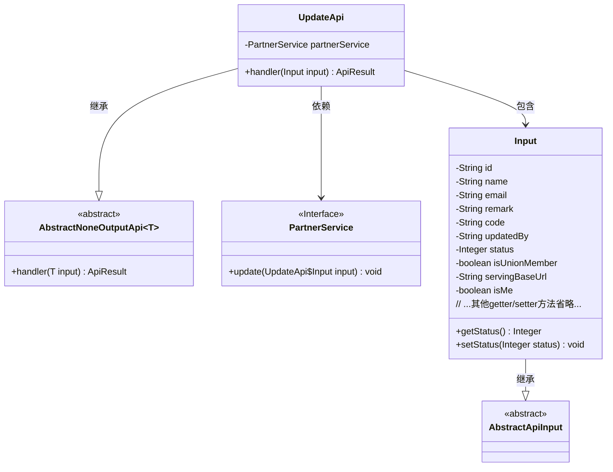

# 基础信息

|      |      |
|------|------|
| 名称 | UpdateApi |
| 编码语言 | .java |
| 代码路径 | WeFe/serving/serving-service/src/main/java/com/welab/wefe/serving/service/api/partner/UpdateApi.java |
| 包名 | com.welab.wefe.serving.service.api.partner |
| 依赖项 | ['org.springframework.beans.factory.annotation.Autowired', 'com.welab.wefe.common.exception.StatusCodeWithException', 'com.welab.wefe.common.fieldvalidate.annotation.Check', 'com.welab.wefe.common.web.api.base.AbstractNoneOutputApi', 'com.welab.wefe.common.web.api.base.Api', 'com.welab.wefe.common.web.dto.AbstractApiInput', 'com.welab.wefe.common.web.dto.ApiResult', 'com.welab.wefe.serving.service.service.PartnerService'] |
| 概述说明 | UpdateApi类用于更新合作者信息，包含必填字段名称和状态，可选字段如ID、邮箱、备注等，调用PartnerService执行更新操作。 |

# 说明

UpdateApi是一个用于更新合作者信息的API类，继承自AbstractNoneOutputApi，处理输入类型为Input。通过PartnerService执行更新操作，成功后返回空结果。Input类包含多个字段：必填的合作者名称和状态、联邦成员标识、服务地址、修改人等，以及可选的ID、邮箱、备注、code和是否为自己标识。每个字段都有对应的getter和setter方法，部分字段通过Check注解进行校验。

# 类列表 Class Summary

| 名称   | 类型  | 说明 |
|-------|------|-------------|
| UpdateApi | class | UpdateApi类用于更新合作者信息，包含必填字段如名称、状态、是否联邦成员，以及可选字段如ID、邮箱、备注等。通过PartnerService执行更新操作。 |

## 类 UpdateApi

|      |      |
|------|------|
| 访问范围 | @Api(path = "partner/update", name = "update");public |
| 类型 | class |
| 名称 | UpdateApi |
| 说明 | UpdateApi类用于更新合作者信息，包含必填字段如名称、状态、是否联邦成员，以及可选字段如ID、邮箱、备注等。通过PartnerService执行更新操作。 |

### UML类图

类图描述：
该代码展示了一个更新合作者信息的API实现，核心类UpdateApi继承自AbstractNoneOutputApi泛型类，并包含一个静态内部类Input作为输入参数。UpdateApi通过依赖PartnerService接口完成业务逻辑，Input类继承自AbstractApiInput并包含多个带校验注解的字段。类图清晰地反映了继承关系（UpdateApi→AbstractNoneOutputApi、Input→AbstractApiInput）、组合关系（UpdateApi包含Input）和依赖关系（UpdateApi使用PartnerService）。输入参数类包含11个不同数据类型的字段，每个字段都通过@Check注解进行校验控制。

### 内部方法调用关系图

```mermaid
graph TD
    A["类UpdateApi"]
    B["注解: @Api(path='partner/update', name='update')"]
    C["继承: AbstractNoneOutputApi<Input>"]
    D["依赖注入: @Autowired PartnerService"]
    E["重写方法: handler(Input input)"]
    F["内部类: Input"]
    G["属性: String id"]
    H["属性: String name"]
    I["属性: String email"]
    J["属性: String remark"]
    K["属性: String code"]
    L["属性: String updatedBy"]
    M["属性: Integer status"]
    N["属性: boolean isUnionMember"]
    O["属性: String servingBaseUrl"]
    P["属性: boolean isMe"]
    Q["校验注解: @Check"]
    R["Getter/Setter方法"]

    A --> B
    A --> C
    A --> D
    A --> E
    A --> F
    F --> G
    F --> H
    F --> I
    F --> J
    F --> K
    F --> L
    F --> M
    F --> N
    F --> O
    F --> P
    G --> Q
    H --> Q
    I --> Q
    J --> Q
    K --> Q
    L --> Q
    M --> Q
    N --> Q
    O --> Q
    P --> Q
    F --> R
```

这段代码描述了一个用于更新合作伙伴信息的API类UpdateApi，它继承自抽象类AbstractNoneOutputApi并包含一个输入参数内部类Input。流程图展示了类结构、注解使用、属性定义和校验规则，重点呈现了输入参数的复杂校验逻辑和类之间的继承关系。该API通过PartnerService执行更新操作，输入参数包含11个带校验规则的字段，每个字段都有对应的getter/setter方法。

### 字段列表 Field List

| 名称  | 类型  | 说明 |
|-------|-------|------|
| partnerService | PartnerService | 自动注入PartnerService实例。 |

### 方法列表

| 名称  | 类型  | 说明 |
|-------|-------|------|
| handler | ApiResult<?> | Java方法重写，调用partnerService更新输入数据，成功后返回ApiResult。异常时抛出StatusCodeWithException。 |

