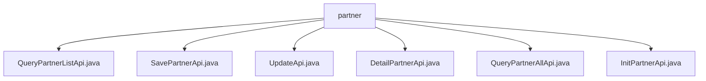

# 基础信息

|      |      |
|------|------|
| 名称 | partner |
| 编码语言 | .java |
| 代码路径 | WeFe/serving/serving-service/src/main/java/com/welab/wefe/serving/service/api/partner |
| 包名 | docs.serving.serving-service.src.main.java.com.welab.wefe.serving.service.api.partner |
| 概述说明 | QueryPartnerListApi查询合作伙伴列表，SavePartnerApi保存合作者信息，UpdateApi更新合作者，DetailPartnerApi获取详情，QueryPartnerAllApi获取所有合作伙伴，InitPartnerApi初始化合作伙伴。 |

# 说明

## 概述  
该模块核心职责是管理合作伙伴信息，提供合作伙伴的增删改查、初始化及列表查询等功能。接口规范统一继承自AbstractApi基类，采用RESTful路径设计（如`partner/query-list`），输入输出均包含校验注解。关键数据结构包括Partner实体字段（如id、name、email、status等）和分页参数PagingInput。外部依赖仅为PartnerService，用于处理业务逻辑。例如，SavePartnerApi保存合作伙伴信息，QueryPartnerListApi支持分页查询。

## 主要业务场景  
模块支持合作伙伴全生命周期管理：初始化（InitPartnerApi）、创建（SavePartnerApi）、更新（UpdateApi）、详情查询（DetailPartnerApi）及列表获取（QueryPartnerListApi/QueryPartnerAllApi）。交互模式类似CRUD操作，通过PartnerService集中处理数据。典型应用包括联邦学习场景下的成员管理，例如通过isUnionMember字段标识联邦成员，servingBaseUrl字段配置服务地址。API类型覆盖带参查询、无参列表及空响应操作。

### 包内部结构视图

该流程图展示了WeFe项目中partner目录下的API文件结构。根节点为partner文件夹，包含6个Java API文件：QueryPartnerListApi、SavePartnerApi、UpdateApi、DetailPartnerApi、QueryPartnerAllApi和InitPartnerApi，这些文件均直接隶属于partner目录，没有更深层级的子目录结构。

# 文件列表

| 名称   | 类型  | 说明 |
|-------|------|-------------|
| [QueryPartnerListApi.java](QueryPartnerListApi.md) | file | 定义查询合作伙伴列表的API接口，包含分页输入参数和输出结果，输出含ID、名称、邮箱等详细信息。 |
| [SavePartnerApi.java](SavePartnerApi.md) | file | 保存合作者信息的API，包含输入输出类，输入有名称、邮箱等字段，输出返回合作者详细信息。 |
| [UpdateApi.java](UpdateApi.md) | file | UpdateApi类用于更新合作者信息，包含必填字段名称和状态，可选字段如ID、邮箱、备注等，调用PartnerService执行更新操作。 |
| [DetailPartnerApi.java](DetailPartnerApi.md) | file | DetailPartnerApi通过ID或名称查询合作伙伴详情，输入包含ID、名称和状态，输出包含合作伙伴详细信息如ID、名称、邮箱等。 |
| [QueryPartnerAllApi.java](QueryPartnerAllApi.md) | file | 查询所有合作者信息的API，包含ID、名称、邮箱等字段，返回列表结果。 |
| [InitPartnerApi.java](InitPartnerApi.md) | file | 这是一个名为"init partner"的API类，路径为"partner/init"，继承自AbstractNoneInputApi，使用PartnerService初始化合作伙伴，无输入参数，返回空输出。 |

