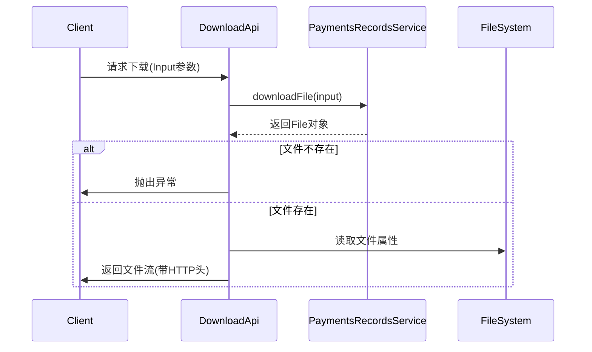

# 基础信息

|      |      |
|------|------|
| 名称 | DownloadApi |
| 编码语言 | .java |
| 代码路径 | WeFe/serving/serving-service/src/main/java/com/welab/wefe/serving/service/api/paymentsrecords/DownloadApi.java |
| 包名 | com.welab.wefe.serving.service.api.paymentsrecords |
| 依赖项 | ['com.welab.wefe.common.StatusCode', 'com.welab.wefe.common.exception.StatusCodeWithException', 'com.welab.wefe.common.fieldvalidate.annotation.Check', 'com.welab.wefe.common.web.api.base.AbstractApi', 'com.welab.wefe.common.web.api.base.Api', 'com.welab.wefe.common.web.dto.AbstractApiInput', 'com.welab.wefe.common.web.dto.ApiResult', 'com.welab.wefe.serving.service.service.PaymentsRecordsService', 'org.springframework.beans.factory.annotation.Autowired', 'org.springframework.core.io.FileSystemResource', 'org.springframework.http.HttpHeaders', 'org.springframework.http.MediaType', 'org.springframework.http.ResponseEntity', 'java.io.File', 'java.io.IOException'] |
| 概述说明 | 支付记录下载API类，通过输入参数查询并返回CSV文件，包含服务名、客户名、时间范围等筛选条件，处理文件不存在异常并设置响应头。 |

# 说明

DownloadApi类是一个用于下载支付记录的API，路径为"paymentsrecords/download"。它继承自AbstractApi，处理Input输入并返回ResponseEntity。主要功能包括调用paymentsRecordsService下载文件，检查文件是否存在，设置HTTP响应头（缓存控制、内容描述、最后修改时间和ETag），并返回文件资源。Input类包含多个校验字段：serviceName、clientName、startTime、endTime、serviceType和payType，均提供getter和setter方法。

# 类列表 Class Summary

| 名称   | 类型  | 说明 |
|-------|------|-------------|
| DownloadApi | class | 下载支付记录的API类，接收服务名、客户名、时间范围等参数，调用服务生成文件并返回下载响应，包含缓存控制和文件信息头。 |


## 类 DownloadApi

|      |      |
|------|------|
| 访问范围 | @Api(path = "paymentsrecords/download", name = "download the payments records");public |
| 类型 | class |
| 名称 | DownloadApi |
| 说明 | 下载支付记录的API类，接收服务名、客户名、时间范围等参数，调用服务生成文件并返回下载响应，包含缓存控制和文件信息头。 |


### UML类图

```mermaid
classDiagram
    class DownloadApi {
        -PaymentsRecordsService paymentsRecordsService
        +handle(Input input) ApiResult~ResponseEntity~?~
        +file(File file) ApiResult~ResponseEntity~?~
    }

    class AbstractApi~T, R~ {
        <<Abstract>>
        +handle(T input) ApiResult~R~
    }

    class PaymentsRecordsService {
        <<Interface>>
        +downloadFile(DownloadApi$Input input) File
    }

    class Input {
        -String serviceName
        -String clientName
        -long startTime
        -long endTime
        -Integer serviceType
        -Integer payType
        +getServiceName() String
        +setServiceName(String serviceName)
        +getClientName() String
        +setClientName(String clientName)
        +getStartTime() long
        +setStartTime(long startTime)
        +getEndTime() long
        +setEndTime(long endTime)
        +getServiceType() Integer
        +setServiceType(Integer serviceType)
        +getPayType() Integer
        +setPayType(Integer payType)
    }

    class AbstractApiInput {
        <<Abstract>>
    }

    DownloadApi --|> AbstractApi~Input, ResponseEntity~?~ : 继承
    Input --|> AbstractApiInput : 继承
    DownloadApi --> PaymentsRecordsService : 依赖
    DownloadApi --> Input : 使用
```

这段代码展示了一个支付记录下载API的实现结构。DownloadApi继承自泛型抽象类AbstractApi，处理Input参数并返回ResponseEntity响应。核心功能包括：1) 通过PaymentsRecordsService接口下载文件；2) 文件存在性校验；3) 构建包含缓存控制、文件元数据的HTTP响应。Input类继承AbstractApiInput，包含多个带校验注解的查询参数，采用标准的getter/setter模式。整体设计体现了清晰的层次结构和职责分离，符合RESTful API的最佳实践。


### 内部方法调用关系图

```mermaid
graph TD
    A["类DownloadApi"]
    B["继承: AbstractApi<Input, ResponseEntity<?>>"]
    C["依赖: PaymentsRecordsService"]
    D["方法: handle(Input input)"]
    E["方法: file(File file)"]
    F["内部类: Input"]
    G["属性: serviceName/clientName/startTime/endTime/serviceType/payType"]
    H["校验注解: @Check"]

    A --> B
    A --> C
    A --> D
    A --> E
    A --> F
    F --> G
    G --> H
    D -->|调用| E
    E -->|检查| F1["文件存在性"]
    E -->|构造| F2["HTTP响应头"]
    E -->|封装| F3["ResponseEntity"]
```





该流程图展示了DownloadApi类的结构及其核心处理逻辑。类继承自AbstractApi并依赖PaymentsRecordsService，主要包含handle请求处理方法和file文件封装方法。内部类Input定义了6个带校验注解的查询参数。时序图描述了从客户端请求到返回文件下载的完整流程，包括异常处理路径。整个过程实现了支付记录文件的下载功能，包含完善的HTTP缓存控制和文件校验机制。

### 字段列表 Field List

| 名称  | 类型  | 说明 |
|-------|-------|------|
| paymentsRecordsService | PaymentsRecordsService | 自动注入支付记录服务实例。 |

### 方法列表

| 名称  | 类型  | 说明 |
|-------|-------|------|
| handle | ApiResult<ResponseEntity<?>> | Java方法重写，处理输入并调用服务下载文件，返回ApiResult封装响应实体，可能抛出状态码异常或IO异常。 |
| file | ApiResult<ResponseEntity<?>> | 该方法检查文件是否存在，不存在则抛出异常。存在时设置HTTP响应头（缓存控制、内容处置、最后修改时间、ETag），返回包含文件资源的响应实体，封装为ApiResult对象返回。 |


