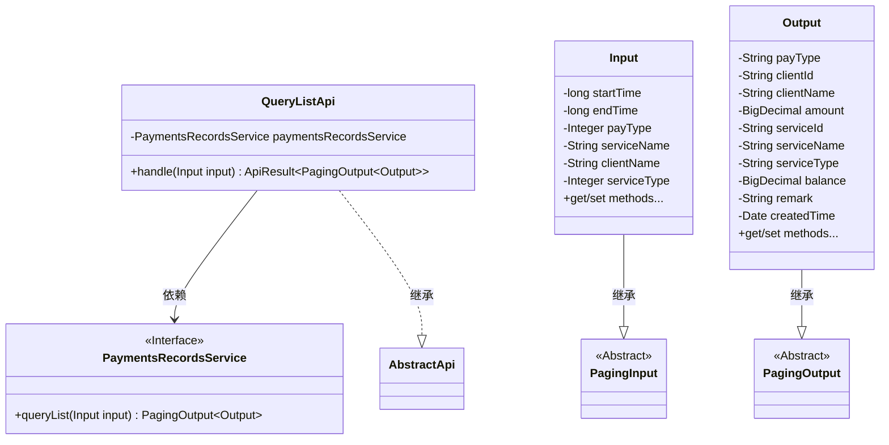

# 基础信息

|      |      |
|------|------|
| 名称 | QueryListApi |
| 编码语言 | .java |
| 代码路径 | WeFe/serving/serving-service/src/main/java/com/welab/wefe/serving/service/api/paymentsrecords/QueryListApi.java |
| 包名 | com.welab.wefe.serving.service.api.paymentsrecords |
| 依赖项 | ['com.welab.wefe.common.exception.StatusCodeWithException', 'com.welab.wefe.common.web.api.base.AbstractApi', 'com.welab.wefe.common.web.api.base.Api', 'com.welab.wefe.common.web.dto.ApiResult', 'com.welab.wefe.serving.service.dto.PagingInput', 'com.welab.wefe.serving.service.dto.PagingOutput', 'com.welab.wefe.serving.service.service.PaymentsRecordsService', 'org.springframework.beans.factory.annotation.Autowired', 'java.io.IOException', 'java.math.BigDecimal', 'java.util.Date'] |
| 概述说明 | 支付记录查询API，输入含时间、类型等参数，输出分页列表包含金额、余额、客户及服务信息等。 |

# 说明

这是一个名为QueryListApi的Java类，用于处理支付记录查询列表的API请求。该类继承自AbstractApi，接受Input类型的输入参数，返回PagingOutput<Output>类型的分页结果。Input类包含分页参数及查询条件，如时间范围、支付类型、服务名称等。Output类包含支付记录详细信息，如支付类型、客户信息、金额、服务信息、余额、备注和创建时间等。该类通过PaymentsRecordsService处理业务逻辑，返回查询结果。

# 类列表 Class Summary

| 名称   | 类型  | 说明 |
|-------|------|-------------|
| QueryListApi | class | 支付记录查询API，支持分页查询，输入含时间、支付类型、服务名等参数，输出包含支付类型、金额、余额等详细信息。 |

## 类 QueryListApi

|      |      |
|------|------|
| 访问范围 | @Api(path = "paymentsrecords/query-list", name = "query list");public |
| 类型 | class |
| 名称 | QueryListApi |
| 说明 | 支付记录查询API，支持分页查询，输入含时间、支付类型、服务名等参数，输出包含支付类型、金额、余额等详细信息。 |

### UML类图

这段代码展示了一个支付记录查询API的实现结构。QueryListApi继承自AbstractApi，处理分页查询请求，使用PaymentsRecordsService服务进行实际数据操作。Input类继承PagingInput包含查询参数，Output类继承PagingOutput包含返回结果字段。整体采用分层设计，Input/Output与分页基类构成继承关系，服务调用通过接口依赖实现松耦合。

### 内部方法调用关系图

```mermaid
graph TD
    A["类QueryListApi"]
    B["注解: @Api(path='paymentsrecords/query-list', name='query list')"]
    C["继承: AbstractApi<Input, PagingOutput<Output>>"]
    D["依赖注入: @Autowired PaymentsRecordsService"]
    E["重写方法: handle(Input input)"]
    F["内部类: Input extends PagingInput"]
    G["内部类: Output extends PagingOutput"]
    H["Input属性: startTime/endTime/payType/serviceName/clientName/serviceType"]
    I["Output属性: payType/clientId/clientName/amount/serviceId/serviceName/serviceType/balance/remark/createdTime"]

    A --> B
    A --> C
    A --> D
    A --> E
    A --> F
    A --> G
    F --> H
    G --> I
    E --> D
    E --> F
```

该流程图展示了QueryListApi类的核心结构，包括类注解、继承关系、依赖服务和两个内部类。Input类包含分页查询参数，Output类封装返回数据字段。handle方法通过调用paymentsRecordsService处理输入参数并返回分页结果，体现了API接口的数据流转过程。图中清晰呈现了类与子类、属性与方法之间的层级关系。

### 字段列表 Field List

| 名称  | 类型  | 说明 |
|-------|-------|------|
| paymentsRecordsService | PaymentsRecordsService | 代码片段使用@Autowired注解自动注入PaymentsRecordsService服务实例。 |

### 方法列表

| 名称  | 类型  | 说明 |
|-------|-------|------|
| handle | ApiResult<PagingOutput<QueryListApi.Output>> | 处理输入并返回支付记录查询列表结果，成功时调用服务方法。 |

