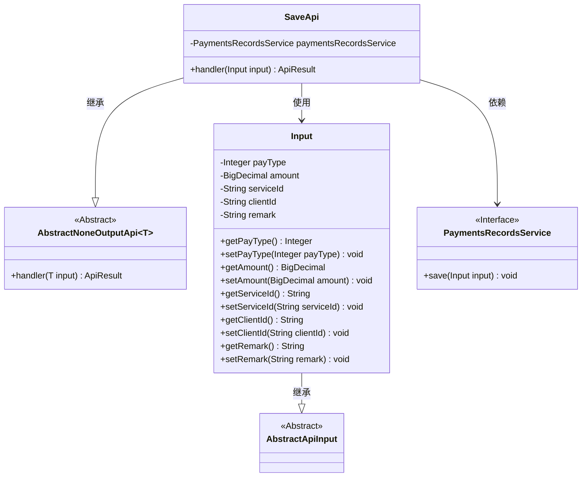

# 基础信息

|      |      |
|------|------|
| 名称 | SaveApi |
| 编码语言 | .java |
| 代码路径 | WeFe/serving/serving-service/src/main/java/com/welab/wefe/serving/service/api/paymentsrecords/SaveApi.java |
| 包名 | com.welab.wefe.serving.service.api.paymentsrecords |
| 依赖项 | ['com.welab.wefe.common.exception.StatusCodeWithException', 'com.welab.wefe.common.web.api.base.AbstractNoneOutputApi', 'com.welab.wefe.common.web.api.base.Api', 'com.welab.wefe.common.web.dto.AbstractApiInput', 'com.welab.wefe.common.web.dto.ApiResult', 'com.welab.wefe.serving.service.service.PaymentsRecordsService', 'org.springframework.beans.factory.annotation.Autowired', 'java.math.BigDecimal'] |
| 概述说明 | 这是一个保存支付记录的API类，路径为"paymentsrecords/save"，输入参数包括支付类型、金额、服务ID、客户ID和备注，调用服务层保存数据后返回成功结果。 |

# 说明

该代码定义了一个名为SaveApi的API类，用于保存支付记录。API路径为paymentsrecords/save，继承自AbstractNoneOutputApi，输入类型为内部类Input。Input类包含支付类型、金额、服务ID、客户ID和备注字段，并提供相应的getter和setter方法。SaveApi通过PaymentsRecordsService的save方法处理输入，并在成功后返回空结果。整个类结构清晰，专注于支付记录的保存功能。

# 类列表 Class Summary

| 名称   | 类型  | 说明 |
|-------|------|-------------|
| SaveApi | class | 这是一个支付记录保存API类，路径为"paymentsrecords/save"，输入参数包括支付类型、金额、服务ID、客户ID和备注，调用支付记录服务保存数据后返回成功结果。 |

## 类 SaveApi

|      |      |
|------|------|
| 访问范围 | @Api(path = "paymentsrecords/save", name = "save payments record");public |
| 类型 | class |
| 名称 | SaveApi |
| 说明 | 这是一个支付记录保存API类，路径为"paymentsrecords/save"，输入参数包括支付类型、金额、服务ID、客户ID和备注，调用支付记录服务保存数据后返回成功结果。 |

### UML类图

这段代码展示了一个支付记录保存API的实现结构。SaveApi继承自AbstractNoneOutputApi泛型类，处理Input类型的输入参数，并通过PaymentsRecordsService服务完成数据保存。Input类继承自AbstractApiInput，包含支付类型、金额、服务ID等字段及其getter/setter方法。整体设计采用了分层架构，通过依赖注入实现服务调用，符合面向对象的设计原则。

### 内部方法调用关系图

```mermaid
graph TD
    A["类SaveApi"]
    B["注解: @Api(path='paymentsrecords/save', name='save payments record')"]
    C["继承: AbstractNoneOutputApi<Input>"]
    D["依赖注入: @Autowired PaymentsRecordsService"]
    E["重写方法: handler(Input input)"]
    F["内部类: Input"]
    G["属性: Integer payType"]
    H["属性: BigDecimal amount"]
    I["属性: String serviceId"]
    J["属性: String clientId"]
    K["属性: String remark"]
    L["getter/setter方法"]
    M["调用: paymentsRecordsService.save(input)"]
    N["返回: success()"]

    A --> B
    A --> C
    A --> D
    A --> E
    A --> F
    F --> G
    F --> H
    F --> I
    F --> J
    F --> K
    F --> L
    E --> M
    E --> N
```

该流程图展示了SaveApi类的完整结构，包括类注解、继承关系、依赖注入的服务、重写的handler方法及其内部处理逻辑，以及Input内部类的属性和方法。handler方法通过调用paymentsRecordsService保存输入数据并返回成功结果，Input类封装了支付类型、金额、服务ID等交易信息。整个设计实现了支付记录保存的API功能，结构清晰且符合面向对象设计原则。

### 字段列表 Field List

| 名称  | 类型  | 说明 |
|-------|-------|------|
| paymentsRecordsService | PaymentsRecordsService | 代码片段使用@Autowired注解自动注入PaymentsRecordsService服务实例。 |

### 方法列表

| 名称  | 类型  | 说明 |
|-------|-------|------|
| handler | ApiResult | 覆盖handler方法，调用paymentsRecordsService保存输入数据，成功返回ApiResult。 |

