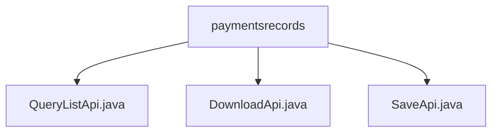

# 基础信息

|      |      |
|------|------|
| 名称 | paymentsrecords |
| 编码语言 | .java |
| 代码路径 | WeFe/serving/serving-service/src/main/java/com/welab/wefe/serving/service/api/paymentsrecords |
| 包名 | docs.serving.serving-service.src.main.java.com.welab.wefe.serving.service.api.paymentsrecords |
| 概述说明 | QueryListApi处理支付记录查询，支持分页和条件筛选。DownloadApi提供支付记录下载功能，设置HTTP响应头。SaveApi用于保存支付记录，包含支付类型、金额等字段。均继承AbstractApi，通过PaymentsRecordsService处理业务逻辑。 |

# 说明

## 概述  
该模块核心职责是提供支付记录的全生命周期管理，包括分页查询、文件下载和记录保存功能。接口规范统一继承AbstractApi基类，采用Input/Output模式，例如QueryListApi返回PagingOutput分页数据，DownloadApi返回文件流，SaveApi无返回值。关键数据结构包括Input（含分页参数、时间范围等查询条件）和Output（含支付详情、客户信息等字段）。外部依赖仅为PaymentsRecordsService，用于处理核心业务逻辑。例如SaveApi通过其save方法持久化支付记录。

## 主要业务场景  
模块支持支付记录的CRUD操作：QueryListApi实现分页查询（类似管理后台表格），DownloadApi提供文件导出（类似Excel下载），SaveApi处理新增记录。交互模式均采用RESTful风格，例如paymentsrecords/save路径对应POST请求。典型应用包括财务对账（组合查询+下载）和支付流水录入。API类型覆盖查询类、下载类和写入类，例如分页查询与文件下载集成可满足审计需求。

### 包内部结构视图

该流程图展示了paymentsrecords目录下的三个Java文件：QueryListApi.java、DownloadApi.java和SaveApi.java。所有文件都直接隶属于paymentsrecords目录，没有更深层级的子目录结构。这种扁平化的结构表明这是一个专门处理支付记录相关API的模块，包含查询列表、下载和保存三个核心功能接口。

# 文件列表

| 名称   | 类型  | 说明 |
|-------|------|-------------|
| [QueryListApi.java](QueryListApi.md) | file | 支付记录查询API，输入含时间、类型等参数，输出分页列表包含金额、余额、客户及服务信息等。 |
| [DownloadApi.java](DownloadApi.md) | file | 支付记录下载API类，通过输入参数查询并返回CSV文件，包含服务名、客户名、时间范围等筛选条件，处理文件不存在异常并设置响应头。 |
| [SaveApi.java](SaveApi.md) | file | 这是一个保存支付记录的API类，路径为"paymentsrecords/save"，输入参数包括支付类型、金额、服务ID、客户ID和备注，调用服务层保存数据后返回成功结果。 |

