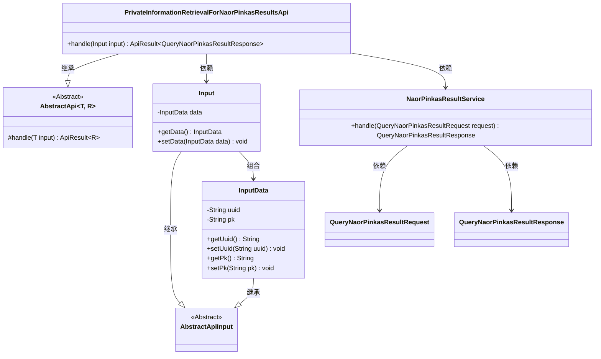

# 基础信息

|      |      |
|------|------|
| 名称 | PrivateInformationRetrievalForNaorPinkasResultsApi |
| 编码语言 | .java |
| 代码路径 | WeFe/serving/serving-service/src/main/java/com/welab/wefe/serving/service/api/pir/PrivateInformationRetrievalForNaorPinkasResultsApi.java |
| 包名 | com.welab.wefe.serving.service.api.pir |
| 依赖项 | ['com.welab.wefe.common.util.JObject', 'com.welab.wefe.common.web.api.base.AbstractApi', 'com.welab.wefe.common.web.api.base.Api', 'com.welab.wefe.common.web.dto.AbstractApiInput', 'com.welab.wefe.common.web.dto.ApiResult', 'com.welab.wefe.common.web.util.ModelMapper', 'com.welab.wefe.mpc.pir.PrivateInformationRetrievalApiName', 'com.welab.wefe.mpc.pir.request.naor.QueryNaorPinkasResultRequest', 'com.welab.wefe.mpc.pir.request.naor.QueryNaorPinkasResultResponse', 'com.welab.wefe.mpc.pir.server.service.naor.NaorPinkasResultService'] |
| 概述说明 | NaorPinkas结果查询API类，处理输入数据并返回查询结果，包含UUID和PK字段。 |

# 说明

这是一个名为PrivateInformationRetrievalForNaorPinkasResultsApi的API类，用于处理Naor-Pinkas协议的结果查询。该类继承自AbstractApi，接收Input类型的输入参数并返回QueryNaorPinkasResultResponse。Input包含一个InputData对象，其中存储了uuid和pk字段。处理逻辑中通过NaorPinkasResultService处理请求，并记录请求和响应的日志信息。该API路径定义为PrivateInformationRetrievalApiName.NAORPINKAS_RESULTS，无需登录即可访问。

# 类列表 Class Summary

| 名称   | 类型  | 说明 |
|-------|------|-------------|
| PrivateInformationRetrievalForNaorPinkasResultsApi | class | NaorPinkas结果查询API类，处理输入数据并返回查询结果，包含UUID和PK字段。 |

## 类 PrivateInformationRetrievalForNaorPinkasResultsApi

|      |      |
|------|------|
| 访问范围 | @Api(path = PrivateInformationRetrievalApiName.NAORPINKAS_RESULTS, name = "results", login = false);public |
| 类型 | class |
| 名称 | PrivateInformationRetrievalForNaorPinkasResultsApi |
| 说明 | NaorPinkas结果查询API类，处理输入数据并返回查询结果，包含UUID和PK字段。 |

### UML类图

这段代码展示了一个基于Naor-Pinkas方案的私有信息检索结果API实现。核心类`PrivateInformationRetrievalForNaorPinkasResultsApi`继承自泛型抽象类`AbstractApi`，通过`NaorPinkasResultService`处理包含UUID和公钥的查询请求。输入参数采用嵌套类结构，`Input`包含`InputData`作为数据载体，两者均继承自`AbstractApiInput`基类。系统通过模型映射将输入数据转换为服务请求对象，最终返回包含查询结果的响应。

### 内部方法调用关系图

```mermaid
graph TD
    A["类PrivateInformationRetrievalForNaorPinkasResultsApi"]
    B["继承: AbstractApi<Input, QueryNaorPinkasResultResponse>"]
    C["重写方法: handle(Input input)"]
    D["创建: NaorPinkasResultService"]
    E["日志记录: 请求路径和参数"]
    F["数据映射: ModelMapper.map"]
    G["调用: service.handle(request)"]
    H["日志记录: 响应结果"]
    I["返回: success(response)"]
    J["嵌套类: Input"]
    K["属性: InputData data"]
    L["嵌套类: InputData"]
    M["属性: String uuid"]
    N["属性: String pk"]

    A --> B
    A --> C
    C --> D
    C --> E
    C --> F
    C --> G
    C --> H
    C --> I
    A --> J
    J --> K
    A --> L
    L --> M
    L --> N
```

这段代码实现了一个基于Naor-Pinkas方案的私有信息检索结果API，主要处理查询请求并返回加密结果。流程图展示了从请求处理到响应返回的完整流程，包括服务初始化、请求参数映射、业务逻辑处理、日志记录等关键步骤，同时描述了嵌套的Input和InputData类的结构关系。该API通过抽象类继承实现标准化处理，并采用分层日志记录确保可追溯性。

### 字段列表 Field List

| 名称  | 类型  | 说明 |
|-------|-------|------|

### 方法列表

| 名称  | 类型  | 说明 |
|-------|-------|------|
| handle | ApiResult<QueryNaorPinkasResultResponse> | 该方法处理NaorPinkas查询请求，记录输入输出日志，调用服务处理请求并返回结果。 |

