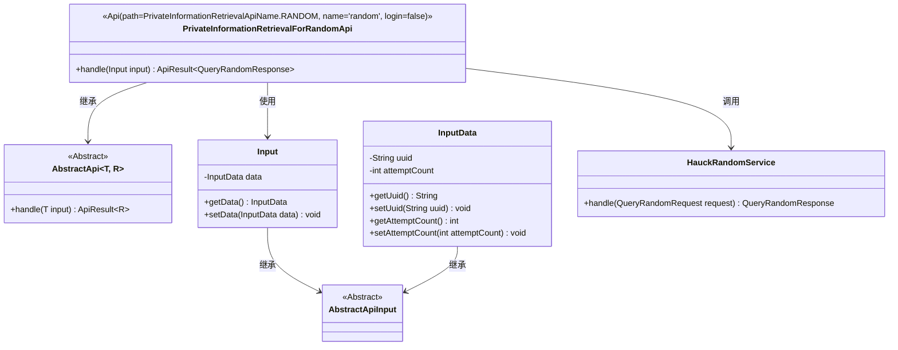

# 基础信息

|      |      |
|------|------|
| 名称 | PrivateInformationRetrievalForRandomApi |
| 编码语言 | .java |
| 代码路径 | WeFe/serving/serving-service/src/main/java/com/welab/wefe/serving/service/api/pir/PrivateInformationRetrievalForRandomApi.java |
| 包名 | com.welab.wefe.serving.service.api.pir |
| 依赖项 | ['java.io.IOException', 'com.welab.wefe.common.exception.StatusCodeWithException', 'com.welab.wefe.common.util.JObject', 'com.welab.wefe.common.web.api.base.AbstractApi', 'com.welab.wefe.common.web.api.base.Api', 'com.welab.wefe.common.web.dto.AbstractApiInput', 'com.welab.wefe.common.web.dto.ApiResult', 'com.welab.wefe.common.web.util.ModelMapper', 'com.welab.wefe.mpc.pir.PrivateInformationRetrievalApiName', 'com.welab.wefe.mpc.pir.request.QueryRandomRequest', 'com.welab.wefe.mpc.pir.request.QueryRandomResponse', 'com.welab.wefe.mpc.pir.server.service.HauckRandomService'] |
| 概述说明 | PrivateInformationRetrievalForRandomApi类处理随机信息查询请求，无需登录。输入包含uuid和attemptCount，通过HauckRandomService处理并返回响应，记录请求和响应日志。 |

# 说明

这是一个名为PrivateInformationRetrievalForRandomApi的API类，用于处理随机信息检索请求。该类继承自AbstractApi，输入类型为内部定义的Input类，输出类型为QueryRandomResponse。API路径为PrivateInformationRetrievalApiName.RANDOM，无需登录即可访问。处理逻辑中创建了HauckRandomService实例，将输入数据映射为QueryRandomRequest对象后调用服务处理，并记录请求和响应日志。Input类包含一个InputData类型的data字段，InputData类则定义了uuid字符串和attemptCount整数字段，均提供了getter和setter方法。

# 类列表 Class Summary

| 名称   | 类型  | 说明 |
|-------|------|-------------|
| PrivateInformationRetrievalForRandomApi | class | PrivateInformationRetrievalForRandomApi类处理随机信息查询请求，接收包含uuid和attemptCount的输入数据，调用HauckRandomService处理并返回响应。 |

## 类 PrivateInformationRetrievalForRandomApi

|      |      |
|------|------|
| 访问范围 | @Api(path = PrivateInformationRetrievalApiName.RANDOM, name = "random", login = false);public |
| 类型 | class |
| 名称 | PrivateInformationRetrievalForRandomApi |
| 说明 | PrivateInformationRetrievalForRandomApi类处理随机信息查询请求，接收包含uuid和attemptCount的输入数据，调用HauckRandomService处理并返回响应。 |

### UML类图

该类图展示了一个基于抽象API框架的随机信息检索实现。PrivateInformationRetrievalForRandomApi继承自泛型抽象类AbstractApi，处理Input类型参数并返回QueryRandomResponse结果。包含嵌套类Input和InputData用于封装请求数据，其中InputData存储UUID和尝试次数。通过HauckRandomService处理核心业务逻辑，整个结构体现了清晰的层级关系和职责划分。

### 内部方法调用关系图

```mermaid
graph TD
    A["类PrivateInformationRetrievalForRandomApi"]
    B["父类: AbstractApi<Input, QueryRandomResponse>"]
    C["注解: @Api"]
    D["方法: handle(Input input)"]
    E["内部类: Input"]
    F["内部类: InputData"]
    G["HauckRandomService实例化"]
    H["日志记录请求"]
    I["映射请求数据"]
    J["调用service.handle"]
    K["日志记录响应"]
    L["返回success()"]

    A --> B
    A --> C
    A --> D
    A --> E
    E --> F
    D --> G
    D --> H
    D --> I
    D --> J
    D --> K
    D --> L
```

这段代码展示了一个基于AbstractApi的随机信息检索API实现类，包含请求处理流程和嵌套输入数据结构。流程图清晰呈现了从请求处理到响应的完整调用链：初始化服务实例→记录请求日志→数据映射转换→业务处理→响应日志记录→返回成功结果。两个静态内部类Input和InputData构成了分层的请求参数结构，其中InputData包含uuid和attemptCount字段。整个设计体现了典型的API处理模式，具有清晰的日志追踪和类型安全的数据转换。

### 字段列表 Field List

| 名称  | 类型  | 说明 |
|-------|-------|------|

### 方法列表

| 名称  | 类型  | 说明 |
|-------|-------|------|
| handle | ApiResult<QueryRandomResponse> | 处理随机查询请求，记录输入输出日志，调用服务并返回结果。 |

