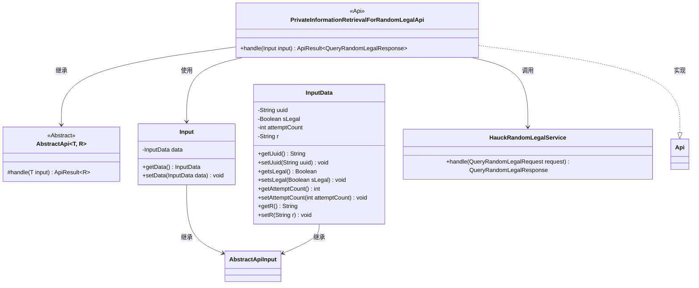

# 基础信息

|      |      |
|------|------|
| 名称 | PrivateInformationRetrievalForRandomLegalApi |
| 编码语言 | .java |
| 代码路径 | WeFe/serving/serving-service/src/main/java/com/welab/wefe/serving/service/api/pir/PrivateInformationRetrievalForRandomLegalApi.java |
| 包名 | com.welab.wefe.serving.service.api.pir |
| 依赖项 | ['java.io.IOException', 'com.welab.wefe.common.exception.StatusCodeWithException', 'com.welab.wefe.common.util.JObject', 'com.welab.wefe.common.web.api.base.AbstractApi', 'com.welab.wefe.common.web.api.base.Api', 'com.welab.wefe.common.web.dto.AbstractApiInput', 'com.welab.wefe.common.web.dto.ApiResult', 'com.welab.wefe.common.web.util.ModelMapper', 'com.welab.wefe.mpc.pir.PrivateInformationRetrievalApiName', 'com.welab.wefe.mpc.pir.request.QueryRandomLegalRequest', 'com.welab.wefe.mpc.pir.request.QueryRandomLegalResponse', 'com.welab.wefe.mpc.pir.server.service.HauckRandomLegalService'] |
| 概述说明 | 随机法律信息查询API类，处理输入数据并调用服务返回响应，包含UUID、合法标志、尝试次数等参数。 |

# 说明

该代码定义了一个名为PrivateInformationRetrievalForRandomLegalApi的API类，用于处理随机法律信息查询请求。API路径为random_legal，无需登录。类继承自AbstractApi，输入类型为内部类Input，输出为QueryRandomLegalResponse。处理逻辑包括：创建HauckRandomLegalService实例，记录请求日志，映射输入数据到QueryRandomLegalRequest，调用服务处理请求并记录响应日志。Input类包含InputData内部类，后者包含uuid、sLegal、attemptCount和r四个字段，均提供了getter和setter方法。

# 类列表 Class Summary

| 名称   | 类型  | 说明 |
|-------|------|-------------|
| PrivateInformationRetrievalForRandomLegalApi | class | 这是一个处理随机法律信息查询的API类，继承自AbstractApi，包含输入数据结构和处理逻辑，使用HauckRandomLegalService处理请求并返回响应。 |

## 类 PrivateInformationRetrievalForRandomLegalApi

|      |      |
|------|------|
| 访问范围 | @Api(path = PrivateInformationRetrievalApiName.RANDOM_LEGAL, name = "random_legal", login = false);public |
| 类型 | class |
| 名称 | PrivateInformationRetrievalForRandomLegalApi |
| 说明 | 这是一个处理随机法律信息查询的API类，继承自AbstractApi，包含输入数据结构和处理逻辑，使用HauckRandomLegalService处理请求并返回响应。 |

### UML类图

该代码实现了一个随机法律信息检索API，核心类`PrivateInformationRetrievalForRandomLegalApi`继承自泛型抽象类`AbstractApi`，通过`HauckRandomLegalService`处理请求。包含嵌套类`Input`和`InputData`分别继承`AbstractApiInput`，用于封装请求参数。类图展示了继承关系、依赖调用及接口实现，体现了分层设计和参数封装机制。

### 内部方法调用关系图

```mermaid
graph TD
    A["类PrivateInformationRetrievalForRandomLegalApi"]
    B["继承: AbstractApi<Input, QueryRandomLegalResponse>"]
    C["注解: @Api"]
    D["方法: handle(Input input)"]
    E["内部类: Input"]
    F["内部类: InputData"]
    G["创建HauckRandomLegalService"]
    H["日志记录请求信息"]
    I["映射请求数据: ModelMapper.map"]
    J["调用service.handle"]
    K["日志记录响应信息"]
    L["返回success(response)"]

    A --> B
    A --> C
    A --> D
    A --> E
    E --> F
    D --> G
    D --> H
    D --> I
    D --> J
    D --> K
    D --> L
```

这段代码展示了一个处理随机法律信息查询的API类，继承自抽象基类AbstractApi。主要流程包括：初始化服务、记录请求日志、数据映射转换、调用服务处理、记录响应日志和返回结果。包含两个嵌套静态类Input和InputData用于封装请求参数，其中InputData包含uuid、sLegal等字段。整个流程体现了典型的API请求处理模式，包含完整的请求/响应日志记录和异常处理机制。

### 字段列表 Field List

| 名称  | 类型  | 说明 |
|-------|-------|------|

### 方法列表

| 名称  | 类型  | 说明 |
|-------|-------|------|
| handle | ApiResult<QueryRandomLegalResponse> | 该方法处理随机法律信息查询请求，创建服务实例并记录请求和响应日志，最终返回成功结果。 |

