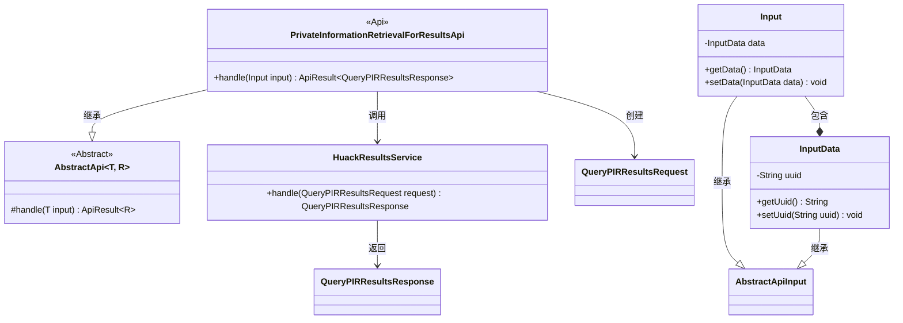

# 基础信息

|      |      |
|------|------|
| 名称 | PrivateInformationRetrievalForResultsApi |
| 编码语言 | .java |
| 代码路径 | WeFe/serving/serving-service/src/main/java/com/welab/wefe/serving/service/api/pir/PrivateInformationRetrievalForResultsApi.java |
| 包名 | com.welab.wefe.serving.service.api.pir |
| 依赖项 | ['java.io.IOException', 'com.welab.wefe.common.exception.StatusCodeWithException', 'com.welab.wefe.common.util.JObject', 'com.welab.wefe.common.web.api.base.AbstractApi', 'com.welab.wefe.common.web.api.base.Api', 'com.welab.wefe.common.web.dto.AbstractApiInput', 'com.welab.wefe.common.web.dto.ApiResult', 'com.welab.wefe.common.web.util.ModelMapper', 'com.welab.wefe.mpc.pir.PrivateInformationRetrievalApiName', 'com.welab.wefe.mpc.pir.request.QueryPIRResultsRequest', 'com.welab.wefe.mpc.pir.request.QueryPIRResultsResponse', 'com.welab.wefe.mpc.pir.server.service.HuackResultsService'] |
| 概述说明 | PrivateInformationRetrievalForResultsApi类处理私有信息检索结果请求，接收包含uuid的输入数据，调用HuackResultsService处理并返回响应结果。 |

# 说明

该代码定义了一个名为PrivateInformationRetrievalForResultsApi的API类，用于处理私有信息检索结果查询。该类继承自AbstractApi，接受Input类型参数并返回QueryPIRResultsResponse。主要功能是通过HuackResultsService处理查询请求，记录请求和响应日志。Input类包含一个InputData对象，其中存储了查询所需的uuid字段。该API路径为RESULTS，无需登录即可访问。

# 类列表 Class Summary

| 名称   | 类型  | 说明 |
|-------|------|-------------|
| PrivateInformationRetrievalForResultsApi | class | PrivateInformationRetrievalForResultsApi类处理私有信息检索结果请求，接收包含uuid的输入数据，调用HuackResultsService处理并返回响应结果。 |

## 类 PrivateInformationRetrievalForResultsApi

|      |      |
|------|------|
| 访问范围 | @Api(path = PrivateInformationRetrievalApiName.RESULTS, name = "results", login = false);public |
| 类型 | class |
| 名称 | PrivateInformationRetrievalForResultsApi |
| 说明 | PrivateInformationRetrievalForResultsApi类处理私有信息检索结果请求，接收包含uuid的输入数据，调用HuackResultsService处理并返回响应结果。 |

### UML类图

这段代码展示了一个私有信息检索结果API的实现结构。核心类PrivateInformationRetrievalForResultsApi继承自泛型抽象类AbstractApi，处理包含UUID参数的输入数据，通过HuackResultsService服务获取查询结果。类图中清晰地呈现了继承关系（抽象API基类）、组合关系（Input包含InputData）以及服务调用依赖关系，体现了典型的API处理流程：参数接收→服务调用→结果返回的完整链路。

### 内部方法调用关系图

```mermaid
graph TD
    A["类PrivateInformationRetrievalForResultsApi"]
    B["继承: AbstractApi<Input, QueryPIRResultsResponse>"]
    C["重写方法: handle(Input input)"]
    D["创建HuackResultsService实例"]
    E["日志记录请求信息"]
    F["映射输入数据到QueryPIRResultsRequest"]
    G["调用service.handle处理请求"]
    H["日志记录响应信息"]
    I["返回成功响应"]
    J["嵌套类Input"]
    K["属性: InputData data"]
    L["嵌套类InputData"]
    M["属性: String uuid"]

    A --> B
    A --> C
    C --> D
    C --> E
    C --> F
    C --> G
    C --> H
    C --> I
    A --> J
    J --> K
    J --> L
    L --> M
```

这段代码展示了一个处理私有信息检索结果的API类，通过继承抽象基类实现了核心请求处理逻辑。流程图清晰呈现了从请求处理到响应返回的完整流程：包括服务实例创建、请求/响应日志记录、数据映射转换、业务处理等关键步骤，同时展示了嵌套输入类的层级结构。该设计遵循了分层处理原则，通过抽象基类规范了输入输出类型，并提供了详细的日志追踪能力。

### 字段列表 Field List

| 名称  | 类型  | 说明 |
|-------|-------|------|

### 方法列表

| 名称  | 类型  | 说明 |
|-------|-------|------|
| handle | ApiResult<QueryPIRResultsResponse> | 重写方法处理查询请求，记录输入输出日志，调用服务并返回结果。 |

