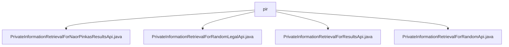

# 基础信息

|      |      |
|------|------|
| 名称 | pir |
| 编码语言 | .java |
| 代码路径 | WeFe/serving/serving-service/src/main/java/com/welab/wefe/serving/service/api/pir |
| 包名 | docs.serving.serving-service.src.main.java.com.welab.wefe.serving.service.api.pir |
| 概述说明 | 该信息描述了四个API类，均继承自AbstractApi，用于处理不同私有信息检索请求。NaorPinkasResultsApi处理Naor-Pinkas协议结果查询，RandomLegalApi处理随机法律信息查询，ResultsApi处理检索结果查询，RandomApi处理随机信息检索。所有API均无需登录，包含输入输出定义及日志记录功能。 |

# 说明

## 概述  
该模块核心职责是提供私有信息检索(PIR)功能，包含Naor-Pinkas协议结果查询、随机法律信息检索等子服务，类似分布式查询代理模式。接口规范统一继承AbstractApi，输入为包含InputData的Input类，输出为特定Response对象，所有API均无需认证即可访问。  

关键数据结构包括InputData（含uuid、pk等字段）和各类Request/Response对象。外部依赖主要为NaorPinkasResultService、HauckRandomLegalService等内部服务组件。例如NaorPinkas协议处理使用uuid和pk字段，随机法律检索则需sLegal和attemptCount参数。  

## 主要业务场景  
模块支持四种典型查询场景：Naor-Pinkas结果获取（如协议验证）、随机数据检索（如测试数据生成）、法律信息查询（如合规检查）和通用PIR结果查询。交互模式均为客户端提交包含uuid的请求，服务端处理后返回结构化结果。  

API类型分为结果查询类（如NAORPINKAS_RESULTS）和随机数据类（如RANDOM_LEGAL）。例如随机API通过attemptCount控制重试次数，法律检索API则需sLegal参数指定法律条文。所有服务均采用"请求-服务-响应"的管道模式，并自带日志追踪能力。

### 包内部结构视图

该流程图展示了PIR（私有信息检索）服务中四个核心API文件的层级关系。所有Java文件都直接位于pir目录下，包括NaorPinkas结果检索、随机合法数据检索、普通结果检索和随机数据检索四个功能接口，体现了该模块的扁平化结构设计。每个文件都代表一种独立的私有信息检索实现方式。

# 文件列表

| 名称   | 类型  | 说明 |
|-------|------|-------------|
| [PrivateInformationRetrievalForNaorPinkasResultsApi.java](PrivateInformationRetrievalForNaorPinkasResultsApi.md) | file | NaorPinkas结果查询API类，处理输入数据并返回查询结果，包含UUID和PK字段。 |
| [PrivateInformationRetrievalForRandomLegalApi.java](PrivateInformationRetrievalForRandomLegalApi.md) | file | 随机法律信息查询API类，处理输入数据并调用服务返回响应，包含UUID、合法标志、尝试次数等参数。 |
| [PrivateInformationRetrievalForResultsApi.java](PrivateInformationRetrievalForResultsApi.md) | file | PrivateInformationRetrievalForResultsApi类处理私有信息检索结果请求，接收包含uuid的输入数据，调用HuackResultsService处理并返回响应结果。 |
| [PrivateInformationRetrievalForRandomApi.java](PrivateInformationRetrievalForRandomApi.md) | file | PrivateInformationRetrievalForRandomApi类处理随机信息查询请求，无需登录。输入包含uuid和attemptCount，通过HauckRandomService处理并返回响应，记录请求和响应日志。 |

