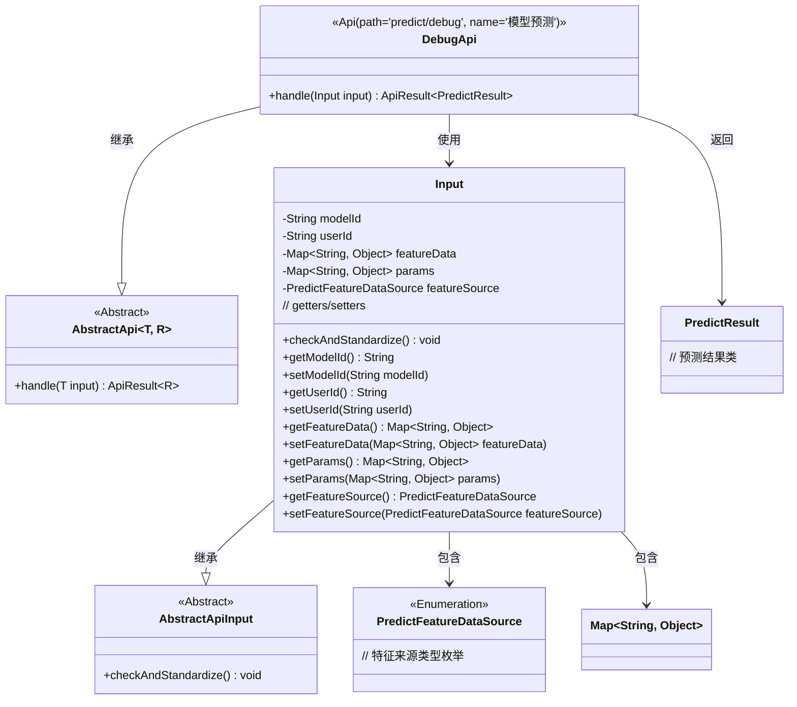
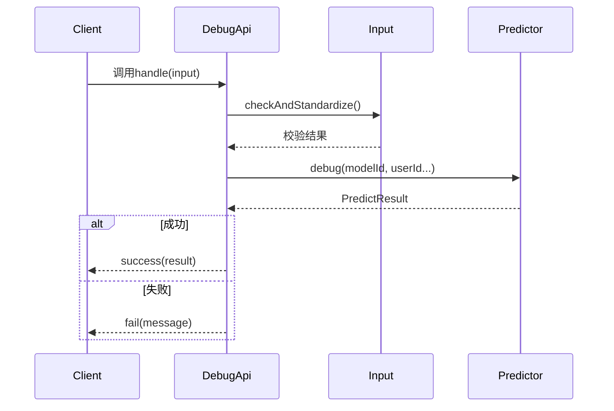

# 基础信息

|      |      |
|------|------|
| 名称 | DebugApi |
| 编码语言 | .java |
| 代码路径 | WeFe/serving/serving-service/src/main/java/com/welab/wefe/serving/service/api/predict/DebugApi.java |
| 包名 | com.welab.wefe.serving.service.api.predict |
| 依赖项 | ['com.alibaba.fastjson.JSONObject', 'com.welab.wefe.common.StatusCode', 'com.welab.wefe.common.exception.StatusCodeWithException', 'com.welab.wefe.common.fieldvalidate.annotation.Check', 'com.welab.wefe.common.web.api.base.AbstractApi', 'com.welab.wefe.common.web.api.base.Api', 'com.welab.wefe.common.web.dto.AbstractApiInput', 'com.welab.wefe.common.web.dto.ApiResult', 'com.welab.wefe.common.wefe.enums.PredictFeatureDataSource', 'com.welab.wefe.serving.sdk.dto.PredictResult', 'com.welab.wefe.serving.service.predicter.Predictor', 'org.apache.commons.collections4.MapUtils', 'org.apache.commons.lang3.StringUtils', 'java.util.Map'] |
| 概述说明 | DebugApi类提供模型预测功能，处理输入参数并返回预测结果，包含参数校验和异常处理。 |

# 说明

DebugApi类是一个用于模型预测调试的API接口，继承自AbstractApi，处理输入类型为Input，输出类型为PredictResult。该API路径为predict/debug，名称为模型预测。主要功能是通过Predictor.debug方法进行预测，接收模型ID、用户ID、特征数据、特征来源和参数等输入。Input类定义了必要的输入字段，包括模型ID、用户ID、特征数据、参数和特征来源类型，并进行了参数校验，确保在特征来源为SQL时参数不为空，且至少提供样本ID或样本特征。处理过程中捕获异常并返回相应错误信息。

# 类列表 Class Summary

| 名称   | 类型  | 说明 |
|-------|------|-------------|
| DebugApi | class | DebugApi类提供模型预测功能，处理输入参数并返回预测结果。输入包括模型ID、用户ID、特征数据等，验证参数有效性后调用Predictor.debug执行预测，成功返回结果，失败返回错误信息。 |

## 类 DebugApi

|      |      |
|------|------|
| 访问范围 | @Api(;        path = "predict/debug",;        name = "模型预测";);public |
| 类型 | class |
| 名称 | DebugApi |
| 说明 | DebugApi类提供模型预测功能，处理输入参数并返回预测结果。输入包括模型ID、用户ID、特征数据等，验证参数有效性后调用Predictor.debug执行预测，成功返回结果，失败返回错误信息。 |

### UML类图

类图描述：
该图展示了DebugApi及其相关类的结构关系。DebugApi继承自泛型类AbstractApi<Input, PredictResult>，实现了模型预测功能。Input作为内部类继承自AbstractApiInput，包含模型ID、用户ID、特征数据等字段，并实现了参数校验逻辑。PredictResult表示预测结果，PredictFeatureDataSource是特征来源的枚举类型。类图清晰地呈现了各组件间的继承、包含和使用关系，体现了参数校验与预测处理的完整流程。

### 内部方法调用关系图

```mermaid
graph TD
    A["类DebugApi"]
    B["继承: AbstractApi<Input, PredictResult>"]
    C["方法: handle(Input input)"]
    D["调用: Predictor.debug()"]
    E["返回: success(result)"]
    F["异常处理: fail(e.getMessage())"]
    G["嵌套类Input"]
    H["继承: AbstractApiInput"]
    I["属性: modelId, userId, featureData, params, featureSource"]
    J["方法: checkAndStandardize()"]
    K["校验逻辑: 参数非空检查"]
    L["getter/setter方法"]

    A --> B
    A --> C
    C --> D
    D --> E
    C --> F
    A --> G
    G --> H
    G --> I
    G --> J
    J --> K
    G --> L
```

这段代码实现了一个模型预测调试API，主要包含DebugApi类和嵌套的Input类。流程图展示了类结构和关键方法调用关系，时序图描述了API调用的完整流程。Input类负责参数校验，DebugApi处理核心预测逻辑，通过Predictor获取结果并返回给客户端。代码包含完善的异常处理和参数校验机制，确保预测过程的可靠性。

### 字段列表 Field List

| 名称  | 类型  | 说明 |
|-------|-------|------|

### 方法列表

| 名称  | 类型  | 说明 |
|-------|-------|------|
| handle | ApiResult<PredictResult> | 处理输入并调用预测器，成功返回结果，失败返回错误信息。 |

