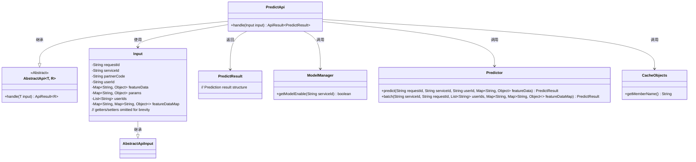

# 基础信息

|      |      |
|------|------|
| 名称 | PredictApi |
| 编码语言 | .java |
| 代码路径 | WeFe/serving/serving-service/src/main/java/com/welab/wefe/serving/service/api/predict/PredictApi.java |
| 包名 | com.welab.wefe.serving.service.api.predict |
| 依赖项 | ['com.welab.wefe.common.fieldvalidate.annotation.Check', 'com.welab.wefe.common.web.api.base.AbstractApi', 'com.welab.wefe.common.web.api.base.Api', 'com.welab.wefe.common.web.api.base.Caller', 'com.welab.wefe.common.web.dto.AbstractApiInput', 'com.welab.wefe.common.web.dto.ApiResult', 'com.welab.wefe.serving.sdk.dto.PredictResult', 'com.welab.wefe.serving.service.manager.ModelManager', 'com.welab.wefe.serving.service.predicter.Predictor', 'com.welab.wefe.serving.service.service.CacheObjects', 'org.apache.commons.collections4.CollectionUtils', 'java.util.List', 'java.util.Map'] |
| 概述说明 | PredictApi提供模型预测功能，支持单用户和批量预测，需传入请求ID、模型标识等参数，验证模型上线状态后返回预测结果。 |

# 说明

PredictApi是一个模型预测接口，允许客户通过签名访问。它继承自AbstractApi，处理输入Input和输出PredictResult。主要功能包括检查模型是否上线，支持批量预测和单用户预测。Input类包含必填字段requestId、serviceId、partnerCode，可选字段userId、userIds、featureData、featureDataMap和params。批量预测使用userIds和featureDataMap，单用户预测使用userId和featureData。所有字段均有getter和setter方法。

# 类列表 Class Summary

| 名称   | 类型  | 说明 |
|-------|------|-------------|
| PredictApi | class | PredictApi提供模型预测功能，支持单用户和批量预测，需传入请求ID、模型标识等参数，验证模型上线状态后返回预测结果。 |

## 类 PredictApi

|      |      |
|------|------|
| 访问范围 | @Api(;        path = "predict",;        name = "模型预测",;        allowAccessWithSign = true,;        domain = Caller.Customer;);public |
| 类型 | class |
| 名称 | PredictApi |
| 说明 | PredictApi提供模型预测功能，支持单用户和批量预测，需传入请求ID、模型标识等参数，验证模型上线状态后返回预测结果。 |

### UML类图

这段代码展示了一个模型预测API的实现结构。PredictApi继承自AbstractApi泛型类，处理两种预测模式：批量预测（通过userIds触发）和单用户预测（通过userId触发）。核心类包括输入参数封装类Input、预测结果类PredictResult，以及依赖的ModelManager（模型状态检查）、Predictor（预测执行）和CacheObjects（缓存访问）等组件。系统通过检查模型状态和输入参数来决定执行路径，最终返回统一的预测结果封装。

### 内部方法调用关系图

```mermaid
graph TD
    A["PredictApi类"]
    B["继承: AbstractApi<Input, PredictResult>"]
    C["注解: @Api配置"]
    D["方法: handle(Input input)"]
    E["检查: ModelManager.getModelEnable"]
    F["批量预测分支: Predictor.batch"]
    G["单条预测分支: Predictor.predict"]
    H["返回结果: success/fail"]
    I["嵌套类: Input"]
    J["Input属性: requestId等9个字段"]
    K["Input方法: getter/setter"]

    A --> B
    A --> C
    A --> D
    D --> E
    E -->|false| H
    E -->|true| F
    E -->|true| G
    F --> H
    G --> H
    A --> I
    I --> J
    I --> K
```

该流程图展示了PredictApi的核心结构：1) 类继承关系和API注解配置；2) handle方法的两条预测路径（批量/单条）及前置检查；3) Input嵌套类的属性与方法。处理流程会先验证模型可用性，再根据userIds是否存在决定预测方式，最后统一封装返回结果。输入参数通过Input类进行结构化封装和管理。

### 字段列表 Field List

| 名称  | 类型  | 说明 |
|-------|-------|------|

### 方法列表

| 名称  | 类型  | 说明 |
|-------|-------|------|
| handle | ApiResult<PredictResult> | 该方法处理预测请求，先检查模型是否启用。支持批量预测（输入含多个用户ID时）和单用户预测，返回预测结果。 |

