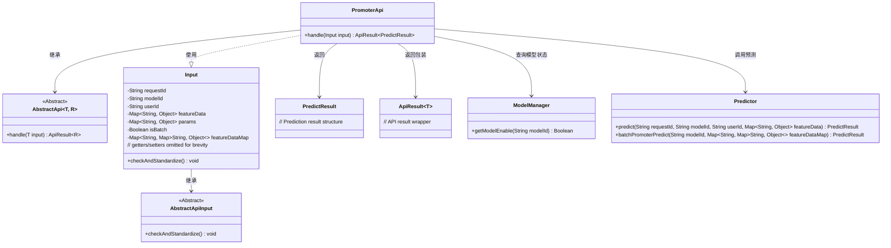

# 基础信息

|      |      |
|------|------|
| 名称 | PromoterApi |
| 编码语言 | .java |
| 代码路径 | WeFe/serving/serving-service/src/main/java/com/welab/wefe/serving/service/api/predict/PromoterApi.java |
| 包名 | com.welab.wefe.serving.service.api.predict |
| 依赖项 | ['com.welab.wefe.common.StatusCode', 'com.welab.wefe.common.exception.StatusCodeWithException', 'com.welab.wefe.common.fieldvalidate.annotation.Check', 'com.welab.wefe.common.util.StringUtil', 'com.welab.wefe.common.web.api.base.AbstractApi', 'com.welab.wefe.common.web.api.base.Api', 'com.welab.wefe.common.web.api.base.Caller', 'com.welab.wefe.common.web.dto.AbstractApiInput', 'com.welab.wefe.common.web.dto.ApiResult', 'com.welab.wefe.serving.sdk.dto.PredictResult', 'com.welab.wefe.serving.service.manager.ModelManager', 'com.welab.wefe.serving.service.predicter.Predictor', 'com.welab.wefe.serving.service.service.CacheObjects', 'org.apache.commons.collections4.MapUtils', 'java.util.Map'] |
| 概述说明 | PromoterApi提供模型预测功能，支持单条和批量预测。输入参数包括请求ID、模型ID、用户ID和特征数据。若模型未上线或参数无效则返回错误，成功则返回预测结果。 |

# 说明

这是一个名为PromoterApi的模型预测API类，继承自AbstractApi，处理输入Input并返回PredictResult。API路径为predict/promoter，允许签名访问，调用域为Member。主要功能包括检查模型是否可用，进行单条预测（当前实现）和批量预测（注释状态）。Input类包含请求ID、模型ID、用户ID、特征数据等字段，提供参数校验逻辑，确保单条预测时用户ID非空，批量预测时特征数据映射非空。所有字段均有getter和setter方法。异常情况下返回失败信息。

# 类列表 Class Summary

| 名称   | 类型  | 说明 |
|-------|------|-------------|
| PromoterApi | class | PromoterApi提供模型预测功能，支持单条和批量预测。输入参数包括请求ID、模型ID、用户ID和特征数据。若模型未上线或参数无效则返回错误，成功则返回预测结果。 |

## 类 PromoterApi

|      |      |
|------|------|
| 访问范围 | @Api(;        path = "predict/promoter",;        name = "模型预测",;        allowAccessWithSign = true,;        domain = Caller.Member;);public |
| 类型 | class |
| 名称 | PromoterApi |
| 说明 | PromoterApi提供模型预测功能，支持单条和批量预测。输入参数包括请求ID、模型ID、用户ID和特征数据。若模型未上线或参数无效则返回错误，成功则返回预测结果。 |

### UML类图

类图描述：
该图展示了PromoterApi预测系统的核心结构。PromoterApi继承自AbstractApi泛型类，处理Input参数并返回PredictResult。Input类继承自AbstractApiInput，包含请求参数和验证逻辑。系统依赖ModelManager检查模型状态，通过Predictor进行单条/批量预测。ApiResult作为统一返回包装，整个架构体现了清晰的层次关系和职责分离。

### 内部方法调用关系图

```mermaid
graph TD
    A["PromoterApi类"]
    B["继承: AbstractApi<Input, PredictResult>"]
    C["注解: @Api配置"]
    D["方法: handle(Input input)"]
    E["检查模型状态: ModelManager.getModelEnable"]
    F["单条预测: Predictor.predict"]
    G["返回结果: success/fail"]
    H["Input内部类"]
    I["字段: requestId, modelId等"]
    J["方法: checkAndStandardize"]
    K["getter/setter方法"]

    A --> B
    A --> C
    A --> D
    D --> E
    E -->|模型未启用| G
    E -->|模型启用| F
    F --> G
    A --> H
    H --> I
    H --> J
    H --> K
```

这段代码实现了一个模型预测API，主要包含PromoterApi类和Input内部类。PromoterApi处理预测请求时先检查模型状态，然后根据输入类型(当前仅支持单条)调用预测器，最后返回结果。Input类封装了请求参数并实现参数校验逻辑，包含多个带校验注解的字段和标准化方法。流程图清晰展示了类结构、主要方法调用关系和异常处理路径。

### 字段列表 Field List

| 名称  | 类型  | 说明 |
|-------|-------|------|

### 方法列表

| 名称  | 类型  | 说明 |
|-------|-------|------|
| handle | ApiResult<PredictResult> | 处理输入并返回预测结果。检查模型是否可用，执行单条预测，成功返回结果，失败返回错误信息。 |

