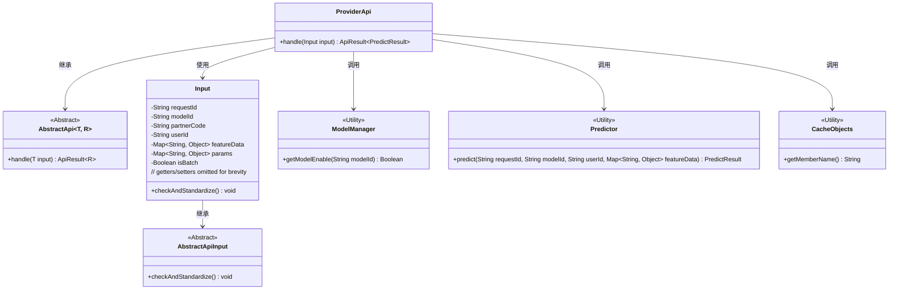
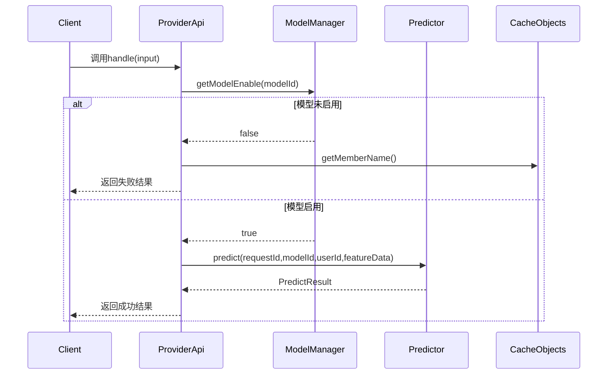

# 基础信息

|      |      |
|------|------|
| 名称 | ProviderApi |
| 编码语言 | .java |
| 代码路径 | WeFe/serving/serving-service/src/main/java/com/welab/wefe/serving/service/api/predict/ProviderApi.java |
| 包名 | com.welab.wefe.serving.service.api.predict |
| 依赖项 | ['com.welab.wefe.common.StatusCode', 'com.welab.wefe.common.exception.StatusCodeWithException', 'com.welab.wefe.common.fieldvalidate.annotation.Check', 'com.welab.wefe.common.util.StringUtil', 'com.welab.wefe.common.web.api.base.AbstractApi', 'com.welab.wefe.common.web.api.base.Api', 'com.welab.wefe.common.web.api.base.Caller', 'com.welab.wefe.common.web.dto.AbstractApiInput', 'com.welab.wefe.common.web.dto.ApiResult', 'com.welab.wefe.serving.sdk.dto.PredictResult', 'com.welab.wefe.serving.service.manager.ModelManager', 'com.welab.wefe.serving.service.predicter.Predictor', 'com.welab.wefe.serving.service.service.CacheObjects', 'java.util.Map'] |
| 概述说明 | ProviderApi提供预测功能，支持单条预测，需校验模型是否上线。输入包括请求ID、模型ID、用户ID等，校验必填项后调用Predictor.predict返回结果。异常时返回错误信息。 |

# 说明

该代码定义了一个名为ProviderApi的API类，用于模型预测功能。API路径为predict/provider，允许签名访问，调用域为Member。类继承自AbstractApi，处理输入Input和输出PredictResult。主要逻辑包括检查模型是否上线，执行单条预测（当前注释掉了批量预测功能）。输入类Input包含必填字段requestId、modelId、partnerCode，可选字段userId、featureData、params和isBatch，并实现了参数校验逻辑。异常处理返回协作方错误信息。

# 类列表 Class Summary

| 名称   | 类型  | 说明 |
|-------|------|-------------|
| ProviderApi | class | 这是一个预测模型的API类，路径为"predict/provider"，需签名访问，处理单条预测请求，验证模型是否上线，返回预测结果或错误信息。输入参数包括请求ID、模型ID、用户ID等，支持单条预测。 |

## 类 ProviderApi

|      |      |
|------|------|
| 访问范围 | @Api(;        path = "predict/provider",;        name = "Model to predict",;        allowAccessWithSign = true,;        domain = Caller.Member;);public |
| 类型 | class |
| 名称 | ProviderApi |
| 说明 | 这是一个预测模型的API类，路径为"predict/provider"，需签名访问，处理单条预测请求，验证模型是否上线，返回预测结果或错误信息。输入参数包括请求ID、模型ID、用户ID等，支持单条预测。 |

### UML类图

类图描述：该图展示了预测服务提供者API的类结构。ProviderApi继承自泛型抽象类AbstractApi，处理预测请求时依赖ModelManager检查模型状态，通过Predictor执行预测，并使用CacheObjects获取协作方信息。Input作为内部类继承AbstractApiInput，包含请求参数和验证逻辑。整体架构体现了清晰的职责分离和分层设计。

### 内部方法调用关系图

```mermaid
graph TD
    A["ProviderApi类"]
    B["继承: AbstractApi<Input, PredictResult>"]
    C["注解: @Api配置"]
    D["方法: handle(Input input)"]
    E["输入类: Input extends AbstractApiInput"]
    F["校验方法: checkAndStandardize()"]
    G["Getter/Setter方法组"]

    A --> B
    A --> C
    A --> D
    A --> E
    E --> F
    E --> G

    D --> H["检查模型状态 ModelManager.getModelEnable"]
    H -->|模型未启用| I["返回失败结果"]
    H -->|模型启用| J["执行单条预测 Predictor.predict"]
    J --> K["返回成功结果"]
    D -->|异常捕获| L["返回错误信息"]

    F --> M["校验非批量时userId非空"]
    M -->|校验失败| N["抛出StatusCodeWithException"]
```

这段代码实现了一个预测服务API，主要包含ProviderApi类和其内部Input类。流程图展示了类结构关系，其中核心处理流程包括：模型状态检查、单条预测执行、异常处理机制。时序图详细描述了客户端调用时的交互过程，包括模型可用性验证和预测执行两个关键阶段。输入类Input通过注解实现参数校验，特别处理了批量/单条预测的场景校验，整体设计体现了防御性编程思想。

### 字段列表 Field List

| 名称  | 类型  | 说明 |
|-------|-------|------|

### 方法列表

| 名称  | 类型  | 说明 |
|-------|-------|------|
| handle | ApiResult<PredictResult> | 处理输入并返回预测结果。检查模型是否可用，不可用则返回错误。执行单次预测，成功返回结果，失败返回错误信息。 |

