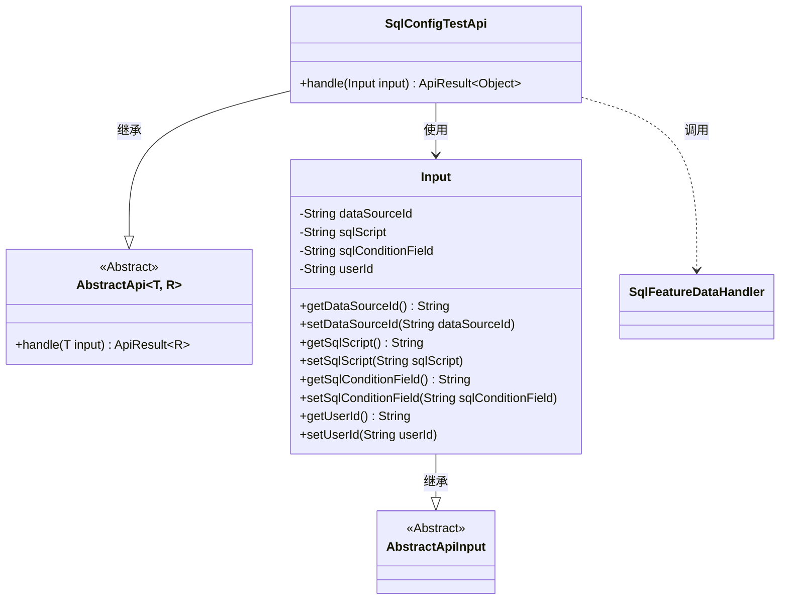

# 基础信息

|      |      |
|------|------|
| 名称 | SqlConfigTestApi |
| 编码语言 | .java |
| 代码路径 | WeFe/serving/serving-service/src/main/java/com/welab/wefe/serving/service/api/predict/SqlConfigTestApi.java |
| 包名 | com.welab.wefe.serving.service.api.predict |
| 依赖项 | ['com.welab.wefe.common.fieldvalidate.annotation.Check', 'com.welab.wefe.common.web.api.base.AbstractApi', 'com.welab.wefe.common.web.api.base.Api', 'com.welab.wefe.common.web.dto.AbstractApiInput', 'com.welab.wefe.common.web.dto.ApiResult', 'com.welab.wefe.serving.service.feature.SqlFeatureDataHandler'] |
| 概述说明 | SqlConfigTestApi接口用于测试SQL脚本，接收数据源ID、SQL脚本、查询条件字段和用户ID参数，调用SqlFeatureDataHandler.debug方法处理并返回结果。 |

# 说明

该代码定义了一个名为SqlConfigTestApi的API类，用于测试SQL脚本。API路径为predict/sql_config_test，继承自AbstractApi类，处理输入类型为Input，输出类型为Object。输入参数包括数据源ID、SQL脚本、查询条件字段和用户ID，均为必填项。API的核心逻辑是通过SqlFeatureDataHandler.debug方法处理输入参数并返回结果。输入类Input包含四个字段的getter和setter方法。

# 类列表 Class Summary

| 名称   | 类型  | 说明 |
|-------|------|-------------|
| SqlConfigTestApi | class | SqlConfigTestApi用于测试SQL脚本，接收数据源ID、SQL脚本、查询条件字段和用户ID，返回调试结果。 |

## 类 SqlConfigTestApi

|      |      |
|------|------|
| 访问范围 | @Api(;        path = "predict/sql_config_test",;        name = "sql脚本测试i";);public |
| 类型 | class |
| 名称 | SqlConfigTestApi |
| 说明 | SqlConfigTestApi用于测试SQL脚本，接收数据源ID、SQL脚本、查询条件字段和用户ID，返回调试结果。 |

### UML类图

这段代码展示了一个SQL配置测试API的实现结构。SqlConfigTestApi继承自泛型抽象类AbstractApi，指定Input作为输入类型，Object作为返回类型。内部类Input继承自AbstractApiInput，包含四个必填字段及其getter/setter方法。Api通过handle方法调用SqlFeatureDataHandler的debug方法进行SQL调试。类图清晰地展示了继承关系和类之间的依赖，体现了API处理输入参数并返回调试结果的设计模式。

### 内部方法调用关系图

```mermaid
graph TD
    A["类SqlConfigTestApi"]
    B["注解: @Api(path='predict/sql_config_test', name='sql脚本测试i')"]
    C["继承: AbstractApi<Input, Object>"]
    D["方法: handle(Input input)"]
    E["调用: SqlFeatureDataHandler.debug()"]
    F["返回: ApiResult<Object>"]
    G["内部类Input"]
    H["属性: String dataSourceId"]
    I["属性: String sqlScript"]
    J["属性: String sqlConditionField"]
    K["属性: String userId"]
    L["Getter/Setter方法"]

    A --> B
    A --> C
    A --> D
    D --> E
    E --> F
    A --> G
    G --> H
    G --> I
    G --> J
    G --> K
    G --> L
```

这段代码定义了一个SQL配置测试API类SqlConfigTestApi，它继承自AbstractApi并处理Input类型的输入参数。主要流程是通过handle方法调用SqlFeatureDataHandler.debug()来执行SQL调试，返回封装的结果。Input内部类包含数据源ID、SQL脚本、查询条件字段和用户ID等必要参数，并通过注解进行校验。整个结构清晰地展现了API请求处理流程和数据传递路径。

### 字段列表 Field List

| 名称  | 类型  | 说明 |
|-------|-------|------|

### 方法列表

| 名称  | 类型  | 说明 |
|-------|-------|------|
| handle | ApiResult<Object> | 重写方法处理输入，调用SqlFeatureDataHandler.debug并返回成功结果，参数包括数据源ID、SQL脚本、条件字段和用户ID。 |

