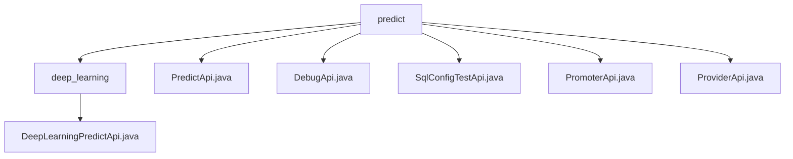

# 基础信息

|      |      |
|------|------|
| 名称 | predict |
| 编码语言 | .java |
| 代码路径 | WeFe/serving/serving-service/src/main/java/com/welab/wefe/serving/service/api/predict |
| 包名 | docs.serving.serving-service.src.main.java.com.welab.wefe.serving.service.api.predict |
| 概述说明 | 深度学习预测API类，路径predict/deep_learning，无需登录，解压模型调用PaddleServing预测，输入含模型ID和图片路径，输出图片和JSON结果。PredictApi支持签名访问，检查模型状态，处理批量或单用户预测，输入含必填requestId等字段。DebugApi用于调试，路径predict/debug，输入需模型ID等，校验参数后预测。SqlConfigTestApi测试SQL脚本，路径predict/sql_config_test，输入必填数据源ID等。PromoterApi和ProviderApi分别路径predict/promoter和predict/provider，支持签名访问，检查模型状态，处理单条预测，输入含必填requestId等字段。 |

# 说明

## 概述  
该模块核心职责是提供统一的深度学习模型预测服务，支持单条/批量预测、调试和SQL配置测试等功能。接口规范遵循AbstractApi基类约束，输入输出均采用结构化类型（如Input/PredictResult），通过路径（如predict/deep_learning）和签名控制访问权限。关键数据结构包括包含模型ID、用户特征等字段的Input类，以及混合图片/JSON格式的Output类。外部依赖涉及PaddleServing服务、文件解压工具和SQL查询引擎。例如DebugApi通过Predictor.debug方法验证特征数据有效性。

## 主要业务场景  
模块主要服务于模型预测全流程，包括常规预测（类似RESTful接口）、调试验证和SQL配置测试三种模式。交互模式均采用请求-响应机制，支持批量特征数据处理（如userIds映射）和单条实时预测。典型应用如PromoterApi检查模型可用性后执行预测，或SqlConfigTestApi测试SQL脚本与特征数据的匹配性。API类型涵盖基础预测（PredictApi）、领域定制（ProviderApi）和工具类（DebugApi），例如通过featureDataMap实现批量推理。

### 包内部结构视图

该流程图展示了WeFe项目中predict模块的API文件结构。predict作为根目录，包含5个直接子文件(PredictApi、DebugApi等)和1个子目录deep_learning。deep_learning目录下包含DeepLearningPredictApi实现文件，形成清晰的层级关系，完整呈现了预测服务API的文件组织结构。

# 文件列表

| 名称   | 类型  | 说明 |
|-------|------|-------------|
| [PredictApi.java](PredictApi.md) | file | PredictApi提供模型预测功能，支持单用户和批量预测，需传入请求ID、模型标识等参数，验证模型上线状态后返回预测结果。 |
| [DebugApi.java](DebugApi.md) | file | DebugApi类提供模型预测功能，处理输入参数并返回预测结果，包含参数校验和异常处理。 |
| [SqlConfigTestApi.java](SqlConfigTestApi.md) | file | SqlConfigTestApi接口用于测试SQL脚本，接收数据源ID、SQL脚本、查询条件字段和用户ID参数，调用SqlFeatureDataHandler.debug方法处理并返回结果。 |
| [PromoterApi.java](PromoterApi.md) | file | PromoterApi提供模型预测功能，支持单条和批量预测。输入参数包括请求ID、模型ID、用户ID和特征数据。若模型未上线或参数无效则返回错误，成功则返回预测结果。 |
| [ProviderApi.java](ProviderApi.md) | file | ProviderApi提供预测功能，支持单条预测，需校验模型是否上线。输入包括请求ID、模型ID、用户ID等，校验必填项后调用Predictor.predict返回结果。异常时返回错误信息。 |
| [deep_learning](deep_learning/_module.md) | package | 深度学习预测API类，无需登录，接收模型ID和图片路径，解压模型文件后调用PaddleServing服务处理图片并返回结果。 |

