# 基础信息

|      |      |
|------|------|
| 名称 | DeepLearningPredictApi |
| 编码语言 | .java |
| 代码路径 | WeFe/serving/serving-service/src/main/java/com/welab/wefe/serving/service/api/predict/deep_learning/DeepLearningPredictApi.java |
| 包名 | com.welab.wefe.serving.service.api.predict.deep_learning |
| 依赖项 | ['com.welab.wefe.common.fieldvalidate.annotation.Check', 'com.welab.wefe.common.file.decompression.SuperDecompressor', 'com.welab.wefe.common.util.JObject', 'com.welab.wefe.common.web.api.base.AbstractApi', 'com.welab.wefe.common.web.api.base.Api', 'com.welab.wefe.common.web.dto.AbstractApiInput', 'com.welab.wefe.common.web.dto.ApiResult', 'com.welab.wefe.serving.service.utils.DeepLearningUtil', 'com.welab.wefe.serving.service.utils.ServingFileUtil', 'java.io.File', 'java.nio.file.Path'] |
| 概述说明 | 深度学习预测API类，无需登录，接收模型ID和图片路径，解压模型文件后调用PaddleServing服务处理图片并返回结果。 |

# 说明

这是一个名为"深度学习预测"的API类，路径为"predict/deep_learning"，无需登录即可访问。该类继承自AbstractApi，接收Input类型参数并返回字符串结果。主要功能包括：解压模型文件到指定目录，调用PaddleServing服务进行预测，并返回预测结果字符串。Input类包含必填的模型ID和可选的图片路径参数。Output类包含图片和JSON格式的预测结果。整个过程涉及文件解压、路径处理和深度学习服务调用等操作。

# 类列表 Class Summary

| 名称   | 类型  | 说明 |
|-------|------|-------------|
| DeepLearningPredictApi | class | 深度学习预测API类，无需登录，接收模型ID和图片路径，解压模型文件后调用PaddleServing服务进行预测，返回结果字符串。 |


## 类 DeepLearningPredictApi

|      |      |
|------|------|
| 访问范围 | @Api(;        path = "predict/deep_learning",;        name = "深度学习预测",;        login = false;);public |
| 类型 | class |
| 名称 | DeepLearningPredictApi |
| 说明 | 深度学习预测API类，无需登录，接收模型ID和图片路径，解压模型文件后调用PaddleServing服务进行预测，返回结果字符串。 |


### UML类图

```mermaid
classDiagram
    class AbstractApi~T, R~ {
        <<Abstract>>
        +handle(T input) ApiResult~R~
    }

    class DeepLearningPredictApi {
        +handle(Input input) ApiResult~String~
        -getWordDir(String modelId) String
        -unZipModelFile(String modelId, Path distDirPath) void
    }

    class AbstractApiInput {
        <<Abstract>>
    }

    class Input {
        -String modelId
        -String imagePath
        +getModelId() String
        +setModelId(String modelId) void
        +getImagePath() String
        +setImagePath(String imagePath) void
    }

    class Output {
        +String images
        +JObject resultJson
        +Output(String images, JObject resultJson)
    }

    class ServingFileUtil$DeepLearningModelFile {
        <<Static>>
        +getZipFileUnzipDir(String modelId) Path
        +getZipFile(String modelId) File
        +getPredictOutputPath(String modelId) Path
    }

    class SuperDecompressor {
        <<Static>>
        +decompression(File zipFile, String outputPath, boolean overwrite) void
    }

    class DeepLearningUtil {
        <<Static>>
        +callPaddleServing(String imagePath, String labelFile, String outputPath, String modelDir) String
    }

    DeepLearningPredictApi --|> AbstractApi~Input, String~
    Input --|> AbstractApiInput
    DeepLearningPredictApi --> ServingFileUtil$DeepLearningModelFile : 使用
    DeepLearningPredictApi --> SuperDecompressor : 使用
    DeepLearningPredictApi --> DeepLearningUtil : 使用
```

这段代码展示了一个深度学习预测API的实现结构。DeepLearningPredictApi继承自泛型抽象类AbstractApi，处理Input输入并返回字符串结果。核心功能包括：通过ServingFileUtil获取模型文件路径，使用SuperDecompressor解压模型文件，调用DeepLearningUtil的Paddle Serving服务进行预测。Input类包含模型ID和图片路径参数，Output类封装预测结果。整个流程涉及文件操作、模型解压和服务调用等多个组件协作，体现了深度学习服务API的典型实现模式。


### 内部方法调用关系图

```mermaid
graph TD
    A["类DeepLearningPredictApi"]
    B["继承: AbstractApi<Input, String>"]
    C["方法: handle(Input input)"]
    D["方法: getWordDir(String modelId)"]
    E["方法: unZipModelFile(String modelId, Path distDirPath)"]
    F["内部类: Input"]
    G["内部类: Output"]
    H["注解: @Api"]

    A --> B
    A --> C
    A --> D
    A --> E
    A --> F
    A --> G
    A -.-> H

    C --> D1["步骤1: 调用getWordDir解压模型"]
    C --> D2["步骤2: 获取预测输出路径"]
    C --> D3["步骤3: 调用PaddleServing服务"]
    C --> D4["步骤4: 返回结果字符串"]

    D --> E1["检查并解压模型文件"]
    E --> E2["若目录不存在则解压zip"]

    F --> F1["字段: modelId"]
    F --> F2["字段: imagePath"]
    F --> F3["Getter/Setter方法"]

    G --> G1["字段: images"]
    G --> G2["字段: resultJson"]
```



这段代码是一个深度学习预测API的实现，主要功能包括处理输入数据、解压模型文件、调用PaddleServing服务进行预测，并返回预测结果。代码结构清晰，包含了输入输出类的定义，以及核心的业务逻辑处理方法。通过注解配置了API的基本信息，继承自抽象API类实现了具体的业务处理流程。流程图展示了类的主要结构和方法调用关系，突出了从输入处理到结果返回的完整流程。

### 字段列表 Field List

| 名称  | 类型  | 说明 |
|-------|-------|------|

### 方法列表

| 名称  | 类型  | 说明 |
|-------|-------|------|
| unZipModelFile | void | 解压模型文件到指定目录，若目录不存在则从压缩文件解压。 |
| getWordDir | String | 该方法通过模型ID获取解压目录路径，解压模型文件后返回目录路径字符串。 |
| handle | ApiResult<String> | 该方法处理输入数据，解压zip文件到指定目录，调用深度学习服务处理图像，并返回预测结果。 |


