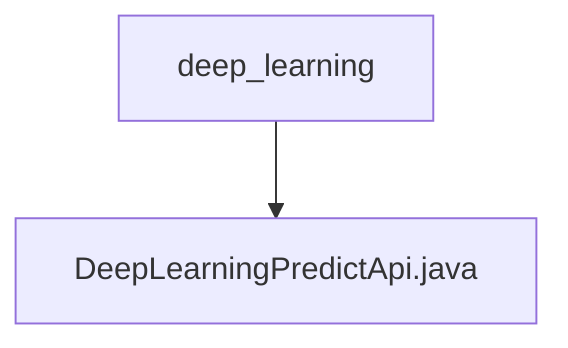

# 基础信息

|      |      |
|------|------|
| 名称 | deep_learning |
| 编码语言 | .java |
| 代码路径 | WeFe/serving/serving-service/src/main/java/com/welab/wefe/serving/service/api/predict/deep_learning |
| 包名 | docs.serving.serving-service.src.main.java.com.welab.wefe.serving.service.api.predict.deep_learning |
| 概述说明 | 深度学习预测API类，无需登录，接收模型ID和图片路径，解压模型文件后调用PaddleServing服务处理图片并返回结果。 |

# 说明

这是一个名为"深度学习预测"的API类，路径为"predict/deep_learning"，无需登录即可访问。该类继承自AbstractApi，接收Input类型参数并返回字符串结果。主要功能包括：解压模型文件到指定目录，调用PaddleServing服务进行预测，并返回预测结果字符串。Input类包含必填的模型ID和可选的图片路径参数。Output类包含图片和JSON格式的预测结果。整个过程涉及文件解压、路径处理和深度学习服务调用等操作。

### 包内部结构视图

该流程图展示了深度学习预测API的路径层级关系，顶层目录为deep_learning，其下包含一个具体的实现文件DeepLearningPredictApi.java。这是一个典型的Java项目结构，其中API实现类位于特定功能模块的目录下，体现了模块化开发的思想。

# 文件列表

| 名称   | 类型  | 说明 |
|-------|------|-------------|
| [DeepLearningPredictApi.java](DeepLearningPredictApi.md) | file | 深度学习预测API类，无需登录，接收模型ID和图片路径，解压模型文件后调用PaddleServing服务处理图片并返回结果。 |

