# 基础信息

|      |      |
|------|------|
| 名称 | QueryListApi |
| 编码语言 | .java |
| 代码路径 | WeFe/serving/serving-service/src/main/java/com/welab/wefe/serving/service/api/requeststatistics/QueryListApi.java |
| 包名 | com.welab.wefe.serving.service.api.requeststatistics |
| 依赖项 | ['com.welab.wefe.common.exception.StatusCodeWithException', 'com.welab.wefe.common.web.api.base.AbstractApi', 'com.welab.wefe.common.web.api.base.Api', 'com.welab.wefe.common.web.dto.ApiResult', 'com.welab.wefe.serving.service.database.entity.RequestStatisticsMysqlModel', 'com.welab.wefe.serving.service.dto.PagingInput', 'com.welab.wefe.serving.service.dto.PagingOutput', 'com.welab.wefe.serving.service.service.RequestStatisticsService', 'org.springframework.beans.factory.annotation.Autowired', 'java.io.IOException', 'java.util.Date'] |
| 概述说明 | 查询请求统计列表的API类，接收分页参数、时间范围、服务名称和客户名称，返回分页的请求统计结果。 |

# 说明

该代码定义了一个名为QueryListApi的API类，用于查询请求统计列表。API路径为requeststatistics/query-list，继承自AbstractApi，输入类型为内部类Input，输出为分页的RequestStatisticsMysqlModel。Input类包含分页参数及四个查询条件：开始时间、结束时间、服务名称和客户名称，均提供getter和setter方法。处理逻辑调用requestStatisticsService的queryList方法并返回结果。

# 类列表 Class Summary

| 名称   | 类型  | 说明 |
|-------|------|-------------|
| QueryListApi | class | QueryListApi用于分页查询请求统计列表，输入包含起止时间、服务名和客户名，调用RequestStatisticsService返回分页结果。 |


## 类 QueryListApi

|      |      |
|------|------|
| 访问范围 | @Api(path = "requeststatistics/query-list", name = "query request statistics list");public |
| 类型 | class |
| 名称 | QueryListApi |
| 说明 | QueryListApi用于分页查询请求统计列表，输入包含起止时间、服务名和客户名，调用RequestStatisticsService返回分页结果。 |


### UML类图

```mermaid
classDiagram
    class QueryListApi {
        -RequestStatisticsService requestStatisticsService
        +handle(Input input) ApiResult~PagingOutput~RequestStatisticsMysqlModel~~
    }
    
    class AbstractApi~T, R~ {
        <<Abstract>>
        +handle(T input) ApiResult~R~
    }
    
    class PagingInput {
        <<Abstract>>
    }
    
    class Input {
        -Date startTime
        -Date endTime
        -String serviceId
        -String clientId
        +getStartTime() Date
        +setStartTime(Date startTime)
        +getEndTime() Date
        +setEndTime(Date endTime)
        +getServiceId() String
        +setServiceId(String serviceId)
        +getClientId() String
        +setClientId(String clientId)
    }
    
    class PagingOutput~T~ {
        <<Generic>>
    }
    
    class RequestStatisticsMysqlModel {
    }
    
    class RequestStatisticsService {
        +queryList(Input input) PagingOutput~RequestStatisticsMysqlModel~
    }
    
    QueryListApi --|> AbstractApi~Input, PagingOutput~RequestStatisticsMysqlModel~~ : 继承
    Input --|> PagingInput : 继承
    QueryListApi --> RequestStatisticsService : 依赖
    RequestStatisticsService ..> PagingOutput~RequestStatisticsMysqlModel~ : 创建
    RequestStatisticsService ..> Input : 使用
```

这段代码描述了一个查询请求统计列表的API类QueryListApi，它继承自泛型抽象类AbstractApi，处理Input参数并返回分页的RequestStatisticsMysqlModel结果。Input类继承自PagingInput，包含时间范围、服务ID和客户端ID等查询条件。QueryListApi通过依赖RequestStatisticsService的queryList方法实现核心业务逻辑，体现了典型的分层架构设计模式。


### 内部方法调用关系图

```mermaid
graph TD
    A["类QueryListApi"]
    B["继承: AbstractApi<Input, PagingOutput<RequestStatisticsMysqlModel>>"]
    C["依赖: RequestStatisticsService"]
    D["重写方法: handle(Input input)"]
    E["内部类: Input"]
    F["属性: Date startTime"]
    G["属性: Date endTime"]
    H["属性: String serviceId"]
    I["属性: String clientId"]
    J["Getter/Setter方法"]

    A --> B
    A --> C
    A --> D
    A --> E
    E --> F
    E --> G
    E --> H
    E --> I
    E --> J
    D -->|调用| C
    D -->|返回| B
```



这段代码定义了一个名为QueryListApi的API类，继承自AbstractApi并处理分页查询请求统计数据的逻辑。类中包含一个内部类Input用于封装查询参数（起止时间、服务ID和客户端ID），通过重写handle方法调用RequestStatisticsService的queryList方法实现业务逻辑。流程图清晰展示了类继承关系、依赖注入、方法重写和内部类结构。

### 字段列表 Field List

| 名称  | 类型  | 说明 |
|-------|-------|------|
| requestStatisticsService | RequestStatisticsService | 自动注入RequestStatisticsService服务实例。 |

### 方法列表

| 名称  | 类型  | 说明 |
|-------|-------|------|
| handle | ApiResult<PagingOutput<RequestStatisticsMysqlModel>> | 重写handle方法，调用服务查询列表并返回分页结果。 |


