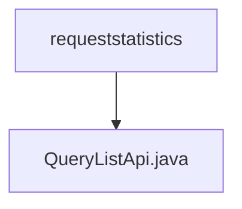

# 基础信息

|      |      |
|------|------|
| 名称 | requeststatistics |
| 编码语言 | .java |
| 代码路径 | WeFe/serving/serving-service/src/main/java/com/welab/wefe/serving/service/api/requeststatistics |
| 包名 | docs.serving.serving-service.src.main.java.com.welab.wefe.serving.service.api.requeststatistics |
| 概述说明 | 查询请求统计列表的API类，接收分页参数、时间范围、服务名称和客户名称，返回分页的请求统计结果。 |

# 说明

该代码定义了一个名为QueryListApi的API类，用于查询请求统计列表。API路径为requeststatistics/query-list，继承自AbstractApi，输入类型为内部类Input，输出为分页的RequestStatisticsMysqlModel。Input类包含分页参数及四个查询条件：开始时间、结束时间、服务名称和客户名称，均提供getter和setter方法。处理逻辑调用requestStatisticsService的queryList方法并返回结果。

### 包内部结构视图

该流程图展示了WeFe项目中requeststatistics目录与QueryListApi.java文件的层级关系。requeststatistics作为父节点，包含一个子节点QueryListApi.java，表示这是一个API接口文件存放在请求统计功能模块目录下的简单结构。整个结构清晰地反映了代码文件在项目中的存储位置关系。

# 文件列表

| 名称   | 类型  | 说明 |
|-------|------|-------------|
| [QueryListApi.java](QueryListApi.md) | file | 查询请求统计列表的API类，接收分页参数、时间范围、服务名称和客户名称，返回分页的请求统计结果。 |

