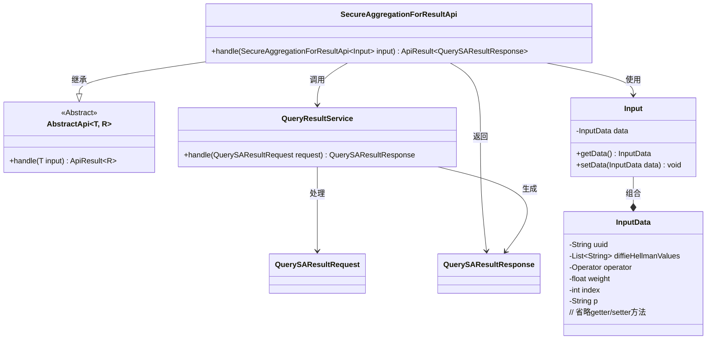

# 基础信息

|      |      |
|------|------|
| 名称 | SecureAggregationForResultApi |
| 编码语言 | .java |
| 代码路径 | WeFe/serving/serving-service/src/main/java/com/welab/wefe/serving/service/api/sa/SecureAggregationForResultApi.java |
| 包名 | com.welab.wefe.serving.service.api.sa |
| 依赖项 | ['java.io.IOException', 'java.util.List', 'com.welab.wefe.common.exception.StatusCodeWithException', 'com.welab.wefe.common.util.JObject', 'com.welab.wefe.common.web.api.base.AbstractApi', 'com.welab.wefe.common.web.api.base.Api', 'com.welab.wefe.common.web.dto.AbstractApiInput', 'com.welab.wefe.common.web.dto.ApiResult', 'com.welab.wefe.common.web.util.ModelMapper', 'com.welab.wefe.mpc.commom.Operator', 'com.welab.wefe.mpc.sa.SecureAggregationApiName', 'com.welab.wefe.mpc.sa.request.QuerySAResultRequest', 'com.welab.wefe.mpc.sa.request.QuerySAResultResponse', 'com.welab.wefe.mpc.sa.server.service.QueryResultService'] |
| 概述说明 | SecureAggregationForResultApi处理安全聚合结果查询，接收包含uuid、DH公钥、操作符、权重等参数的输入，调用QueryResultService处理请求并返回响应。 |

# 说明

SecureAggregationForResultApi是一个处理安全聚合结果的API类，继承自AbstractApi，输入为Input类，输出为QuerySAResultResponse。API路径为SA_RESULT，无需登录。handle方法处理输入请求，调用QueryResultService服务，记录请求和响应日志。Input类包含InputData数据，InputData包含请求标识uuid、参与方DH公钥列表diffieHellmanValues、操作符operator、权重weight、参与方序号index和DH模式p等字段，提供各字段的getter和setter方法。

# 类列表 Class Summary

| 名称   | 类型  | 说明 |
|-------|------|-------------|
| SecureAggregationForResultApi | class | SecureAggregationForResultApi处理安全聚合结果查询，接收包含UUID、DH公钥列表、操作符、权重等参数的输入，调用QueryResultService处理请求并返回响应。 |

## 类 SecureAggregationForResultApi

|      |      |
|------|------|
| 访问范围 | @Api(path = SecureAggregationApiName.SA_RESULT, name = "sa_result", login = false);public |
| 类型 | class |
| 名称 | SecureAggregationForResultApi |
| 说明 | SecureAggregationForResultApi处理安全聚合结果查询，接收包含UUID、DH公钥列表、操作符、权重等参数的输入，调用QueryResultService处理请求并返回响应。 |

### UML类图

该代码实现了一个安全聚合结果查询API，核心类SecureAggregationForResultApi继承自泛型抽象类AbstractApi，处理包含加密参数（DH公钥、操作符等）的输入数据，通过QueryResultService生成查询响应。类结构包含三层嵌套：API主类、输入参数类(Input)及其数据类(InputData)，配合服务类完成安全计算请求处理流程，涉及多种数据类型转换和日志记录功能。

### 内部方法调用关系图

```mermaid
graph TD
    A["类SecureAggregationForResultApi"]
    B["继承: AbstractApi<Input, QuerySAResultResponse>"]
    C["注解: @Api"]
    D["方法: handle(Input input)"]
    E["创建: QueryResultService"]
    F["日志记录请求信息"]
    G["数据映射: ModelMapper.map"]
    H["调用: service.handle"]
    I["日志记录响应信息"]
    J["返回: success(response)"]
    K["内部类Input"]
    L["属性: InputData data"]
    M["getter/setter方法"]
    N["内部类InputData"]
    O["属性: String uuid, List<String> diffieHellmanValues等"]
    P["getter/setter方法"]

    A --> B
    A --> C
    A --> D
    D --> E
    D --> F
    D --> G
    D --> H
    D --> I
    D --> J
    A --> K
    K --> L
    K --> M
    A --> N
    N --> O
    N --> P
```

这段代码展示了一个安全聚合结果API的实现，主要包含请求处理流程和数据结构定义。流程图清晰地呈现了类继承关系、核心处理方法handle()的执行步骤（包括服务调用、数据转换和日志记录），以及两个内部类Input和InputData的结构。InputData类封装了请求参数如UUID、DH公钥列表、操作符等字段，通过getter/setter方法提供访问接口。整个设计体现了API请求处理的标准模式，从请求接收、业务处理到响应返回的完整流程。

### 字段列表 Field List

| 名称  | 类型  | 说明 |
|-------|-------|------|

### 方法列表

| 名称  | 类型  | 说明 |
|-------|-------|------|
| handle | ApiResult<QuerySAResultResponse> | 处理安全聚合结果请求，记录输入输出日志，调用服务并返回响应。 |

