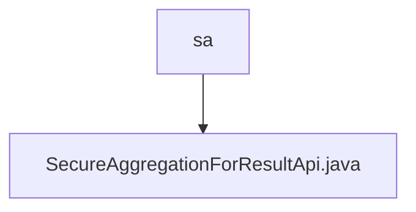

# 基础信息

|      |      |
|------|------|
| 名称 | sa |
| 编码语言 | .java |
| 代码路径 | WeFe/serving/serving-service/src/main/java/com/welab/wefe/serving/service/api/sa |
| 包名 | docs.serving.serving-service.src.main.java.com.welab.wefe.serving.service.api.sa |
| 概述说明 | SecureAggregationForResultApi处理安全聚合结果查询，接收包含uuid、DH公钥、操作符、权重等参数的输入，调用QueryResultService处理请求并返回响应。 |

# 说明

SecureAggregationForResultApi是一个处理安全聚合结果的API类，继承自AbstractApi，输入为Input类，输出为QuerySAResultResponse。API路径为SA_RESULT，无需登录。handle方法处理输入请求，调用QueryResultService服务，记录请求和响应日志。Input类包含InputData数据，InputData包含请求标识uuid、参与方DH公钥列表diffieHellmanValues、操作符operator、权重weight、参与方序号index和DH模式p等字段，提供各字段的getter和setter方法。

### 包内部结构视图

该流程图展示了WeFe项目中secure aggregation模块的API文件结构。顶层目录"sa"包含一个实现安全聚合功能的Java类文件SecureAggregationForResultApi.java，这是该模块的核心业务逻辑实现文件。整个结构简洁明了，体现了单一职责的设计原则。

# 文件列表

| 名称   | 类型  | 说明 |
|-------|------|-------------|
| [SecureAggregationForResultApi.java](SecureAggregationForResultApi.md) | file | SecureAggregationForResultApi处理安全聚合结果查询，接收包含uuid、DH公钥、操作符、权重等参数的输入，调用QueryResultService处理请求并返回响应。 |

