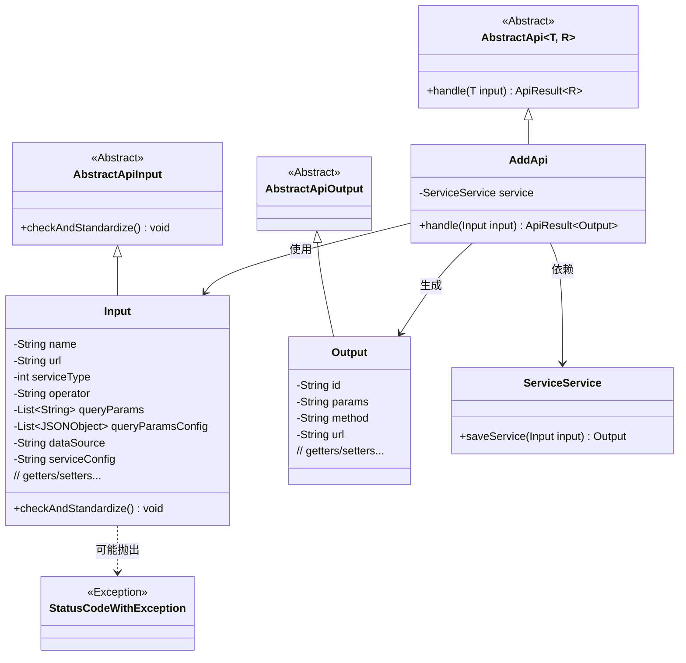
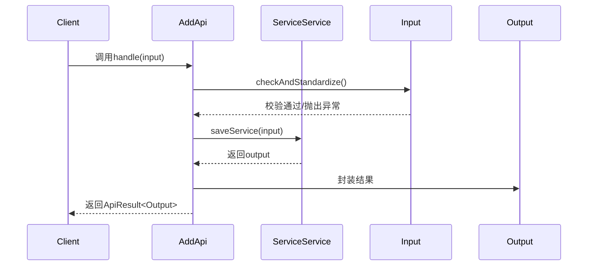

# 基础信息

|      |      |
|------|------|
| 名称 | AddApi |
| 编码语言 | .java |
| 代码路径 | WeFe/serving/serving-service/src/main/java/com/welab/wefe/serving/service/api/service/AddApi.java |
| 包名 | com.welab.wefe.serving.service.api.service |
| 依赖项 | ['java.io.IOException', 'java.util.List', 'org.apache.commons.lang3.StringUtils', 'org.springframework.beans.factory.annotation.Autowired', 'com.alibaba.fastjson.JSONArray', 'com.alibaba.fastjson.JSONObject', 'com.welab.wefe.common.StatusCode', 'com.welab.wefe.common.exception.StatusCodeWithException', 'com.welab.wefe.common.fieldvalidate.annotation.Check', 'com.welab.wefe.common.util.JObject', 'com.welab.wefe.common.web.api.base.AbstractApi', 'com.welab.wefe.common.web.api.base.Api', 'com.welab.wefe.common.web.dto.AbstractApiInput', 'com.welab.wefe.common.web.dto.AbstractApiOutput', 'com.welab.wefe.common.web.dto.ApiResult', 'com.welab.wefe.serving.service.enums.ServiceTypeEnum', 'com.welab.wefe.serving.service.service.ServiceService'] |
| 概述说明 | AddApi类用于添加服务，包含输入输出类。输入类校验服务名、地址、类型等参数，输出类返回ID、参数、方法和URL。处理逻辑调用service保存服务并返回结果。 |

# 说明

该代码定义了一个名为AddApi的API类，用于添加服务。API路径为"service/add"，继承自AbstractApi类，处理Input和Output类型数据。Input类包含服务名、地址、类型等必填字段，以及操作、查询参数配置等可选字段，并进行了严格的参数校验。Output类返回服务ID、参数、方法类型和URL。核心逻辑通过ServiceService保存输入数据并返回输出结果，校验包括服务类型检查、数据源和服务配置的非空验证，以及URL格式的合法性检查。

# 类列表 Class Summary

| 名称   | 类型  | 说明 |
|-------|------|-------------|
| AddApi | class | AddApi类处理服务添加请求，输入包含服务名、地址、类型等必填字段，输出返回服务ID、参数、方法和URL。输入校验包括服务类型、数据源、配置及地址格式。 |

## 类 AddApi

|      |      |
|------|------|
| 访问范围 | @Api(path = "service/add", name = "add service");public |
| 类型 | class |
| 名称 | AddApi |
| 说明 | AddApi类处理服务添加请求，输入包含服务名、地址、类型等必填字段，输出返回服务ID、参数、方法和URL。输入校验包括服务类型、数据源、配置及地址格式。 |

### UML类图

该类图展示了AddApi及其相关类的结构关系。AddApi继承自泛型抽象类AbstractApi，处理Input输入并生成Output输出。Input类继承自AbstractApiInput，包含多个校验字段和复杂的参数校验逻辑。Output是简单的数据传输对象。ServiceService作为依赖服务被注入，StatusCodeWithException是可能抛出的异常类型。整体结构体现了分层设计和参数校验的严谨性。

### 内部方法调用关系图

```mermaid
graph TD
    A["类AddApi"]
    B["注解: @Api(path='service/add', name='add service')"]
    C["继承: AbstractApi<Input, Output>"]
    D["依赖注入: @Autowired ServiceService service"]
    E["重写方法: handle(Input input)"]
    F["内部类: Output"]
    G["内部类: Input"]
    H["Output属性: id, params, method='POST', url"]
    I["Input属性: name, url, serviceType等"]
    J["Input方法: checkAndStandardize()"]

    A --> B
    A --> C
    A --> D
    A --> E
    A --> F
    A --> G
    F --> H
    G --> I
    G --> J
    E -->|调用| D
    E -->|返回| F
    J -->|校验| I
```

该流程图展示了AddApi类的结构，包含注解、继承关系、依赖注入和两个内部类(Input/Output)。时序图描述了客户端调用handle方法时的完整流程：先校验输入参数，然后通过ServiceService保存服务，最后返回封装结果。Input类包含严格的参数校验逻辑，Output类定义了标准响应格式。整个流程实现了服务添加的API功能。

### 字段列表 Field List

| 名称  | 类型  | 说明 |
|-------|-------|------|
| service | ServiceService | 自动注入ServiceService实例。 |

### 方法列表

| 名称  | 类型  | 说明 |
|-------|-------|------|
| handle | ApiResult<Output> | Java方法重写，处理输入并调用服务保存，返回成功结果或异常。 |

