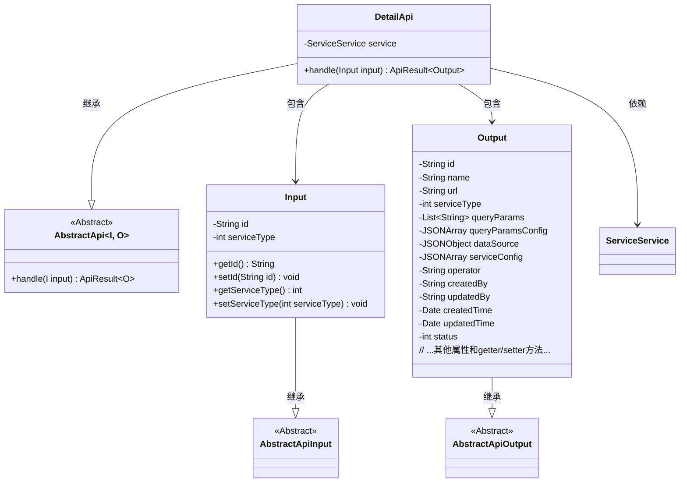

# 基础信息

|      |      |
|------|------|
| 名称 | DetailApi |
| 编码语言 | .java |
| 代码路径 | WeFe/serving/serving-service/src/main/java/com/welab/wefe/serving/service/api/service/DetailApi.java |
| 包名 | com.welab.wefe.serving.service.api.service |
| 依赖项 | ['com.alibaba.fastjson.JSONArray', 'com.alibaba.fastjson.JSONObject', 'com.welab.wefe.common.exception.StatusCodeWithException', 'com.welab.wefe.common.fieldvalidate.annotation.Check', 'com.welab.wefe.common.util.JObject', 'com.welab.wefe.common.web.api.base.AbstractApi', 'com.welab.wefe.common.web.api.base.Api', 'com.welab.wefe.common.web.dto.AbstractApiInput', 'com.welab.wefe.common.web.dto.AbstractApiOutput', 'com.welab.wefe.common.web.dto.ApiResult', 'com.welab.wefe.common.wefe.enums.Algorithm', 'com.welab.wefe.common.wefe.enums.FederatedLearningType', 'com.welab.wefe.common.wefe.enums.JobMemberRole', 'com.welab.wefe.common.wefe.enums.PredictFeatureDataSource', 'com.welab.wefe.serving.service.dto.ModelSqlConfigOutput', 'com.welab.wefe.serving.service.dto.ModelStatusOutput', 'com.welab.wefe.serving.service.dto.TreeNode', 'com.welab.wefe.serving.service.service.ServiceService', 'org.springframework.beans.factory.annotation.Autowired', 'java.io.IOException', 'java.util.Date', 'java.util.List'] |
| 概述说明 | 服务详情API类，处理输入id和服务类型，返回包含服务配置、数据源、状态等详细信息的输出。 |

# 说明

DetailApi是一个处理服务详情的API类，继承自AbstractApi，路径为"service/detail"。它接收Input参数，包含必填的主键id和服务类型，通过ServiceService获取详情数据并返回Output结果。Output包含服务的基本信息如id、名称、URL、服务类型，以及查询参数、数据源、配置等详细字段，还涉及算法、联邦学习类型、模型参数、SQL脚本等扩展信息。处理过程中捕获异常并返回失败信息。

# 类列表 Class Summary

| 名称   | 类型  | 说明 |
|-------|------|-------------|
| DetailApi | class | 服务详情API类，处理输入id和服务类型，返回包含服务配置、数据源、模型参数等详细信息的输出。 |

## 类 DetailApi

|      |      |
|------|------|
| 访问范围 | @Api(path = "service/detail", name = "服务详情");public |
| 类型 | class |
| 名称 | DetailApi |
| 说明 | 服务详情API类，处理输入id和服务类型，返回包含服务配置、数据源、模型参数等详细信息的输出。 |

### UML类图

这段代码定义了一个服务详情API（DetailApi），它继承自泛型抽象类AbstractApi，处理输入（Input）和输出（Output）类型。Input类包含id和serviceType字段及校验注解，Output类包含大量服务详情相关字段。DetailApi通过ServiceService获取详情数据，并处理可能的异常。类图展示了继承关系和依赖关系，Input和Output作为嵌套类分别扩展了抽象输入输出基类。

### 内部方法调用关系图

```mermaid
graph TD
    A["类DetailApi"]
    B["注解: @Api(path='service/detail', name='服务详情')"]
    C["继承: AbstractApi<Input, Output>"]
    D["依赖注入: @Autowired ServiceService service"]
    E["重写方法: handle(Input input)"]
    F["嵌套类: Input"]
    G["嵌套类: Output"]
    H["Input属性: String id, int serviceType"]
    I["Input方法: getter/setter"]
    J["Output属性: 25个字段"]
    K["Output方法: getter/setter"]

    A --> B
    A --> C
    A --> D
    A --> E
    A --> F
    A --> G
    F --> H
    F --> I
    G --> J
    G --> K
    E -->|try| L["调用: service.detail(input)"]
    E -->|catch| M["处理异常: e.printStackTrace(), fail(e.getMessage())"]
    L --> N["返回: success(result)"]
    M --> O["返回: fail(message)"]
```

该流程图展示了DetailApi类的核心结构，包括类注解、继承关系、依赖注入和主要方法调用链。重点描述了handle方法的异常处理流程：正常情况调用service.detail并返回成功结果，异常时打印堆栈并返回错误信息。嵌套类Input和Output分别包含验证注解的字段和复杂的输出数据结构，通过getter/setter方法暴露属性。整体呈现了API请求处理的核心路径和数据结构关系。

### 字段列表 Field List

| 名称  | 类型  | 说明 |
|-------|-------|------|
| service | ServiceService | 自动注入ServiceService实例。 |

### 方法列表

| 名称  | 类型  | 说明 |
|-------|-------|------|
| handle | ApiResult<Output> | 处理输入并返回服务详情结果，成功返回详情，失败返回错误信息。 |

