# 基础信息

|      |      |
|------|------|
| 名称 | ExportSDKApi |
| 编码语言 | .java |
| 代码路径 | WeFe/serving/serving-service/src/main/java/com/welab/wefe/serving/service/api/service/ExportSDKApi.java |
| 包名 | com.welab.wefe.serving.service.api.service |
| 依赖项 | ['java.io.IOException', 'org.springframework.beans.factory.annotation.Autowired', 'org.springframework.http.ResponseEntity', 'com.welab.wefe.common.exception.StatusCodeWithException', 'com.welab.wefe.common.web.api.base.AbstractApi', 'com.welab.wefe.common.web.api.base.Api', 'com.welab.wefe.common.web.dto.AbstractApiInput', 'com.welab.wefe.common.web.dto.ApiResult', 'com.welab.wefe.serving.service.service.ServiceService'] |
| 概述说明 | 这是一个名为ExportSDKApi的Java类，用于处理导出SDK的API请求。它继承自AbstractApi，接受Input参数并返回ResponseEntity。Input类包含serviceId字段，通过ServiceService处理导出请求。 |

# 说明

这是一个名为ExportSDKApi的Java类，用于处理导出SDK的API请求。它继承自AbstractApi类，泛型参数指定输入类型为内部类Input，返回类型为ResponseEntity<?>。类上标注了Api注解，定义了API路径为"service/export_sdk"和名称为"export sdk"。通过Autowired注入了ServiceService实例。核心方法handle接收Input参数，调用service.exportSdk方法并返回文件结果。Input是内部静态类，继承AbstractApiInput，包含一个serviceId字符串属性及其getter和setter方法。

# 类列表 Class Summary

| 名称   | 类型  | 说明 |
|-------|------|-------------|
| ExportSDKApi | class | ExportSDKApi类处理导出SDK请求，接收serviceId参数，调用ServiceService导出文件并返回结果。输入类Input包含serviceId字段及其getter/setter方法。 |


## 类 ExportSDKApi

|      |      |
|------|------|
| 访问范围 | @Api(path = "service/export_sdk", name = "export sdk");public |
| 类型 | class |
| 名称 | ExportSDKApi |
| 说明 | ExportSDKApi类处理导出SDK请求，接收serviceId参数，调用ServiceService导出文件并返回结果。输入类Input包含serviceId字段及其getter/setter方法。 |


### UML类图

```mermaid
classDiagram
    class ExportSDKApi {
        -ServiceService service
        +handle(Input input) ApiResult~ResponseEntity~?~
    }
    class AbstractApi~T, R~ {
        <<Abstract>>
        +handle(T input) ApiResult~R~
    }
    class AbstractApiInput {
        <<Abstract>>
    }
    class Input {
        -String serviceId
        +String getServiceId()
        +void setServiceId(String serviceId)
    }
    class ServiceService {
        <<Interface>>
        +exportSdk(String serviceId) Object
    }

    ExportSDKApi --|> AbstractApi~Input, ResponseEntity~?~ : 继承
    Input --|> AbstractApiInput : 继承
    ExportSDKApi --> ServiceService : 依赖
    ExportSDKApi --> Input : 包含
```

类图描述：该图展示了一个基于Spring框架的API实现结构。ExportSDKApi继承自泛型抽象类AbstractApi，处理Input参数并返回ResponseEntity。Input作为内部类继承AbstractApiInput，包含serviceId字段。ExportSDKApi通过依赖注入使用ServiceService接口的exportSdk方法，整体构成典型的控制器-服务分层架构，符合RESTful API设计规范。


### 内部方法调用关系图

```mermaid
graph TD
    A["类ExportSDKApi"]
    B["注解: @Api(path='service/export_sdk', name='export sdk')"]
    C["继承: AbstractApi<Input, ResponseEntity<?>>"]
    D["依赖注入: @Autowired ServiceService service"]
    E["重写方法: handle(Input input)"]
    F["内部类: Input"]
    G["属性: String serviceId"]
    H["方法: getServiceId()"]
    I["方法: setServiceId(String)"]
    J["调用: service.exportSdk(input.getServiceId())"]
    K["返回: file(export结果)"]

    A --> B
    A --> C
    A --> D
    A --> E
    A --> F
    F --> G
    F --> H
    F --> I
    E --> J
    J --> K
```



该流程图展示了ExportSDKApi类的完整结构，包含API注解、父类继承、服务注入和核心处理逻辑。handle方法通过serviceId调用exportSdk服务，最终返回封装后的文件结果。内部类Input负责封装服务ID参数，提供标准的getter/setter方法。整体设计符合Spring Boot的API开发规范，实现了清晰的参数传递和业务处理分离。

### 字段列表 Field List

| 名称  | 类型  | 说明 |
|-------|-------|------|
| service | ServiceService | 自动注入ServiceService类型的私有成员变量service。 |

### 方法列表

| 名称  | 类型  | 说明 |
|-------|-------|------|
| handle | ApiResult<ResponseEntity<?>> | 处理输入并调用服务导出SDK，返回文件结果或异常。 |


