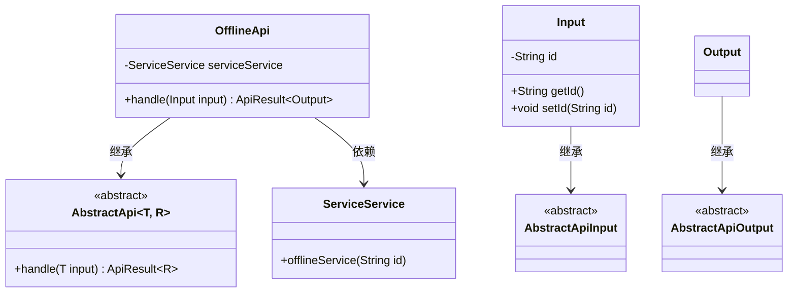

# 基础信息

|      |      |
|------|------|
| 名称 | OfflineApi |
| 编码语言 | .java |
| 代码路径 | WeFe/serving/serving-service/src/main/java/com/welab/wefe/serving/service/api/service/OfflineApi.java |
| 包名 | com.welab.wefe.serving.service.api.service |
| 依赖项 | ['java.io.IOException', 'org.springframework.beans.factory.annotation.Autowired', 'com.welab.wefe.common.exception.StatusCodeWithException', 'com.welab.wefe.common.fieldvalidate.annotation.Check', 'com.welab.wefe.common.web.api.base.AbstractApi', 'com.welab.wefe.common.web.api.base.Api', 'com.welab.wefe.common.web.dto.AbstractApiInput', 'com.welab.wefe.common.web.dto.AbstractApiOutput', 'com.welab.wefe.common.web.dto.ApiResult', 'com.welab.wefe.serving.service.service.ServiceService'] |
| 概述说明 | 离线服务API类，处理服务下线请求，需传入ID参数，调用serviceService完成操作，返回成功结果。 |

# 说明

该代码定义了一个名为OfflineApi的API类，用于处理服务下线操作。类注解指定了API路径为service/offline，名称为offline service。它继承自AbstractApi，使用泛型指定输入类型为内部类Input，输出类型为内部类Output。Input类包含一个名为id的字符串属性，带有主键校验注解，并提供了getter和setter方法。Output类为空，继承自AbstractApiOutput。handle方法通过注入的ServiceService调用offlineService方法执行下线操作，输入参数为id，成功后返回空结果。整个API设计简洁，专注于单一功能。

# 类列表 Class Summary

| 名称   | 类型  | 说明 |
|-------|------|-------------|
| OfflineApi | class | OfflineApi类处理离线服务请求，接收包含id的输入，调用serviceService下线服务，返回成功结果。 |

## 类 OfflineApi

|      |      |
|------|------|
| 访问范围 | @Api(path = "service/offline", name = "offline service");public |
| 类型 | class |
| 名称 | OfflineApi |
| 说明 | OfflineApi类处理离线服务请求，接收包含id的输入，调用serviceService下线服务，返回成功结果。 |

### UML类图

类图描述：该图展示了OfflineApi类继承自泛型抽象类AbstractApi<Input, Output>的结构，其中Input和Output分别继承自AbstractApiInput和AbstractApiOutput。OfflineApi通过@Autowired注入ServiceService依赖，并重写handle方法实现具体业务逻辑。输入类Input包含id字段及其访问器，输出类Output为空实现。整体构成一个典型的API处理类层次结构。

### 内部方法调用关系图

```mermaid
graph TD
    A["类OfflineApi"]
    B["注解: @Api(path='service/offline', name='offline service')"]
    C["继承: AbstractApi<Input, Output>"]
    D["依赖注入: @Autowired ServiceService"]
    E["重写方法: handle(Input input)"]
    F["调用: serviceService.offlineService(input.getId())"]
    G["返回: success()"]
    H["嵌套类Input"]
    I["属性: @Check String id"]
    J["嵌套类Output"]
    K["getter/setter: getId()/setId()"]

    A --> B
    A --> C
    A --> D
    A --> E
    E --> F
    E --> G
    A --> H
    H --> I
    H --> K
    A --> J
```

这段代码描述了一个名为OfflineApi的API类，继承自AbstractApi并处理离线服务请求。类结构包含输入参数Input（带ID校验）和空输出Output，核心逻辑通过handle方法调用serviceService完成服务下线操作。流程图展示了类注解、继承关系、依赖注入、方法调用及嵌套类的完整结构。

### 字段列表 Field List

| 名称  | 类型  | 说明 |
|-------|-------|------|
| serviceService | ServiceService | 使用@Autowired自动注入ServiceService实例。 |

### 方法列表

| 名称  | 类型  | 说明 |
|-------|-------|------|
| handle | ApiResult<Output> | 方法重写，处理输入并调用服务下线，成功返回结果。 |

