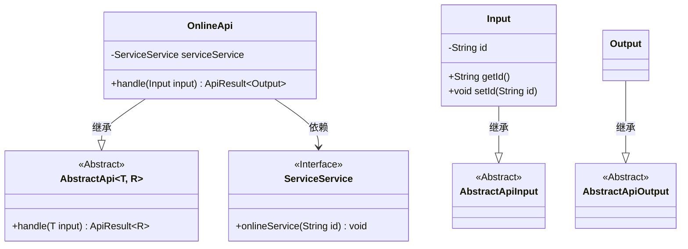

# 基础信息

|      |      |
|------|------|
| 名称 | OnlineApi |
| 编码语言 | .java |
| 代码路径 | WeFe/serving/serving-service/src/main/java/com/welab/wefe/serving/service/api/service/OnlineApi.java |
| 包名 | com.welab.wefe.serving.service.api.service |
| 依赖项 | ['java.io.IOException', 'org.springframework.beans.factory.annotation.Autowired', 'com.welab.wefe.common.exception.StatusCodeWithException', 'com.welab.wefe.common.fieldvalidate.annotation.Check', 'com.welab.wefe.common.web.api.base.AbstractApi', 'com.welab.wefe.common.web.api.base.Api', 'com.welab.wefe.common.web.dto.AbstractApiInput', 'com.welab.wefe.common.web.dto.AbstractApiOutput', 'com.welab.wefe.common.web.dto.ApiResult', 'com.welab.wefe.serving.service.service.ServiceService'] |
| 概述说明 | OnlineApi类提供在线服务接口，接收含id的输入，调用serviceService.onlineService处理，返回成功结果。 |

# 说明

该代码定义了一个名为OnlineApi的API类，用于处理在线服务请求。类注解指定了API路径为"service/online"，名称为"online service"。它继承自AbstractApi，使用泛型指定输入类型为OnlineApi.Input，输出类型为OnlineApi.Output。通过@Autowired注入了ServiceService依赖。handle方法接收Input对象，调用serviceService的onlineService方法处理请求，并返回成功结果。Input内部类继承AbstractApiInput，包含一个名为id的字符串属性，带有@Check注解验证。Output内部类继承AbstractApiOutput，当前为空。整个API实现了基本的在线服务功能。

# 类列表 Class Summary

| 名称   | 类型  | 说明 |
|-------|------|-------------|
| OnlineApi | class | OnlineApi类提供在线服务接口，通过id调用serviceService.onlineService方法，返回成功结果。输入参数为id，输出为空。 |

## 类 OnlineApi

|      |      |
|------|------|
| 访问范围 | @Api(path = "service/online", name = "online service");public |
| 类型 | class |
| 名称 | OnlineApi |
| 说明 | OnlineApi类提供在线服务接口，通过id调用serviceService.onlineService方法，返回成功结果。输入参数为id，输出为空。 |

### UML类图

该代码展示了一个在线服务API的实现结构。OnlineApi继承自泛型抽象类AbstractApi，处理Input和Output类型的数据。Input类包含服务ID字段及其访问器，继承自AbstractApiInput；Output是空实现，继承自AbstractApiOutput。OnlineApi通过依赖注入使用ServiceService接口的onlineService方法。整体设计遵循模板方法模式，抽象类定义处理框架，子类实现具体业务逻辑。

### 内部方法调用关系图

```mermaid
graph TD
    A["类OnlineApi"]
    B["注解: @Api(path='service/online', name='online service')"]
    C["继承: AbstractApi<Input, Output>"]
    D["依赖注入: @Autowired ServiceService"]
    E["重写方法: handle(Input input)"]
    F["内部类: Input"]
    G["内部类: Output"]
    H["Input属性: String id"]
    I["Input方法: getId/setId"]
    J["调用: serviceService.onlineService"]
    K["返回: success()"]

    A --> B
    A --> C
    A --> D
    A --> E
    A --> F
    A --> G
    F --> H
    F --> I
    E --> J
    E --> K
```

该流程图展示了OnlineApi类的结构及其关键行为。OnlineApi是一个带有API注解的类，继承自泛型抽象类AbstractApi，包含两个嵌套的输入输出类Input和Output。核心逻辑在handle方法中，通过注入的serviceService调用onlineService方法，并返回成功结果。Input类包含一个带校验注解的id字段及其getter/setter方法。

### 字段列表 Field List

| 名称  | 类型  | 说明 |
|-------|-------|------|
| serviceService | ServiceService | 使用@Autowired自动注入ServiceService实例。 |

### 方法列表

| 名称  | 类型  | 说明 |
|-------|-------|------|
| handle | ApiResult<Output> | 重写handle方法，调用onlineService处理输入ID，成功返回结果。异常时抛出StatusCodeWithException或IOException。 |

