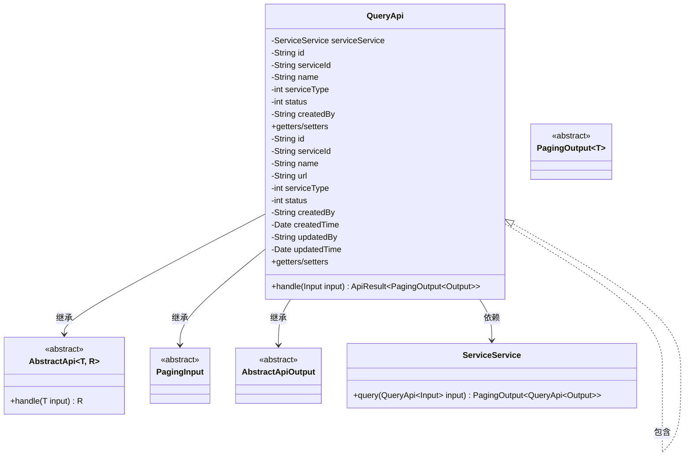

# 基础信息

|      |      |
|------|------|
| 名称 | QueryApi |
| 编码语言 | .java |
| 代码路径 | WeFe/serving/serving-service/src/main/java/com/welab/wefe/serving/service/api/service/QueryApi.java |
| 包名 | com.welab.wefe.serving.service.api.service |
| 依赖项 | ['java.io.IOException', 'java.util.Date', 'org.springframework.beans.factory.annotation.Autowired', 'com.welab.wefe.common.exception.StatusCodeWithException', 'com.welab.wefe.common.web.api.base.AbstractApi', 'com.welab.wefe.common.web.api.base.Api', 'com.welab.wefe.common.web.dto.AbstractApiOutput', 'com.welab.wefe.common.web.dto.ApiResult', 'com.welab.wefe.serving.service.dto.PagingInput', 'com.welab.wefe.serving.service.dto.PagingOutput', 'com.welab.wefe.serving.service.service.ServiceService'] |
| 概述说明 | QueryApi类用于查询服务列表，包含输入参数和输出结果的定义，输入支持分页、服务类型和状态筛选，输出包含服务详情和分页信息。 |

# 说明

QueryApi类是一个用于查询服务列表的API接口，继承自AbstractApi，处理Input输入并返回PagingOutput<Output>分页结果。Input类包含分页参数及服务ID、名称、类型、状态、创建人等查询条件。Output类包含服务ID、名称、URL、类型、状态、创建及更新时间等详细信息。该API通过ServiceService的query方法实现查询逻辑，返回结果封装为ApiResult。

# 类列表 Class Summary

| 名称   | 类型  | 说明 |
|-------|------|-------------|
| QueryApi | class | QueryApi类提供分页查询服务列表功能，包含输入参数和输出结果定义，输入支持服务名、类型、状态等筛选，输出包含服务ID、名称、URL、类型、状态及创建更新信息。 |

## 类 QueryApi

|      |      |
|------|------|
| 访问范围 | @Api(path = "service/query", name = "query service list");public |
| 类型 | class |
| 名称 | QueryApi |
| 说明 | QueryApi类提供分页查询服务列表功能，包含输入参数和输出结果定义，输入支持服务名、类型、状态等筛选，输出包含服务ID、名称、URL、类型、状态及创建更新信息。 |

### UML类图

这段代码展示了一个查询服务的API实现，包含输入输出数据结构和业务逻辑处理。QueryApi继承自泛型抽象类AbstractApi，使用ServiceService处理具体查询业务。输入类Input继承PagingInput实现分页参数，输出类Output继承AbstractApiOutput包含服务详情字段。类图清晰地反映了各组件间的继承、依赖和包含关系，体现了分层设计和职责分离原则。

### 内部方法调用关系图

```mermaid
graph TD
    A["类QueryApi"]
    B["注解: @Api"]
    C["继承: AbstractApi<Input, PagingOutput<Output>>"]
    D["依赖注入: @Autowired ServiceService"]
    E["重写方法: handle(Input input)"]
    F["内部类: Output"]
    G["内部类: Input"]
    H["Output属性: id, serviceId, name, url..."]
    I["Input属性: id, serviceId, name, serviceType..."]
    J["方法调用: serviceService.query(input)"]
    K["返回结果: success()"]

    A --> B
    A --> C
    A --> D
    A --> E
    A --> F
    A --> G
    F --> H
    G --> I
    E --> J
    J --> K
```

这段代码展示了一个基于Spring框架的查询API实现，主要包含QueryApi主类及其两个嵌套类Input和Output。流程图清晰地呈现了类结构关系：QueryApi通过继承AbstractApi获得基础功能，使用@ServiceService处理业务逻辑，并通过handle方法处理输入参数后返回分页结果。嵌套类Input用于封装查询条件参数，Output则定义了返回数据的结构。整个流程从API入口开始，经过服务调用，最终返回封装好的结果数据。

### 字段列表 Field List

| 名称  | 类型  | 说明 |
|-------|-------|------|
| serviceService | ServiceService | 使用@Autowired自动注入ServiceService实例。 |

### 方法列表

| 名称  | 类型  | 说明 |
|-------|-------|------|
| handle | ApiResult<PagingOutput<Output>> | 重写handle方法，调用serviceService.query处理输入并返回分页结果。 |

