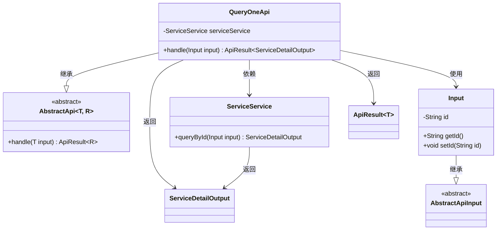

# 基础信息

|      |      |
|------|------|
| 名称 | QueryOneApi |
| 编码语言 | .java |
| 代码路径 | WeFe/serving/serving-service/src/main/java/com/welab/wefe/serving/service/api/service/QueryOneApi.java |
| 包名 | com.welab.wefe.serving.service.api.service |
| 依赖项 | ['org.springframework.beans.factory.annotation.Autowired', 'com.welab.wefe.common.web.api.base.AbstractApi', 'com.welab.wefe.common.web.api.base.Api', 'com.welab.wefe.common.web.dto.AbstractApiInput', 'com.welab.wefe.common.web.dto.ApiResult', 'com.welab.wefe.serving.service.dto.ServiceDetailOutput', 'com.welab.wefe.serving.service.service.ServiceService'] |
| 概述说明 | QueryOneApi是一个通过ID查询服务的API，输入为ID，输出服务详情，调用serviceService.queryById实现查询。 |

# 说明

这段代码定义了一个名为QueryOneApi的API类，用于通过ID查询服务详情。该类继承自AbstractApi，指定了输入类型为Input、输出类型为ServiceDetailOutput。API路径为"service/query-one"，名称为"query service by id"。内部类Input包含一个字符串类型的id字段及其getter和setter方法。handle方法通过注入的ServiceService调用queryById方法处理输入参数，并返回封装为ApiResult的成功结果。

# 类列表 Class Summary

| 名称   | 类型  | 说明 |
|-------|------|-------------|
| QueryOneApi | class | QueryOneApi是一个通过ID查询服务的接口，输入为ID，输出服务详情，调用serviceService的queryById方法处理请求。 |

## 类 QueryOneApi

|      |      |
|------|------|
| 访问范围 | @Api(path = "service/query-one", name = "query service by id");public |
| 类型 | class |
| 名称 | QueryOneApi |
| 说明 | QueryOneApi是一个通过ID查询服务的接口，输入为ID，输出服务详情，调用serviceService的queryById方法处理请求。 |

### UML类图

类图描述：该图展示了QueryOneApi类继承自泛型类AbstractApi，并依赖ServiceService来查询服务详情。Input作为内部类继承AbstractApiInput，包含id属性和getter/setter方法。ApiResult和ServiceDetailOutput作为返回类型使用。整体结构体现了基于抽象模板的API实现模式，通过服务层获取数据并返回包装结果。

### 内部方法调用关系图

```mermaid
graph TD
    A["类QueryOneApi"]
    B["注解: @Api(path='service/query-one', name='query service by id')"]
    C["继承: AbstractApi<Input, ServiceDetailOutput>"]
    D["依赖注入: @Autowired ServiceService"]
    E["重写方法: handle(Input input)"]
    F["内部类: Input"]
    G["属性: String id"]
    H["方法: String getId()"]
    I["方法: void setId(String id)"]
    J["调用: serviceService.queryById(input)"]
    K["返回: ApiResult.success(result)"]

    A --> B
    A --> C
    A --> D
    A --> E
    E --> J
    J --> K
    A -.-> F
    F --> G
    F --> H
    F --> I
```

这段代码定义了一个名为QueryOneApi的API类，用于通过ID查询服务详情。该类继承自AbstractApi，使用@ServiceService处理业务逻辑，并通过handle方法调用queryById查询服务。Input作为内部类封装了请求参数id及其getter/setter方法。流程图展示了类结构、方法调用关系和数据处理流程，体现了从请求处理到结果返回的完整链路。

### 字段列表 Field List

| 名称  | 类型  | 说明 |
|-------|-------|------|
| serviceService | ServiceService | 自动注入ServiceService实例。 |

### 方法列表

| 名称  | 类型  | 说明 |
|-------|-------|------|
| handle | ApiResult<ServiceDetailOutput> | 这段代码重写了一个方法，调用serviceService的queryById方法处理输入参数，并返回封装为ApiResult的成功结果。 |

