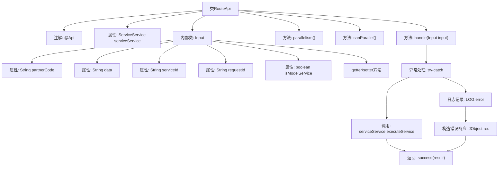

# 基础信息

|      |      |
|------|------|
| 名称 | RouteApi |
| 编码语言 | .java |
| 代码路径 | WeFe/serving/serving-service/src/main/java/com/welab/wefe/serving/service/api/service/RouteApi.java |
| 包名 | com.welab.wefe.serving.service.api.service |
| 依赖项 | ['org.springframework.beans.factory.annotation.Autowired', 'com.welab.wefe.common.fieldvalidate.annotation.Check', 'com.welab.wefe.common.util.JObject', 'com.welab.wefe.common.web.api.base.AbstractApi', 'com.welab.wefe.common.web.api.base.Api', 'com.welab.wefe.common.web.api.base.Caller', 'com.welab.wefe.common.web.dto.AbstractApiInput', 'com.welab.wefe.common.web.dto.ApiResult', 'com.welab.wefe.serving.service.enums.ServiceResultEnum', 'com.welab.wefe.serving.service.service.ServiceService'] |
| 概述说明 | RouteApi是一个API服务类，处理输入并调用服务执行，支持并发且最大并行度为20。输入包含合作者ID、请求数据等字段，执行成功返回结果，失败返回错误信息。 |

# 说明

RouteApi是一个继承自AbstractApi的API类，路径为api，名称为api service，允许转发和签名访问，域为Caller.Customer。它处理输入类型为Input，输出类型为JObject的请求。类中注入了ServiceService，handle方法调用executeService执行服务，成功返回结果，失败返回错误码和消息。并行度上限为20，允许并发。Input内部类包含合作者ID、请求数据、服务ID、必填的请求ID和是否模型服务等字段，均有getter和setter方法。

# 类列表 Class Summary

| 名称   | 类型  | 说明 |
|-------|------|-------------|
| RouteApi | class | RouteApi是一个API服务类，路径为api，允许签名访问，处理输入并调用服务执行，支持并发且最大并行度为20。输入包含合作者ID、请求数据、服务ID等必填字段。 |


## 类 RouteApi

|      |      |
|------|------|
| 访问范围 | @Api(path = "api", name = "api service", forward = true, allowAccessWithSign = true, domain = Caller.Customer);public |
| 类型 | class |
| 名称 | RouteApi |
| 说明 | RouteApi是一个API服务类，路径为api，允许签名访问，处理输入并调用服务执行，支持并发且最大并行度为20。输入包含合作者ID、请求数据、服务ID等必填字段。 |


### UML类图

```mermaid
classDiagram
    class RouteApi {
        -ServiceService serviceService
        +handle(Input input) ApiResult~JObject~
        +parallelism() int
        +canParallel() boolean
    }

    class AbstractApi~T, R~ {
        <<Abstract>>
        +handle(T input) ApiResult~R~
        +parallelism() int
        +canParallel() boolean
    }

    class ServiceService {
        +executeService(RouteApi.Input input) JObject
    }

    class ApiResult~T~ {
        +success(T data) ApiResult~T~
    }

    class JObject {
        +put(String key, Object value) void
    }

    class RouteApi$Input {
        -String partnerCode
        -String data
        -String serviceId
        -String requestId
        -boolean isModelService
        +getPartnerCode() String
        +setPartnerCode(String partnerCode) void
        +getData() String
        +setData(String data) void
        +getServiceId() String
        +setServiceId(String serviceId) void
        +getRequestId() String
        +setRequestId(String requestId) void
        +isModelService() boolean
        +setModelService(boolean modelService) void
    }

    class AbstractApiInput {
        <<Abstract>>
    }

    RouteApi --|> AbstractApi~RouteApi$Input, JObject~ : 继承
    RouteApi --> ServiceService : 依赖
    RouteApi$Input --|> AbstractApiInput : 继承
    RouteApi ..> RouteApi$Input : 包含
    AbstractApi~T, R~ ..> ApiResult~R~ : 使用
    ServiceService ..> JObject : 返回
```

这段代码展示了一个路由API的实现架构，其中RouteApi继承自泛型抽象类AbstractApi，处理特定输入类型Input并返回JObject结果。RouteApi通过依赖ServiceService来执行业务逻辑，Input作为静态内部类封装了请求参数。类图清晰地展示了继承关系、依赖关系和组合关系，体现了面向对象设计中抽象与实现分离的原则，同时通过泛型保持了类型安全性。异常处理流程和并发控制方法也通过类方法得到体现。


### 内部方法调用关系图



这段代码展示了一个API路由类RouteApi，继承自AbstractApi，主要处理服务请求。流程图清晰呈现了类结构，包括注解、属性、核心方法handle()及其异常处理流程，以及内部类Input的字段结构。handle方法尝试执行服务，成功返回结果，失败则记录错误并返回包含错误码的响应。类还定义了并行度控制和并发许可方法，体现了完整的API请求处理机制。

### 字段列表 Field List

| 名称  | 类型  | 说明 |
|-------|-------|------|
| serviceService | ServiceService | 自动注入ServiceService实例。 |

### 方法列表

| 名称  | 类型  | 说明 |
|-------|-------|------|
| handle | ApiResult<JObject> | 处理输入并调用服务，成功返回结果，异常时记录错误并返回失败信息。 |
| parallelism | int | 重写方法parallelism，返回并行度20。 |
| canParallel | boolean | 方法canParallel返回true，表示支持并行处理。 |


