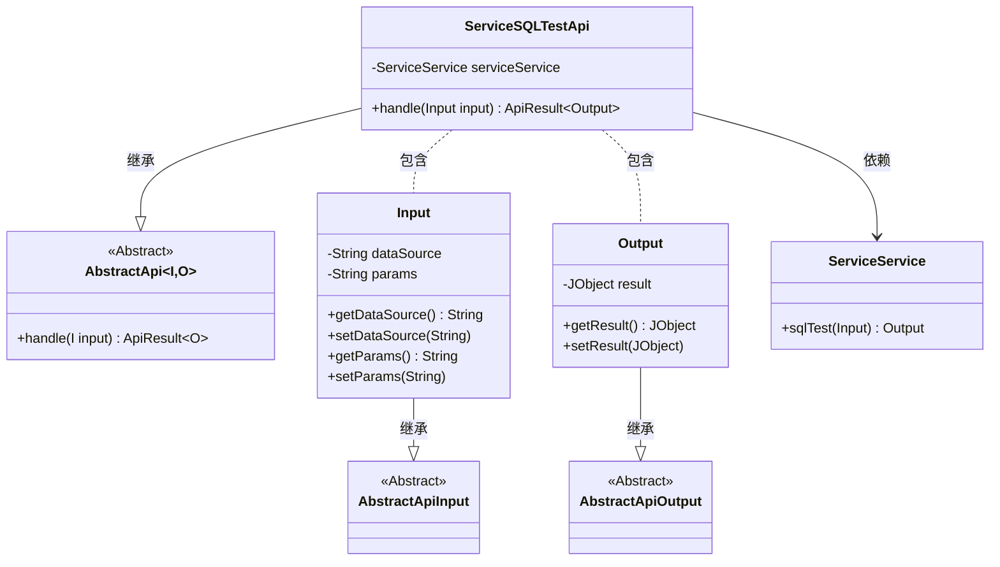

# 基础信息

|      |      |
|------|------|
| 名称 | ServiceSQLTestApi |
| 编码语言 | .java |
| 代码路径 | WeFe/serving/serving-service/src/main/java/com/welab/wefe/serving/service/api/service/ServiceSQLTestApi.java |
| 包名 | com.welab.wefe.serving.service.api.service |
| 依赖项 | ['java.io.IOException', 'org.springframework.beans.factory.annotation.Autowired', 'com.welab.wefe.common.exception.StatusCodeWithException', 'com.welab.wefe.common.fieldvalidate.annotation.Check', 'com.welab.wefe.common.util.JObject', 'com.welab.wefe.common.web.api.base.AbstractApi', 'com.welab.wefe.common.web.api.base.Api', 'com.welab.wefe.common.web.dto.AbstractApiInput', 'com.welab.wefe.common.web.dto.AbstractApiOutput', 'com.welab.wefe.common.web.dto.ApiResult', 'com.welab.wefe.serving.service.service.ServiceService'] |
| 概述说明 | ServiceSQLTestApi类提供SQL测试接口，输入为数据源配置和查询参数，输出为JObject格式结果，调用serviceService处理请求。 |

# 说明

该代码定义了一个名为ServiceSQLTestApi的API类，用于处理SQL测试请求。该类继承自AbstractApi，包含输入Input和输出Output两个静态内部类。输入类包含两个字段：dataSource（SQL配置，JSON格式）和params（查询参数），均带有@Check注解进行校验。输出类包含一个JObject类型的result字段，用于存储测试结果。API路径为"service/sql_test"，通过注入的serviceService调用sqlTest方法处理请求，并返回封装后的结果。整个类实现了对SQL配置和参数的校验、处理及结果返回功能。

# 类列表 Class Summary

| 名称   | 类型  | 说明 |
|-------|------|-------------|
| ServiceSQLTestApi | class | ServiceSQLTestApi类用于测试SQL查询，接收数据源和参数输入，返回JSON格式结果。 |

## 类 ServiceSQLTestApi

|      |      |
|------|------|
| 访问范围 | @Api(path = "service/sql_test", name = "service sql test");public |
| 类型 | class |
| 名称 | ServiceSQLTestApi |
| 说明 | ServiceSQLTestApi类用于测试SQL查询，接收数据源和参数输入，返回JSON格式结果。 |

### UML类图

该图展示了`ServiceSQLTestApi`及其相关类的结构。`ServiceSQLTestApi`继承自泛型类`AbstractApi`，包含嵌套类`Input`和`Output`，分别继承自`AbstractApiInput`和`AbstractApiOutput`。`ServiceSQLTestApi`通过`@Autowired`依赖`ServiceService`来执行SQL测试。`Input`类包含数据源和查询参数字段，`Output`类包含测试结果字段。整体设计遵循了分层和封装原则，通过继承实现代码复用。

### 内部方法调用关系图

```mermaid
graph TD
    A["类ServiceSQLTestApi"]
    B["注解: @Api(path='service/sql_test', name='service sql test')"]
    C["继承: AbstractApi<Input, Output>"]
    D["依赖注入: @Autowired ServiceService serviceService"]
    E["重写方法: handle(Input input)"]
    F["内部类: Output"]
    G["内部类: Input"]
    H["Output属性: JObject result"]
    I["Input属性: String dataSource, String params"]
    J["Input校验注解: @Check(name='SQL配置'), @Check(name='查询参数')"]

    A --> B
    A --> C
    A --> D
    A --> E
    A --> F
    A --> G
    F --> H
    G --> I
    G --> J
    E -->|调用| D
    E -->|返回| F
```

这段代码描述了一个基于Spring框架的API控制器类ServiceSQLTestApi，它继承自抽象基类AbstractApi并处理SQL测试请求。该API包含输入(Input)和输出(Output)两个嵌套类，其中Input类包含经过校验的SQL配置和查询参数，Output类封装了JSON格式的测试结果。主要流程是通过注入的ServiceService执行sqlTest方法，并将结果包装成ApiResult返回。整个设计采用了依赖注入和参数校验等企业级开发常用模式。

### 字段列表 Field List

| 名称  | 类型  | 说明 |
|-------|-------|------|
| serviceService | ServiceService | 使用@Autowired自动注入ServiceService实例。 |

### 方法列表

| 名称  | 类型  | 说明 |
|-------|-------|------|
| handle | ApiResult<Output> | Java方法重写，调用serviceService.sqlTest处理输入并返回成功结果，可能抛出异常。 |

