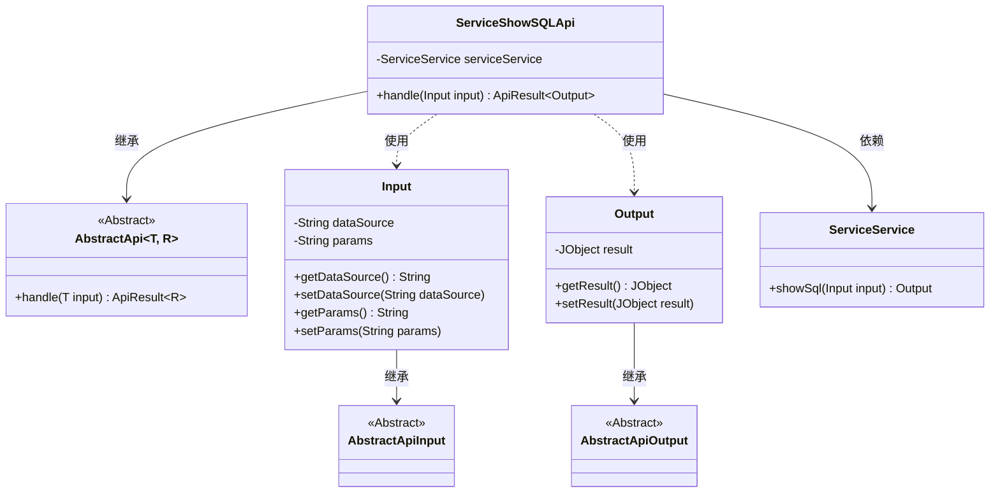

# 基础信息

|      |      |
|------|------|
| 名称 | ServiceShowSQLApi |
| 编码语言 | .java |
| 代码路径 | WeFe/serving/serving-service/src/main/java/com/welab/wefe/serving/service/api/service/ServiceShowSQLApi.java |
| 包名 | com.welab.wefe.serving.service.api.service |
| 依赖项 | ['java.io.IOException', 'org.springframework.beans.factory.annotation.Autowired', 'com.welab.wefe.common.exception.StatusCodeWithException', 'com.welab.wefe.common.fieldvalidate.annotation.Check', 'com.welab.wefe.common.util.JObject', 'com.welab.wefe.common.web.api.base.AbstractApi', 'com.welab.wefe.common.web.api.base.Api', 'com.welab.wefe.common.web.dto.AbstractApiInput', 'com.welab.wefe.common.web.dto.AbstractApiOutput', 'com.welab.wefe.common.web.dto.ApiResult', 'com.welab.wefe.serving.service.service.ServiceService'] |
| 概述说明 | ServiceShowSQLApi类提供展示SQL服务，输入含数据源和查询参数，输出为JObject格式结果。 |

# 说明

该代码定义了一个名为ServiceShowSQLApi的API类，用于展示SQL查询结果。它继承自AbstractApi，接受Input类作为输入参数，返回Output类作为输出结果。Input类包含两个字段：dataSource（SQL配置，JSON格式）和params（查询参数），均带有校验注解。Output类包含一个JObject类型的result字段，用于存储查询结果。API通过serviceService的showSql方法处理输入并返回结果，使用success方法包装返回数据。整个API路径为service/show_sql，名称为service show sql。

# 类列表 Class Summary

| 名称   | 类型  | 说明 |
|-------|------|-------------|
| ServiceShowSQLApi | class | ServiceShowSQLApi类是一个处理SQL查询的API，通过输入数据源和参数，调用serviceService.showSql方法返回查询结果。输入包含数据源和参数，输出为JObject格式的结果。 |

## 类 ServiceShowSQLApi

|      |      |
|------|------|
| 访问范围 | @Api(path = "service/show_sql", name = "service show sql");public |
| 类型 | class |
| 名称 | ServiceShowSQLApi |
| 说明 | ServiceShowSQLApi类是一个处理SQL查询的API，通过输入数据源和参数，调用serviceService.showSql方法返回查询结果。输入包含数据源和参数，输出为JObject格式的结果。 |

### UML类图

这段代码展示了一个服务展示SQL的API实现，包含输入输出数据结构和处理逻辑。ServiceShowSQLApi继承自泛型抽象类AbstractApi，使用ServiceService处理业务逻辑。Input类包含数据源和查询参数，Output类封装了JObject类型的结果。类图清晰地展示了继承关系和依赖关系，体现了API处理请求的完整流程。

### 内部方法调用关系图

```mermaid
graph TD
    A["类ServiceShowSQLApi"]
    B["注解: @Api(path='service/show_sql', name='service show sql')"]
    C["继承: AbstractApi<Input, Output>"]
    D["依赖注入: @Autowired ServiceService"]
    E["重写方法: handle(Input input)"]
    F["内部类: Output"]
    G["内部类: Input"]
    H["Output属性: JObject result"]
    I["Input属性: String dataSource, String params"]
    J["Input校验: @Check(name='SQL配置')"]
    K["Input校验: @Check(name='查询参数')"]

    A --> B
    A --> C
    A --> D
    A --> E
    A --> F
    A --> G
    F --> H
    G --> I
    G --> J
    G --> K
    E --> D
    E --> F
```

这段代码描述了一个Spring风格的API类ServiceShowSQLApi，继承自泛型抽象类AbstractApi，包含输入输出参数处理和业务逻辑执行流程。类结构包含两个嵌套静态类Input和Output，分别用于封装请求参数和响应数据，其中Input类带有字段校验注解。主类通过handle方法调用ServiceService的showSql功能，并返回包含JObject结果的ApiResult包装对象。流程图清晰展示了类继承关系、依赖注入、方法重写和内部类结构。

### 字段列表 Field List

| 名称  | 类型  | 说明 |
|-------|-------|------|
| serviceService | ServiceService | 使用@Autowired自动注入ServiceService实例。 |

### 方法列表

| 名称  | 类型  | 说明 |
|-------|-------|------|
| handle | ApiResult<Output> | Java方法重写，调用serviceService.showSql处理输入并返回成功结果，可能抛出StatusCodeWithException和IOException异常。 |

