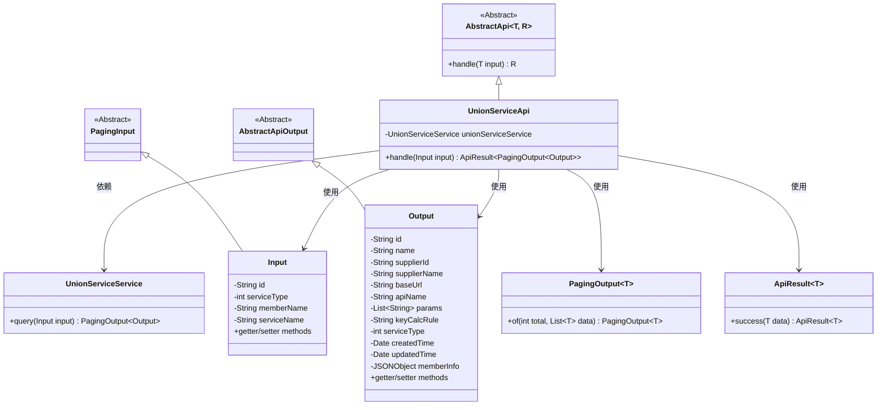
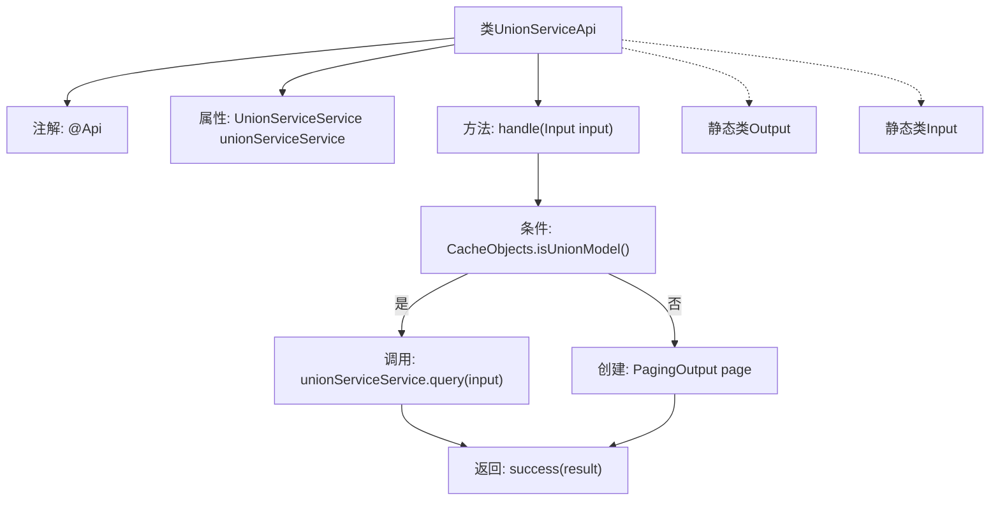

# 基础信息

|      |      |
|------|------|
| 名称 | UnionServiceApi |
| 编码语言 | .java |
| 代码路径 | WeFe/serving/serving-service/src/main/java/com/welab/wefe/serving/service/api/service/UnionServiceApi.java |
| 包名 | com.welab.wefe.serving.service.api.service |
| 依赖项 | ['java.io.IOException', 'java.util.ArrayList', 'java.util.Date', 'java.util.List', 'org.springframework.beans.factory.annotation.Autowired', 'com.alibaba.fastjson.JSONObject', 'com.welab.wefe.common.exception.StatusCodeWithException', 'com.welab.wefe.common.web.api.base.AbstractApi', 'com.welab.wefe.common.web.api.base.Api', 'com.welab.wefe.common.web.dto.AbstractApiOutput', 'com.welab.wefe.common.web.dto.ApiResult', 'com.welab.wefe.serving.service.dto.PagingInput', 'com.welab.wefe.serving.service.dto.PagingOutput', 'com.welab.wefe.serving.service.service.CacheObjects', 'com.welab.wefe.serving.service.service.UnionServiceService'] |
| 概述说明 | UnionServiceApi类提供查询联合服务列表功能，输入参数包括服务ID、类型、成员名和服务名，输出包含服务详情如ID、名称、供应商信息等。根据缓存状态返回查询结果或空列表。 |

# 说明

UnionServiceApi是一个用于查询联合服务列表的API类，继承自AbstractApi，处理输入Input和分页输出PagingOutput<Output>。通过UnionServiceService执行查询，若CacheObjects.isUnionModel()为真则返回查询结果，否则返回空分页。Output类包含服务ID、名称、供应商信息、URL、参数、主键规则、服务类型、时间戳等字段及对应getter/setter。Input类继承PagingInput，包含服务ID、类型、成员名称和服务名称等查询条件及对应getter/setter。

# 类列表 Class Summary

| 名称   | 类型  | 说明 |
|-------|------|-------------|
| UnionServiceApi | class | UnionServiceApi类提供查询联合服务列表功能，输入参数包括服务ID、类型、成员名和服务名，输出包含服务详情如ID、名称、供应商信息等。若为联合模式则返回查询结果，否则返回空列表。 |

## 类 UnionServiceApi

|      |      |
|------|------|
| 访问范围 | @Api(path = "service/union/query", name = "query union service list");public |
| 类型 | class |
| 名称 | UnionServiceApi |
| 说明 | UnionServiceApi类提供查询联合服务列表功能，输入参数包括服务ID、类型、成员名和服务名，输出包含服务详情如ID、名称、供应商信息等。若为联合模式则返回查询结果，否则返回空列表。 |

### UML类图

该类图展示了UnionServiceApi及其相关类的结构。UnionServiceApi继承自AbstractApi，处理分页查询请求，依赖UnionServiceService进行实际业务处理。包含Input和Output两个静态内部类分别表示请求参数和响应数据，其中Input继承自PagingInput，Output继承自AbstractApiOutput。通过ApiResult包装返回结果，使用PagingOutput实现分页功能。整体设计体现了清晰的层次结构和职责分离。

### 内部方法调用关系图

这段代码展示了一个基于Spring框架的API类UnionServiceApi，用于查询联合服务列表。流程图描述了主处理逻辑：首先检查缓存模式，若为联合模式则调用服务查询，否则返回空分页结果。类中包含两个静态嵌套类Output和Input，分别定义了输出数据结构（包含服务详情字段）和输入参数（包含分页和服务过滤条件）。该API继承自抽象基类，实现了带异常处理的请求处理方法。

### 字段列表 Field List

| 名称  | 类型  | 说明 |
|-------|-------|------|
| unionServiceService | UnionServiceService | 自动注入UnionServiceService实例。 |

### 方法列表

| 名称  | 类型  | 说明 |
|-------|-------|------|
| handle | ApiResult<PagingOutput<Output>> | 方法处理输入，若为联合模式则调用服务查询，否则返回空分页结果。 |

