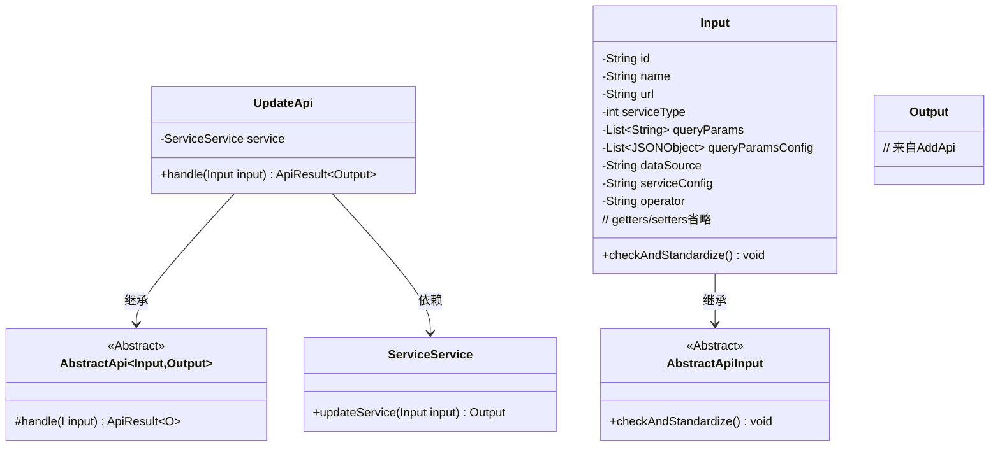

# 基础信息

|      |      |
|------|------|
| 名称 | UpdateApi |
| 编码语言 | .java |
| 代码路径 | WeFe/serving/serving-service/src/main/java/com/welab/wefe/serving/service/api/service/UpdateApi.java |
| 包名 | com.welab.wefe.serving.service.api.service |
| 依赖项 | ['java.io.IOException', 'java.util.List', 'org.apache.commons.lang3.StringUtils', 'org.springframework.beans.factory.annotation.Autowired', 'com.alibaba.fastjson.JSONArray', 'com.alibaba.fastjson.JSONObject', 'com.welab.wefe.common.StatusCode', 'com.welab.wefe.common.exception.StatusCodeWithException', 'com.welab.wefe.common.fieldvalidate.annotation.Check', 'com.welab.wefe.common.util.JObject', 'com.welab.wefe.common.web.api.base.AbstractApi', 'com.welab.wefe.common.web.api.base.Api', 'com.welab.wefe.common.web.dto.AbstractApiInput', 'com.welab.wefe.common.web.dto.ApiResult', 'com.welab.wefe.serving.service.api.service.AddApi.Output', 'com.welab.wefe.serving.service.enums.ServiceTypeEnum', 'com.welab.wefe.serving.service.service.ServiceService'] |
| 概述说明 | UpdateApi类用于更新服务信息，包含输入参数校验逻辑，如服务类型、数据源配置等必填项检查，确保参数有效性后调用service.updateService处理请求。 |

# 说明

该代码定义了一个名为UpdateApi的API类，用于更新服务信息。API路径为"service/update"，继承自AbstractApi，处理输入类型Input和输出类型AddApi.Output。Input类包含多个必填和可选字段，如ID、服务名、服务地址、服务类型等，并对这些字段进行校验和标准化处理。校验逻辑包括检查服务类型是否有效、SQL配置和服务配置是否为空等。Input类还提供了各字段的getter和setter方法。API处理逻辑通过调用service.updateService方法实现，返回成功结果。

# 类列表 Class Summary

| 名称   | 类型  | 说明 |
|-------|------|-------------|
| UpdateApi | class | UpdateApi类用于更新服务信息，包含必填字段ID、名称、地址和类型，可选字段包括查询参数、SQL配置和服务配置，并验证服务类型和相关配置的有效性。 |

## 类 UpdateApi

|      |      |
|------|------|
| 访问范围 | @Api(path = "service/update", name = "update service info");public |
| 类型 | class |
| 名称 | UpdateApi |
| 说明 | UpdateApi类用于更新服务信息，包含必填字段ID、名称、地址和类型，可选字段包括查询参数、SQL配置和服务配置，并验证服务类型和相关配置的有效性。 |

### UML类图

这段代码展示了一个服务更新API的实现结构。UpdateApi继承自泛型抽象类AbstractApi，处理Input/Output类型参数，通过ServiceService完成核心业务逻辑。Input类包含丰富的字段校验逻辑，继承自AbstractApiInput并实现了参数标准化检查。类图清晰地反映了各组件间的继承和依赖关系，特别是输入参数的复杂校验逻辑与业务服务的交互方式。

### 内部方法调用关系图

```mermaid
graph TD
    A["类UpdateApi"]
    B["注解: @Api"]
    C["继承: AbstractApi<Input, Output>"]
    D["依赖注入: ServiceService service"]
    E["重写方法: handle(Input input)"]
    F["内部类: Input"]
    G["属性: String id"]
    H["属性: String name"]
    I["属性: String url"]
    J["属性: int serviceType"]
    K["属性: List<String> queryParams"]
    L["属性: List<JSONObject> queryParamsConfig"]
    M["属性: String dataSource"]
    N["属性: String serviceConfig"]
    O["属性: String operator"]
    P["方法: checkAndStandardize()"]
    Q["方法: 各属性的getter/setter"]

    A --> B
    A --> C
    A --> D
    A --> E
    A --> F
    F --> G
    F --> H
    F --> I
    F --> J
    F --> K
    F --> L
    F --> M
    F --> N
    F --> O
    F --> P
    F --> Q
```

这段代码展示了一个服务更新API的实现，主要包含UpdateApi类和其内部Input类。UpdateApi继承自AbstractApi，通过@ServiceService处理业务逻辑，Input类包含多个带校验注解的属性和一个核心校验方法checkAndStandardize()。流程图清晰地呈现了类结构、继承关系、属性组成和方法调用路径，特别是Input类中对服务类型、数据源配置等关键参数的校验逻辑。

### 字段列表 Field List

| 名称  | 类型  | 说明 |
|-------|-------|------|
| service | ServiceService | 自动注入ServiceService类型的服务实例。 |

### 方法列表

| 名称  | 类型  | 说明 |
|-------|-------|------|
| handle | ApiResult<Output> | Java方法重写，处理输入并调用服务更新，返回成功结果或异常。 |

