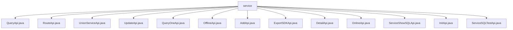

# 基础信息

|      |      |
|------|------|
| 名称 | service |
| 编码语言 | .java |
| 代码路径 | WeFe/serving/serving-service/src/main/java/com/welab/wefe/serving/service/api/service |
| 包名 | docs.serving.serving-service.src.main.java.com.welab.wefe.serving.service.api.service |
| 概述说明 | QueryApi处理服务列表查询，RouteApi转发请求，UnionServiceApi查询联合服务，UpdateApi更新服务信息，QueryOneApi按ID查询，OfflineApi下线服务，AddApi添加服务，ExportSDKApi导出SDK，DetailApi获取详情，OnlineApi上线服务，ServiceShowSQLApi展示SQL结果，ServiceSQLTestApi测试SQL。 |

# 说明

## 概述  
该模块是服务管理系统核心API集合，提供服务的全生命周期管理能力，类似服务编排中枢。主要职责包括服务查询（分页/详情/联合列表）、增删改查、上下线操作及SQL测试等功能。接口规范统一继承AbstractApi基类，采用泛型定义Input/Output结构，返回结果封装为ApiResult或分页对象PagingOutput。  

关键数据结构包含服务基础信息（ID/名称/URL/类型）、配置参数（SQL/数据源）、状态标识及时间戳等。例如QueryApi.Output包含服务状态，DetailApi.Output扩展了模型参数等高级字段。外部依赖集中于ServiceService和UnionServiceService，通过依赖注入实现业务逻辑，并行度上限为20。  

## 主要业务场景  
典型应用模式为服务运维控制台，支持通过ID精确查询（QueryOneApi）、条件筛选分页（QueryApi）及联合服务检索（UnionServiceApi）。服务配置阶段通过AddApi/UpdateApi实现增改，结合严格校验（如URL格式）；状态管理通过OnlineApi/OfflineApi切换，类似断路器模式。  

特殊功能包括SQL测试（ServiceSQLTestApi）和SDK导出（ExportSDKApi），前者验证SQL配置有效性，后者生成客户端集成包。路由功能（RouteApi）支持请求转发，Input包含合作者ID等联邦学习特征。所有交互均采用标准化输入输出，例如ServiceShowSQLApi用JObject返回动态查询结果。

### 包内部结构视图

该流程图展示了service目录下的13个API文件，包括QueryApi、RouteApi、UnionServiceApi等，所有文件均直接隶属于service节点，清晰地呈现了扁平化的文件结构关系。

# 文件列表

| 名称   | 类型  | 说明 |
|-------|------|-------------|
| [QueryApi.java](QueryApi.md) | file | QueryApi类用于查询服务列表，包含输入参数和输出结果的定义，输入支持分页、服务类型和状态筛选，输出包含服务详情和分页信息。 |
| [RouteApi.java](RouteApi.md) | file | RouteApi是一个API服务类，处理输入并调用服务执行，支持并发且最大并行度为20。输入包含合作者ID、请求数据等字段，执行成功返回结果，失败返回错误信息。 |
| [UnionServiceApi.java](UnionServiceApi.md) | file | UnionServiceApi类提供查询联合服务列表功能，输入参数包括服务ID、类型、成员名和服务名，输出包含服务详情如ID、名称、供应商信息等。根据缓存状态返回查询结果或空列表。 |
| [UpdateApi.java](UpdateApi.md) | file | UpdateApi类用于更新服务信息，包含输入参数校验逻辑，如服务类型、数据源配置等必填项检查，确保参数有效性后调用service.updateService处理请求。 |
| [QueryOneApi.java](QueryOneApi.md) | file | QueryOneApi是一个通过ID查询服务的API，输入为ID，输出服务详情，调用serviceService.queryById实现查询。 |
| [OfflineApi.java](OfflineApi.md) | file | 离线服务API类，处理服务下线请求，需传入ID参数，调用serviceService完成操作，返回成功结果。 |
| [AddApi.java](AddApi.md) | file | AddApi类用于添加服务，包含输入输出类。输入类校验服务名、地址、类型等参数，输出类返回ID、参数、方法和URL。处理逻辑调用service保存服务并返回结果。 |
| [ExportSDKApi.java](ExportSDKApi.md) | file | 这是一个名为ExportSDKApi的Java类，用于处理导出SDK的API请求。它继承自AbstractApi，接受Input参数并返回ResponseEntity。Input类包含serviceId字段，通过ServiceService处理导出请求。 |
| [DetailApi.java](DetailApi.md) | file | 服务详情API类，处理输入id和服务类型，返回包含服务配置、数据源、状态等详细信息的输出。 |
| [OnlineApi.java](OnlineApi.md) | file | OnlineApi类提供在线服务接口，接收含id的输入，调用serviceService.onlineService处理，返回成功结果。 |
| [ServiceShowSQLApi.java](ServiceShowSQLApi.md) | file | ServiceShowSQLApi类提供展示SQL服务，输入含数据源和查询参数，输出为JObject格式结果。 |
| [InitApi.java](InitApi.md) | file | 输入内容为空，无法生成概要描述。 |
| [ServiceSQLTestApi.java](ServiceSQLTestApi.md) | file | ServiceSQLTestApi类提供SQL测试接口，输入为数据源配置和查询参数，输出为JObject格式结果，调用serviceService处理请求。 |

